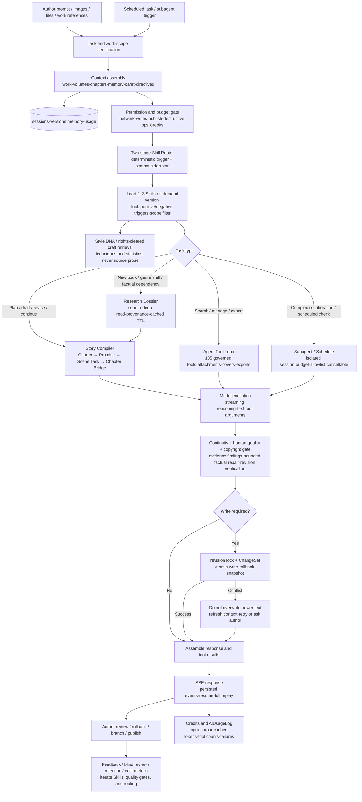
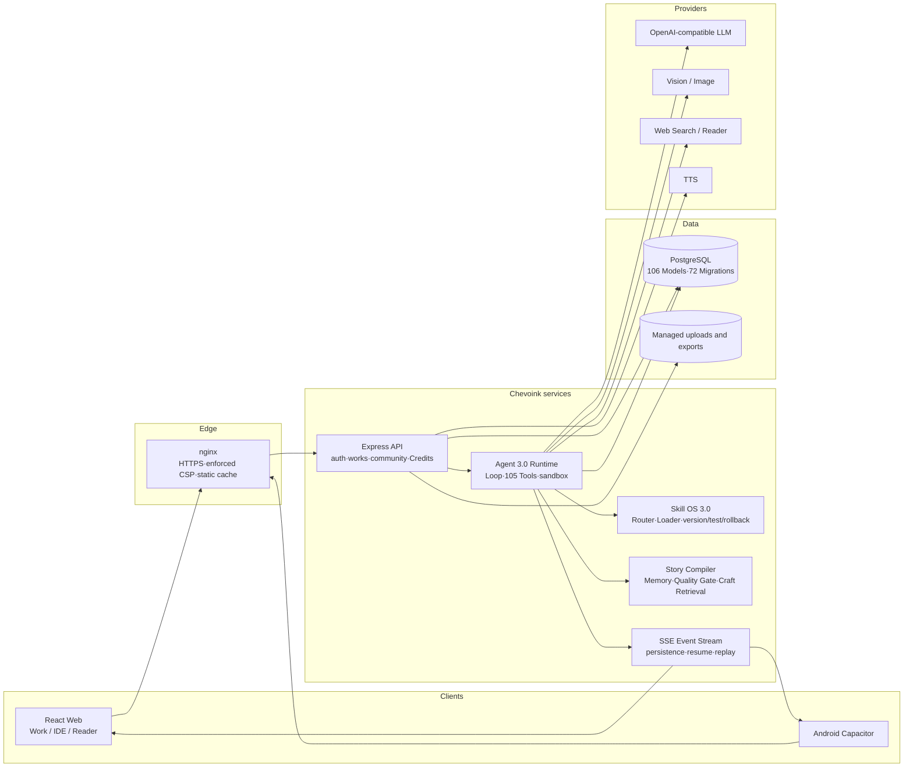

<p align="center">
  <a href="https://chevoink.chevolink.com">
    
  </a>
</p>

<h3 align="center">A spark of inspiration. A world in words.</h3>

<p align="center">
  Your AI creative partner, connecting ideas, stories, and readers.<br>
  Research, plan, write, and revise with Chevoink Agent — a home for creating novels and discovering, reading, and sharing stories.<br>
  <sub>Web · Windows · Android</sub>
</p>

<p align="center">
  <a href="https://github.com/Xcy8010/chevoink/releases"></a>
  <a href="https://github.com/Xcy8010/chevoink/actions/workflows/ci.yml"></a>
  <a href="https://github.com/Xcy8010/chevoink/stargazers"></a>
  <a href="#license"></a>
  <a href="#community"></a>
</p>

<p align="center">
  <a href="https://chevoink.chevolink.com"><strong>Try Online</strong></a> ·
  <a href="#product-preview">Preview</a> ·
  <a href="#feature-overview">Features</a> ·
  <a href="#quick-start">Quick Start</a> ·
  <a href="https://github.com/Xcy8010/chevoink/releases">Download</a> ·
  <a href="#community">Community</a>
</p>

<p align="center"><a href="./README.md">简体中文</a> · <strong>English</strong></p>

---

## Product Preview

**Desktop**

<table>
  <tr>
    <td align="center"><br>Bookstore & reading experience</td>
    <td align="center"><br>Studio & AI writing Agent</td>
  </tr>
</table>

**Mobile**

<table>
  <tr>
    <td align="center"><br>Home & community</td>
    <td align="center"><br>Studio & reading</td>
  </tr>
</table>

## Chevoink Agent 3.0

Agent 3.0 is a stateful creative agent that keeps working with one novel rather than a one-shot prompt generator. It identifies the task and story phase, loads two or three relevant Skills on demand, builds a cacheable Research Dossier when research is justified, and uses the Story Compiler to turn reader promises, character desires, obstacles, choices, costs, and state transitions into a scene task. Continuity and human-quality checks run before a revision-guarded atomic write, ChangeSet, and durable event stream commit the result to the workspace.

### Runtime flow



### System architecture



The deterministic evaluation suite freezes 24 Chinese web-fiction scenarios across six genres, nine task classes, and twelve quality signals. CI stores a report carrying the dataset hash, code SHA, model, and Skill version. Automated metrics diagnose regressions; they do not replace real author outcomes or anonymous review by at least three target-genre readers/editors.

### Long-running tasks

Long tasks can resume within budget and progress checks, retaining the original request and target. Hard limits, unverifiable results and failed quality gates stop execution explicitly; automatic completion of an entire book is not guaranteed.

## Current engineering status

Revision `71f7adc` was deployed on 2026-09-08: [CI passed](https://github.com/Xcy8010/chevoink/actions/runs/34240086273), 1,885 tests passed; global line coverage is **33.62%**, with 40% still a target. Resume, repeated continuity repairs, research caching and cross-novel review persistence were addressed. Creating a novel no longer requires resolving the previous novel's reviews first.

Still in beta: whole-book per-chapter analysis, V2 shadow pricing, independent security/recovery exercises and full end-to-end performance acceptance remain incomplete. No 95–100 score or measured Token-saving percentage is claimed. See [engineering evidence](./docs/ENGINEERING.en.md).

## Quick Navigation

| What you want | Where to go |
| --- | --- |
| Try the product now | [Live site](https://chevoink.chevolink.com) (web, no install needed) |
| Install the Android app | [Download & install guide](#download--install-android-app) · [Releases page](https://github.com/Xcy8010/chevoink/releases) |
| Windows client development | [Build instructions](desktop/windows/README.md) · [Acceptance status](docs/WINDOWS_DESKTOP.md); internal candidate, not yet a signed public release |
| Learn how to use it | [User guide](#user-guide) |
| Explore features | [Feature overview](#feature-overview) |
| Understand Agent 3.0 | [Runtime flow & architecture](#chevoink-agent-30) · [Agent 3.0 proposal (Chinese)](./plan/23-Agent3.0中文网文人类化创作与技能生态升级方案.md) |
| Run it locally | [Quick start](#quick-start) |
| Understand the architecture | [Tech stack](#tech-stack) · [Directory structure](#directory-structure) |
| Deep engineering details | [Engineering Documentation](./docs/ENGINEERING.en.md) ([中文](./docs/ENGINEERING.md)) · [Development Standards](./docs/DEVELOPMENT-STANDARDS.en.md) ([中文](./docs/DEVELOPMENT-STANDARDS.md)) · [Agent evaluation guide (Chinese)](./tests/agent-evals/README.md) |
| Deploy to production | [Deployment & releases](#deployment--releases) · [Environment variables](#environment-variables) |
| Chat with us | [QQ group 158443235](#community) |

## Download & Install (Android App)

Pick either channel:

1. **GitHub Releases (recommended)**
   - Open the [Releases page](https://github.com/Xcy8010/chevoink/releases) and enter the latest version (e.g. `v1.50`);
   - Download `chevoink-vX.XX.apk` from the Assets section;
   - Tap to install. If the system warns about "unknown sources", allow "install anyway" in the dialog (the APK is signed with the release key).
2. **Direct download from the official site**
   - Visit <https://chevoink.chevolink.com/download/chevoink.apk> in a mobile browser and install directly.

No manual upgrades needed afterwards: the app checks for new versions on launch, and the in-app banner / settings page will prompt and guide the update. Web users always get the latest version by opening the live site.

## User Guide

### Readers

1. **Sign in**: phone number + SMS verification code — no registration flow; the account is created on first login;
2. **Find books**: the bookstore home offers carousels, rankings and category recommendations, plus title/author search;
3. **Read**: page-flip navigation inside the reader; tap the center to summon the menu for font size, typeface, paper theme and flip mode; reading progress and bookshelf sync to the cloud, so you can continue on another device;
4. **Listen**: enable TTS narration in the reader, with selectable voices and speeds; flip mode shows a bottom playback capsule;
5. **Interact**: comment, like and bookmark on the book detail page; post, join topics, follow authors and chat in the community.

### Authors

1. Enter the **Studio** and start talking to Chevoink Agent immediately. With no existing work, randomized creation examples appear; selecting one only fills the composer, and after the first send the Agent turns the hidden bootstrap workspace into a real novel through the scope-checked, atomic `novel_create` action. A new empty task inside an existing novel also receives four randomized building prompts;
2. Write directly in the chapter editor or invoke **Chevoink Agent 3.0**. It streams drafts and revisions grounded in your project knowledge, builds a genre Research Dossier only when needed, and uses Story Charter, Reader Promise, Scene Task, and Chapter Bridge to preserve long-form causality and continuity. Post-write quality findings always include source-text evidence;
3. Manage Skill OS 3.0 in the **Work Skills** area on Work, IDE, or mobile. Built-ins route automatically; authors or the Agent can draft private Skills, which must pass positive/negative trigger tests before publication. Every version can be pinned, disabled, and rolled back. Shared installation requires author confirmation, while third-party source imports must declare a licence, attribution, and immutable version;
4. Attach **images (≤6) and files (≤3, pdf/docx/txt/md)** to the prompt. Multimodal models receive image pixels directly, while text-only models automatically use the safe vision sidecar; files are always read before action. Conversation files are clickable, and long contents are collapsed by default;
5. Generate cover art with one click via **AI cover generation** (remote URLs are automatically persisted to the site); you can also ask the Agent to "look at the current cover" to verify the artwork;
6. **One-click export**: launch it from the immersive-mode toolbar, the "…" more menu or the mobile "More" sheet; pick the export scope (plans / catalog / chapters / work info & publishing advice, with per-chapter selection), and the server packs a zip for direct download, including AI-generated publishing advice for Fanqie Novel based on its official tag vocabulary; you can also ask the Agent in chat to export on demand (only certain chapters, or excluding specific parts);
7. Open the **Agent Operations Center** from the Agent header to search, pin, or archive tasks across novels; fork a novel version from the current chapter/run snapshot and compare or merge it; launch budgeted/cancellable research, continuity, quality, and lore subagents with trace replay; configure durable inspections, server-enforced tool sandboxes, and 2–4-run comparisons across model tier, reasoning, tokens, and latency;
8. Publish finished chapters — readers see them instantly; scheduled updates and chapter management are supported.

### Public-beta Credits

- Public-beta accounts receive **450 Credits per day**, resetting at **15:00 UTC+8**. Referral rewards live in a separate balance and survive daily resets.
- Text uses a bundled allowance: **at base multiplier m=1, 1 Credit includes both 10,000 input tokens and 1,000 output tokens**. Charging uses the larger utilization ratio instead of adding input and output charges. Image generation costs 6 Credits per invocation and web search costs 2 Credits per invocation.
- Every user gets a unique referral URL. Only a brand-new account can redeem it on first registration: the inviter receives 300 Credits and the invitee receives 120 Credits; each invitee can redeem exactly once.
- Studio warns at 20%, 10%, and 5% remaining. Exhaustion safely stops the task; [`/account/usage`](/account/usage) shows the plan, balances, and itemized ledger.
- Cache-discount V2: `min(C_v1, ceil(1000 × m × ((P − H + 0.25H)/10000 + O/1000)) / 1000)` Credits. H is confirmed cached input; ordinary input/output rates are unchanged and each charge is capped at the frozen V1 price. Active cards and pre-dispatch snapshots govern; old requests are not repriced and unknown usage awaits reconciliation. Selectable multipliers on 2026-09-08: Speed 1.1, Standard 1.0, Performance 3.0, Ultimate 3.5. See [engineering](./docs/ENGINEERING.en.md).
- Models expose supported reasoning efforts only; default high. BYOK text has no platform text charge; keys are encrypted and never returned. Other platform tool fees remain separate.

## Feature Overview

- **Reading**: bookstore home (carousels, rankings, category picks), cloud-synced bookshelf & reading progress, immersive reader, TTS narration
- **Studio**: Codex-inspired Work/IDE workspace; Agent 3.0 with Research Dossier, Skill OS, Story Compiler, Chapter Bridge, human-quality gate, licensed craft retrieval, work-private Style DNA, first-three-chapter prototyping, and blind-review pipeline; cross-novel task search/pin/archive; branch/diff/conflict-safe merge; embedded subagents; schedules; permission sandbox; replay; multimodal attachments; web/in-platform research; cross-session memory; relationship graph; AI covers; and scoped ZIP export
- **Community**: posts & topics, recommendation algorithm, comments/likes/bookmarks, follows & fans, direct messages with online presence
- **Accounts**: phone + SMS-code login (Tencent Cloud SMS), HttpOnly Cookie session + Bearer fallback channel (survives Android shell process kills), public-beta Credits, and one-time referral rewards
- **Admin console**: data dashboard, user/novel/content governance, encrypted built-in-model configuration, single-user and bulk Credits reset/pause controls, token ranking with user/novel/task drill-down, web-search and image-generation call counts, mobile-friendly
- **Android client**: Capacitor shell loading the remote site, in-app update checks and APK distribution

## Tech Stack

| Layer | Technology |
| --- | --- |
| Frontend | React 18 · Vite 6 · TypeScript · TailwindCSS · React Query 5 · Zustand 5 · React Router 7 |
| Backend | Express 4 · Prisma 6 · PostgreSQL · Zod |
| AI | DeepSeek text generation · Zhipu GLM-4.1V image understanding · OpenAI-compatible image generation · Edge TTS speech synthesis · Bocha web search (multi-engine fallback) |
| Agent | Agent 3.0 Runtime (`api/lib/agent`): unified Loop, 105 governed tools, Skill OS 3.0, Story Compiler, layered memory, quality gate, embedded subagents, long-task auto-resume with runaway protection, and durable SSE events |
| Testing | Vitest + Supertest + Testing Library (unit, PostgreSQL integration, real DOM interaction, and frozen Agent evals; 2026-09-08: 161 files / 1,885 tests passed, with coverage gates) |
| Deployment | PM2 + nginx (production) · GitHub Actions CI (type check / lint / unit / integration tests on push) · Android Capacitor shell project (separate directory) |

## Directory Structure

```
├── api/               # Express backend (routes, lib business modules, config)
├── src/               # React frontend (app shell & routes, feature domains, shared components)
├── shared/contracts/  # Type contracts shared by frontend & backend
├── prisma/            # Data model schema, migrations, seed data
├── tests/             # Unit, PostgreSQL integration, UI interaction, Chevoink-CN-Fiction-Eval
├── docs/              # Engineering docs (ENGINEERING & DEVELOPMENT-STANDARDS, both bilingual)
├── plan/              # Published phase proposals/checklists; not proof of complete acceptance
├── deploy/            # nginx config & server deployment scripts
├── scripts/           # Deployment / push / data cleanup scripts
└── public/            # Static assets
```

## Quick Start

```bash
# 1. Use pinned Node 22.23.2 / npm 10.9.8, then install locked dependencies
npm ci

# 2. Configure environment variables (see .env.example; fill in DB connection, AI keys, etc.)
copy .env.example .env   # or: cp .env.example .env on Unix

# 3. Initialize the database
npm run prisma:generate
npm run prisma:migrate:deploy
npm run prisma:seed   # optional: seed data

# 4. Start development (Vite frontend + nodemon backend in parallel)
npm run dev
```

Common scripts:

| Command | Description |
| --- | --- |
| `npm run dev` | Frontend + backend parallel development |
| `npm run check` | TypeScript type check |
| `npm run test` | Run tests (Vitest) |
| `npx vitest run --coverage` | Run tests with local/CI dual-baseline coverage gates |
| `npm run agent3:eval` | Emit a versioned Agent 3.0 deterministic eval snapshot with hashes and code SHA |
| `npm run lint` | ESLint check |
| `npm run build` | Production build |
| `npm run deploy:prod` | One-click deploy to the production server |

## Deployment & Releases

- **Production deploy**: full gates, Agent eval and both dependency audits → concise Chinese commit/push → same-SHA CI success → authorized `npm run deploy:prod`. Archive git HEAD; verify pinned Node, migrate/build, reload PM2 and check health. Current deployment is in-place, not atomic rollback. SkipLocalChecks requires authorization and equivalent controlled remote gates for that SHA.
- **Push to GitHub**: `powershell -ExecutionPolicy Bypass -File scripts\push-to-github.ps1`, supports `-Tag v1.50 -ReleaseAsset <apk path>` to tag and publish a Release (with the Android APK attached)
- **Android APK**: built by the separate Capacitor shell project, distributed via the in-app update banner / settings-page update check

## Environment Variables

All secrets are injected via `.env` (database, session signing, Tencent Cloud SMS, AI services, etc.); the template is at [.env.example](.env.example). Model API keys are encrypted at rest with AES-256-GCM. Production must use a dedicated `MODEL_CONFIG_ENCRYPTION_KEY`; back it up and rotate it deliberately, because losing it makes stored keys undecryptable. Sensitive files such as `.env`, certificates and keystores are excluded by `.gitignore` and never enter the repository.

## Community

Join the **Chevoink community group** (QQ group: `158443235`) to discuss the experience, report issues or contribute:

[Join the QQ group](https://qun.qq.com/universal-share/share?ac=1&authKey=O%2Bhtn0O51Qt5fW67Pj%2BSV7v0QI1%2FESTce7xHduNryLjTadVyekW9TMJcs0Wd5Qap&busi_data=eyJncm91cENvZGUiOiIxNTg0NDMyMzUiLCJ0b2tlbiI6ImdkU3I4ckRWR1M1L3hjTklTTGxHUnVYdVJ6bFNJeXN0c2ozbk1qd0pEeXpZb0JrdkZsbVNyUGtXY3lHZUFGYXQiLCJ1aW4iOiIyNDQ5MTI5ODYyIn0%3D&data=ys8RFeB2nMSORLKaLMkGLLRE8N8WU2t9WCjktU9Dg5YogAZktMZLLLMTj5t2KvcXA8K4p4J2NLPUEV0FO9OpRw&svctype=4&tempid=h5_group_info)

## License

This project is open-sourced under the [GNU AGPL-3.0 License](LICENSE): free to use, modify, and distribute. **If you provide it as an online service (SaaS / web server), you must offer the corresponding, modifiable source code to that service's users.** Closed-source commercial deployment requires a separate [commercial licence](./docs/COMMERCIAL-LICENSE.md) from the original author.

## Special Thanks

Chevoink is independently designed and implemented. The following open-source projects provided important references during the evolution of Agent 3.0, the novel domain model, and the Studio experience:

| Open-source project | Referenced area in Chevoink | What we learned from it |
| --- | --- | --- |
| [OpenAI Codex](https://github.com/openai/codex) | Writing Agent Loop, Work mode, task/tool execution, context organization | Agent-first workflows, traceable tool calls, continuous long-running tasks, context compaction, restrained workspace hierarchy, and collapsible sidebars |
| [OpenFic](https://github.com/syrizelink/OpenFic) | IDE mode, work tree, volume/chapter structure, novel retrieval, and writing Skills | Novel-focused IDE information architecture, the `Volume → Chapter` domain model, persisted panel layouts, chapter retrieval flows, and open-ended writing capabilities |
| [TencentDB Agent Memory](https://github.com/TencentCloud/TencentDB-Agent-Memory) | Long-form Agent story memory, character relationships, events, and conflict review | Layered memory, provenance and revision tracking, hybrid retrieval, memory updates, and conflict-governance patterns |
| [DeepSeek Harness](https://github.com/deepseek-ai/deepseek-harness) | Reasoning and tool-activity UI in Work / IDE | Progressive disclosure of reasoning, execution-state communication, and compact visual hierarchy for tool-call history |
| [React Flow / xyflow](https://github.com/xyflow/xyflow) | Story-memory relationship graph | Chevoink directly uses `@xyflow/react` for viewport panning, zooming, fit-to-view, controls, and minimap navigation |

These projects primarily informed architecture research, product interaction, and engineering principles. Except for third-party software explicitly declared in the dependency manifests, Chevoink's business code is redesigned and implemented for its own stack and novel-writing use cases. Our sincere thanks go to their maintainers and contributors for advancing the open-source Agent and creative-tool ecosystem.
