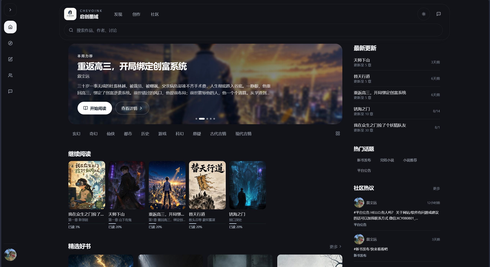
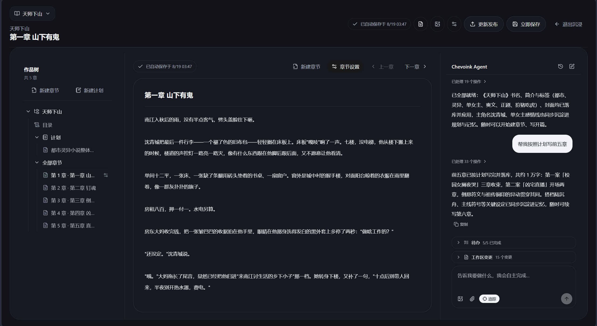
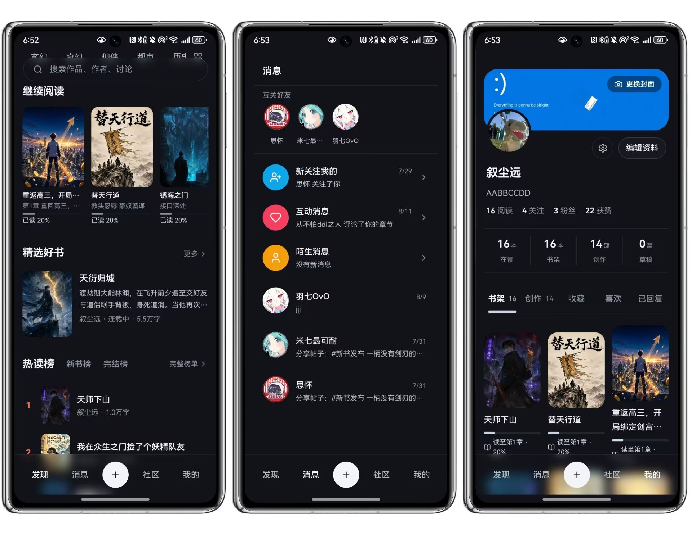
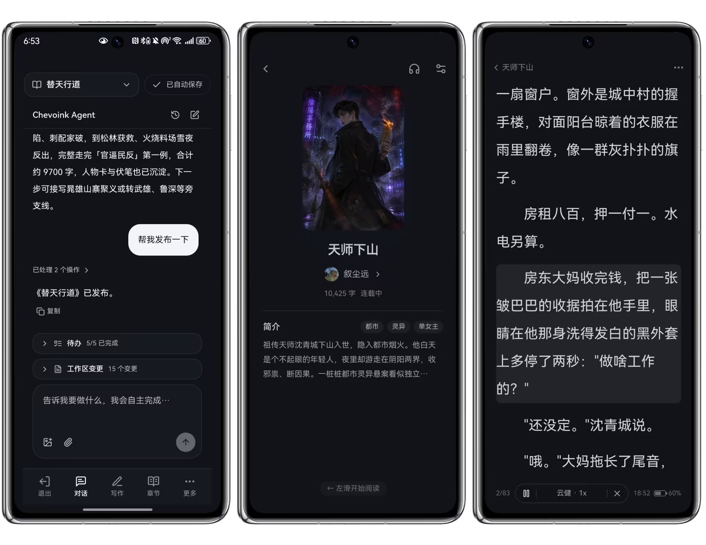

#  Chevoink 启创墨域

[简体中文](./README.md) | **English**

An AI application — an AI-driven, full-stack novel writing & reading platform: readers can discover, follow and listen to books in the bookstore; authors collaborate with a writing Agent in the studio to produce chapters (the Agent supports image/file attachments, vision, reference-material reading, web research and in-platform novel references); the community offers posts, topics and direct messages. Available as a web app and an Android app (Capacitor shell + in-app updates).

🌐 Live site: <https://chevoink.chevolink.com>

[](https://github.com/Xcy8010/chevoink/actions/workflows/ci.yml)
[](https://github.com/Xcy8010/chevoink/stargazers)
[](#-license)
[](#%EF%B8%8F-tech-stack)
[](#%EF%B8%8F-tech-stack)
[](https://github.com/Xcy8010/chevoink/releases)
[](https://qun.qq.com/universal-share/share?ac=1&authKey=O%2Bhtn0O51Qt5fW67Pj%2BSV7v0QI1%2FESTce7xHduNryLjTadVyekW9TMJcs0Wd5Qap&busi_data=eyJncm91cENvZGUiOiIxNTg0NDMyMzUiLCJ0b2tlbiI6ImdkU3I4ckRWR1M1L3hjTklTTGxHUnVYdVJ6bFNJeXN0c2ozbk1qd0pEeXpZb0JrdkZsbVNyUGtXY3lHZUFGYXQiLCJ1aW4iOiIyNDQ5MTI5ODYyIn0%3D&data=ys8RFeB2nMSORLKaLMkGLLRE8N8WU2t9WCjktU9Dg5YogAZktMZLLLMTj5t2KvcXA8K4p4J2NLPUEV0FO9OpRw&svctype=4&tempid=h5_group_info)

## 🖥️ Product Preview

**Desktop**

<table>
  <tr>
    <td align="center"><br>Bookstore & reading experience</td>
    <td align="center"><br>Studio & AI writing Agent</td>
  </tr>
</table>

**Mobile**

<table>
  <tr>
    <td align="center"><br>Home & community</td>
    <td align="center"><br>Studio & reading</td>
  </tr>
</table>

## 🧭 Quick Navigation

| What you want | Where to go |
| --- | --- |
| Try the product now | [Live site](https://chevoink.chevolink.com) (web, no install needed) |
| Install the Android app | [Download & install guide](#-download--install-android-app) · [Releases page](https://github.com/Xcy8010/chevoink/releases) |
| Learn how to use it | [User guide](#-user-guide) |
| Explore features | [Feature overview](#-feature-overview) |
| Run it locally | [Quick start](#-quick-start) |
| Understand the architecture | [Tech stack](#%EF%B8%8F-tech-stack) · [Directory structure](#-directory-structure) |
| Deep engineering details | [Engineering Documentation](./docs/ENGINEERING.en.md) ([中文](./docs/ENGINEERING.md)) · [Development Standards](./docs/DEVELOPMENT-STANDARDS.en.md) ([中文](./docs/DEVELOPMENT-STANDARDS.md)) |
| Deploy to production | [Deployment & releases](#-deployment--releases) · [Environment variables](#-environment-variables) |
| Chat with us | [QQ group 158443235](#-community) |

## 📥 Download & Install (Android App)

Pick either channel:

1. **GitHub Releases (recommended)**
   - Open the [Releases page](https://github.com/Xcy8010/chevoink/releases) and enter the latest version (e.g. `v1.07`);
   - Download `chevoink-vX.XX.apk` from the Assets section;
   - Tap to install. If the system warns about "unknown sources", allow "install anyway" in the dialog (the APK is signed with the release key).
2. **Direct download from the official site**
   - Visit <https://chevoink.chevolink.com/download/chevoink.apk> in a mobile browser and install directly.

No manual upgrades needed afterwards: the app checks for new versions on launch, and the in-app banner / settings page will prompt and guide the update. Web users always get the latest version by opening the live site.

## 📖 User Guide

### Readers

1. **Sign in**: phone number + SMS verification code — no registration flow; the account is created on first login;
2. **Find books**: the bookstore home offers carousels, rankings and category recommendations, plus title/author search;
3. **Read**: page-flip navigation inside the reader; tap the center to summon the menu for font size, typeface, paper theme and flip mode; reading progress and bookshelf sync to the cloud, so you can continue on another device;
4. **Listen**: enable TTS narration in the reader, with selectable voices and speeds; flip mode shows a bottom playback capsule;
5. **Interact**: comment, like and bookmark on the book detail page; post, join topics, follow authors and chat in the community.

### Authors

1. Enter the **Studio** and create a novel with title, synopsis and tags;
2. Write directly in the chapter editor, or summon the **AI writing Agent**: autonomous execution with maximum permissions by default (tool calls auto-approved, with a trace button), streaming chapter drafts and rewrites grounded in your settings and knowledge sets (worldbuilding, character cards), web research for source material, references to published works on the platform and your own unpublished works (fan-fiction / prequels, similar-work detection), cross-session memory of your preferences — intervenable at any time;
3. Use the **Work Skills** area in Work, IDE, or mobile to save reusable long-term writing rules as private drafts. Each field has placeholder examples, or simply ask in chat: “create a … skill for me.” The Agent drafts and runs positive/negative trigger tests; it publishes only after your explicit confirmation. Shared skills can be installed after confirmation, while third-party source imports must declare their licence, attribution, and immutable version;
4. Attach **images (≤6) and files (≤3, pdf/docx/txt/md)** to the prompt; the Agent first understands attachments via vision/reading tools before acting; files in the conversation are clickable, and long file contents are collapsed by default;
5. Generate cover art with one click via **AI cover generation** (remote URLs are automatically persisted to the site); you can also ask the Agent to "look at the current cover" to verify the artwork;
6. **One-click export**: launch it from the immersive-mode toolbar, the "…" more menu or the mobile "More" sheet; pick the export scope (plans / catalog / chapters / work info & publishing advice, with per-chapter selection), and the server packs a zip for direct download, including AI-generated publishing advice for Fanqie Novel based on its official tag vocabulary; you can also ask the Agent in chat to export on demand (only certain chapters, or excluding specific parts);
7. Publish finished chapters — readers see them instantly; scheduled updates and chapter management are supported.

## ✨ Feature Overview

- **Reading**: bookstore home (carousels, rankings, category picks), cloud-synced bookshelf & reading progress, immersive reader, TTS narration
- **Studio**: novel/chapter management, AI writing Agent (streaming events, Harness-style compact tool flow and active-state motion, knowledge-set Skills, user/Agent-created private skills, confirmed shared-skill installation, maximum permissions by default, image/file attachments, vision, pdf/docx/txt/md reference reading, web search & page reading, in-platform novel references (browse all published works and your own unpublished works, similar-work detection by tags/genres, web fallback when the platform yields nothing, fan-fiction / prequel support), cross-session memory), AI cover generation (remote URLs auto-persisted), one-click zip export (plans / catalog / chapters / work info & publishing advice, with Fanqie Novel official-vocabulary publishing advice; the Agent tool supports custom scoping)
- **Community**: posts & topics, recommendation algorithm, comments/likes/bookmarks, follows & fans, direct messages with online presence
- **Accounts**: phone + SMS-code login (Tencent Cloud SMS), HttpOnly Cookie session + Bearer fallback channel (survives Android shell process kills)
- **Admin console**: data dashboard, user/novel/content governance, mobile-friendly
- **Android client**: Capacitor shell loading the remote site, in-app update checks and APK distribution

## 🛠️ Tech Stack

| Layer | Technology |
| --- | --- |
| Frontend | React 18 · Vite 6 · TypeScript · TailwindCSS · React Query 5 · Zustand 5 · React Router 7 |
| Backend | Express 4 · Prisma 6 · PostgreSQL · Zod |
| AI | DeepSeek text generation · Zhipu GLM-4.1V image understanding · OpenAI-compatible image generation · Edge TTS speech synthesis · Bocha web search (multi-engine fallback) |
| Agent | Unified writing loop engine (`api/lib/agent`): loop scheduling kernel + tool registry + permission guards + knowledge-set Skills; the frontend consumes a standard event stream |
| Testing | Vitest + Supertest (unit & integration smoke; zero-setup — `npm test` right after clone, DB cases auto-skip without a test database) |
| Deployment | PM2 + nginx (production) · GitHub Actions CI (type check / lint / unit / integration tests on push) · Android Capacitor shell project (separate directory) |

## 📁 Directory Structure

```
├── api/               # Express backend (routes, lib business modules, config)
├── src/               # React frontend (app shell & routes, feature domains, shared components)
├── shared/contracts/  # Type contracts shared by frontend & backend
├── prisma/            # Data model schema, migrations, seed data
├── tests/             # Vitest tests (unit + integration smoke, see tests/.env.test.example)
├── docs/              # Engineering docs (ENGINEERING & DEVELOPMENT-STANDARDS, both bilingual)
├── plan/              # Planning snapshots per phase (24 docs + parallel execution checklists)
├── deploy/            # nginx config & server deployment scripts
├── scripts/           # Deployment / push / data cleanup scripts
└── public/            # Static assets
```

## 🚀 Quick Start

```bash
# 1. Install dependencies
npm install

# 2. Configure environment variables (see .env.example; fill in DB connection, AI keys, etc.)
copy .env.example .env   # or: cp .env.example .env on Unix

# 3. Initialize the database
npm run prisma:generate
npm run prisma:migrate:deploy
npm run prisma:seed   # optional: seed data

# 4. Start development (Vite frontend + nodemon backend in parallel)
npm run dev
```

Common scripts:

| Command | Description |
| --- | --- |
| `npm run dev` | Frontend + backend parallel development |
| `npm run check` | TypeScript type check |
| `npm run test` | Run tests (Vitest) |
| `npm run lint` | ESLint check |
| `npm run build` | Production build |
| `npm run deploy:prod` | One-click deploy to the production server |

## 📦 Deployment & Releases

- **Production deploy**: `npm run deploy:prod` (local gates: type check → tests → production-dependency security audit → build; then package & upload → remote migrate/build → PM2 reload → health check)
- **Push to GitHub**: `powershell -ExecutionPolicy Bypass -File scripts\push-to-github.ps1`, supports `-Tag v1.07 -ReleaseAsset <apk path>` to tag and publish a Release (with the Android APK attached)
- **Android APK**: built by the separate Capacitor shell project, distributed via the in-app update banner / settings-page update check

## 🔐 Environment Variables

All secrets are injected via `.env` (database, session signing, Tencent Cloud SMS, AI services, etc.); the template is at [.env.example](.env.example). Sensitive files such as `.env`, certificates and keystores are excluded by `.gitignore` and never enter the repository.

## 💬 Community

Join the **Chevoink community group** (QQ group: `158443235`) to discuss the experience, report issues or contribute:

👉 [Join the QQ group](https://qun.qq.com/universal-share/share?ac=1&authKey=O%2Bhtn0O51Qt5fW67Pj%2BSV7v0QI1%2FESTce7xHduNryLjTadVyekW9TMJcs0Wd5Qap&busi_data=eyJncm91cENvZGUiOiIxNTg0NDMyMzUiLCJ0b2tlbiI6ImdkU3I4ckRWR1M1L3hjTklTTGxHUnVYdVJ6bFNJeXN0c2ozbk1qd0pEeXpZb0JrdkZsbVNyUGtXY3lHZUFGYXQiLCJ1aW4iOiIyNDQ5MTI5ODYyIn0%3D&data=ys8RFeB2nMSORLKaLMkGLLRE8N8WU2t9WCjktU9Dg5YogAZktMZLLLMTj5t2KvcXA8K4p4J2NLPUEV0FO9OpRw&svctype=4&tempid=h5_group_info)

## 📄 License

This project is open-sourced under the [MIT License](LICENSE): free to use, modify and distribute, provided the copyright notice is retained.

## 🙏 Special Thanks

Chevoink is independently designed and implemented. The following open-source projects provided important references during the evolution of Agent 2.0, the novel domain model, and the Studio experience:

| Open-source project | Referenced area in Chevoink | What we learned from it |
| --- | --- | --- |
| [OpenAI Codex](https://github.com/openai/codex) | Writing Agent Loop, Work mode, task/tool execution, context organization | Agent-first workflows, traceable tool calls, continuous long-running tasks, context compaction, restrained workspace hierarchy, and collapsible sidebars |
| [OpenFic](https://github.com/syrizelink/OpenFic) | IDE mode, work tree, volume/chapter structure, novel retrieval, and writing Skills | Novel-focused IDE information architecture, the `Volume → Chapter` domain model, persisted panel layouts, chapter retrieval flows, and open-ended writing capabilities |
| [TencentDB Agent Memory](https://github.com/TencentCloud/TencentDB-Agent-Memory) | Agent 2.0 story memory, character relationships, events, and conflict review | Layered memory, provenance and revision tracking, hybrid retrieval, memory updates, and conflict-governance patterns |
| [DeepSeek Harness](https://github.com/deepseek-ai/deepseek-harness) | Reasoning and tool-activity UI in Work / IDE | Progressive disclosure of reasoning, execution-state communication, and compact visual hierarchy for tool-call history |
| [React Flow / xyflow](https://github.com/xyflow/xyflow) | Story-memory relationship graph | Chevoink directly uses `@xyflow/react` for viewport panning, zooming, fit-to-view, controls, and minimap navigation |

These projects primarily informed architecture research, product interaction, and engineering principles. Except for third-party software explicitly declared in the dependency manifests, Chevoink's business code is redesigned and implemented for its own stack and novel-writing use cases. Our sincere thanks go to their maintainers and contributors for advancing the open-source Agent and creative-tool ecosystem.
