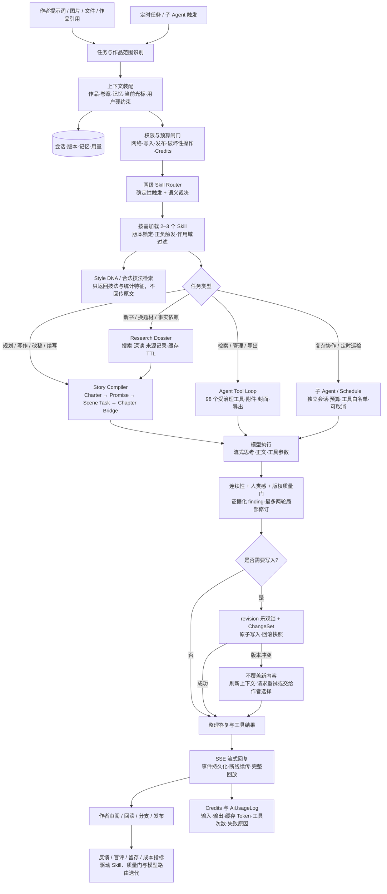
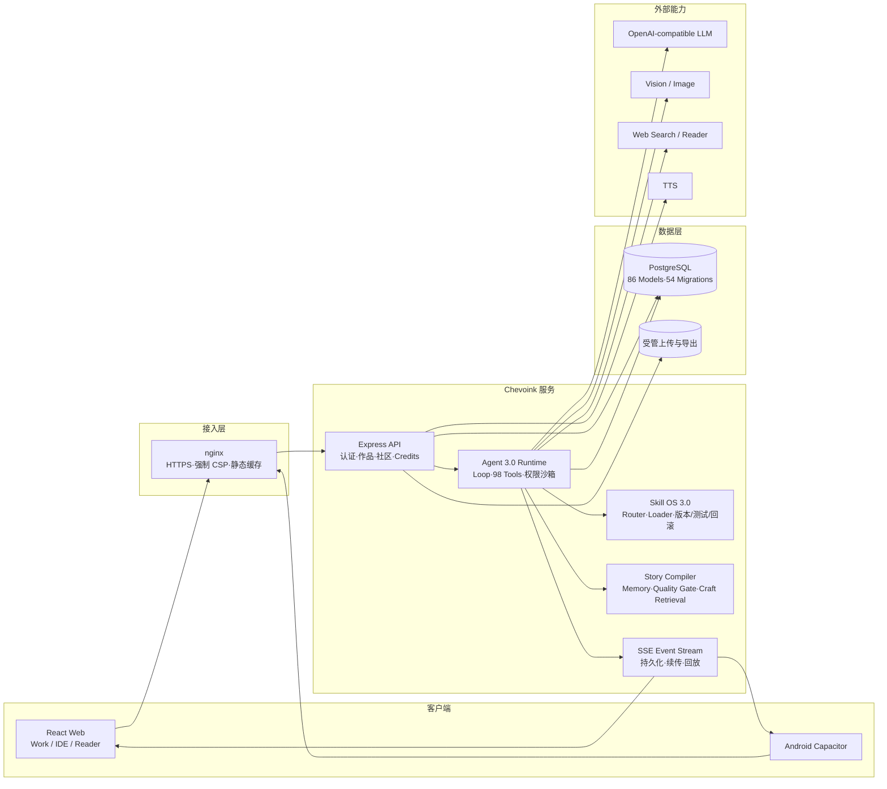

#  启创墨域 Chevoink

**简体中文** | [English](./README.en.md)

这是一个 AI 应用——AI 驱动的全栈小说创作与阅读平台。**Chevoink Agent 3.0** 把题材研究、Story Charter、Skill OS、场景任务、长篇记忆、人类感质量门与版本化工具执行组织成一条可追踪创作流水线；读者可以在书城发现、追更、听书，社区提供帖子、话题与私信互动。支持网页端与安卓 APP（Capacitor 壳 + 应用内更新）。

线上地址：<https://chevoink.chevolink.com>

[](https://github.com/Xcy8010/chevoink/actions/workflows/ci.yml)
[](https://github.com/Xcy8010/chevoink/stargazers)
[](#license)
[](#技术栈)
[](#技术栈)
[](https://github.com/Xcy8010/chevoink/releases)
[](https://qun.qq.com/universal-share/share?ac=1&authKey=O%2Bhtn0O51Qt5fW67Pj%2BSV7v0QI1%2FESTce7xHduNryLjTadVyekW9TMJcs0Wd5Qap&busi_data=eyJncm91cENvZGUiOiIxNTg0NDMyMzUiLCJ0b2tlbiI6ImdkU3I4ckRWR1M1L3hjTklTTGxHUnVYdVJ6bFNJeXN0c2ozbk1qd0pEeXpZb0JrdkZsbVNyUGtXY3lHZUFGYXQiLCJ1aW4iOiIyNDQ5MTI5ODYyIn0%3D&data=ys8RFeB2nMSORLKaLMkGLLRE8N8WU2t9WCjktU9Dg5YogAZktMZLLLMTj5t2KvcXA8K4p4J2NLPUEV0FO9OpRw&svctype=4&tempid=h5_group_info)

## 产品预览

**桌面端**

<table>
  <tr>
    <td align="center"><br>书城与阅读链路</td>
    <td align="center"><br>创作区与 AI 写作 Agent</td>
  </tr>
</table>

**移动端**

<table>
  <tr>
    <td align="center"><br>手机端首页与社区</td>
    <td align="center"><br>手机端创作与阅读</td>
  </tr>
</table>

## Chevoink Agent 3.0

Agent 3.0 不是单次提示词生成器，而是围绕一部作品持续工作的有状态创作 Agent。它会先识别任务和作品阶段，再按需加载 2–3 个 Skill；需要调研时建立可缓存的 Research Dossier，需要写作时由 Story Compiler 把读者承诺、人物欲望、阻力、选择、代价与状态变化编译为场景任务；写后经过连续性与人类感质量检查，最后通过带 revision 的原子写入、ChangeSet 和事件流提交到工作区。

### 运行流程



### 系统架构



自动评测覆盖 24 个冻结中文网文场景、6 类题材、9 类任务和 12 类质量信号；CI 会保存带数据集 Hash、代码 SHA、模型与 Skill 版本的评测快照。自动指标用于回归定位，不能替代真实作者数据和至少三位目标题材读者/编辑的匿名盲评。

### 长任务连续执行

Agent 可以持续执行「写完整本书」这类长任务：任务没做完、还在产出真实进展时会自动续跑；同时内置多层防失控保护，避免重复劳动和 Credits 浪费。

## 快速导航

| 想做什么 | 去哪里 |
| --- | --- |
| 直接体验产品 | [线上地址](https://chevoink.chevolink.com)（网页端，无需安装） |
| 安装安卓 APP | [下载与安装教程](#下载与安装安卓-app) · [Releases 页面](https://github.com/Xcy8010/chevoink/releases) |
| 了解怎么用 | [使用教程](#使用教程) |
| 了解功能 | [功能一览](#功能一览) |
| 了解 Agent 3.0 | [运行流程与系统架构](#chevoink-agent-30) · [Agent 3.0 方案](./plan/23-Agent3.0中文网文人类化创作与技能生态升级方案.md) |
| 本地跑起来 | [快速开始](#快速开始) |
| 了解架构 | [技术栈](#技术栈) · [目录结构](#目录结构) |
| 深入工程细节 | [工程文档](./docs/ENGINEERING.md)（[English](./docs/ENGINEERING.en.md)）· [开发规范](./docs/DEVELOPMENT-STANDARDS.md)（[English](./docs/DEVELOPMENT-STANDARDS.en.md)）· [Agent 评测说明](./tests/agent-evals/README.md) |
| 部署上线 | [部署与发布](#部署与发布) · [环境变量](#环境变量) |
| 交流讨论 | [QQ 交流群 158443235](#交流群) |

## 下载与安装（安卓 APP）

两种方式任选其一：

1. **GitHub Releases（推荐）**
   - 打开 [Releases 页面](https://github.com/Xcy8010/chevoink/releases)，进入最新版本（如 `v1.50`）；
   - 在 Assets 中下载 `chevoink-vX.XX.apk` 到手机；
   - 点击安装。系统若提示「未知来源应用」，在弹窗中允许「本次安装」即可（APK 已使用发布密钥签名）。
2. **官网直装**
   - 手机浏览器访问 <https://chevoink.chevolink.com/download/chevoink.apk> 直接下载安装。

安装后无需手动升级：APP 启动时会自动检测新版本，站内条幅 / 设置页会提示更新并引导下载。网页端用户打开线上地址即是最新版。

## 使用教程

### 读者

1. **登录**：手机号 + 短信验证码，无需注册流程，首次登录自动建号；
2. **找书**：书城首页有轮播、榜单与分类推荐，也可搜索书名/作者；
3. **阅读**：进入正文后左右翻页，点击屏幕中央呼出菜单，可调字号、字体、纸色主题、翻页方式；阅读进度与书架自动云同步，换设备接着读；
4. **听书**：阅读器内开启 TTS 听书，支持切换音色与语速，翻页模式下有底部播放胶囊；
5. **互动**：书籍详情页可评论、点赞、收藏；社区区可发帖、参与话题、关注作者、私信聊天。

### 作者

1. 进入**创作区**即可直接与 Chevoink Agent 对话；零作品时会显示随机创作示例，点击只填入输入框，首次发送后 Agent 通过受作品范围校验的 `novel_create` 原子动作，把隐藏占位工作区完善为真实作品。新建任务对话为空时也会按当前作品随机推荐四个可继续构建的方向；
2. 在章节编辑器直接写作，或呼出 **Chevoink Agent 3.0**：默认最大权限自主执行（工具调用自动批准，保留追踪按钮），能按你的设定与知识集流式生成章节、改写润色，按需建立题材 Research Dossier，以 Story Charter、Reader Promise、Scene Task 和 Chapter Bridge 维持长篇因果与连续性，写后输出带原文证据的质量 finding；
3. 在 Work、IDE 或手机端的**作品技能**区管理 Skill OS 3.0：内置 Skill 按任务自动路由，私有 Skill 可由作者或 Agent 草拟，经过正/负触发测试后发布；每个版本都可锁定、停用和回滚，共享安装需作者确认，第三方源码必须登记许可证、归属与固定版本；
4. 输入框可附加**图片（≤6 张）与文件（≤3 个，pdf/docx/txt/md）**随提示词发送；支持多模态的模型直接接收图片像素，纯文本模型自动走安全视觉旁路，文件统一先读取再行动；对话内文件可点击打开、长文件内容默认折叠；
5. 用 **AI 封面生成**一键产出封面图（远程直链自动落盘本站）；也可以让 Agent 直接「查看当前封面」核对画面效果；
6. **一键导出**：沉浸模式工具栏、「…」更多菜单与手机端「更多」均可发起，勾选导出范围（规划/目录/章节/作品信息以及发布建议，章节可逐章自选），服务端打包 zip 直接下载，附 AI 按番茄小说官方词表生成的发布建议；也可在对话里让 Agent 按需导出（只导出指定章节、排除某部分内容）；
7. 从 Agent 标题栏进入**操作中心**：跨作品搜索、置顶或归档任务；从当前章节/运行快照 Fork 小说版本并比较、合并；启动带 Token 预算、取消和轨迹回放的调研/一致性/质量/设定子 Agent；配置定时巡检、工具权限沙箱，并比较 2–4 次真实运行的模型、推理强度、Token 与耗时；
8. 章节写完点击发布，读者端即刻可见；支持定时追更与章节管理。

### 公测 Credits

- 公测账户每天获得 **450 Credits**，在 **UTC+8 15:00** 重置；邀请奖励为独立余额，不随每日重置清零。
- 文本采用同时包含两类额度的套餐口径：**1 Credit 同时包含 10,000 输入 Token 与 1,000 输出 Token**，按两者使用比例的较大值扣费，而不是输入、输出分别相加；生图每次 6 Credits，联网搜索每次 2 Credits。
- 每位用户都有唯一邀请链接。仅新用户首次注册可领取：邀请人获得 300 Credits，被邀请人获得 120 Credits；同一新用户只能兑现一次。
- 余额低于 20% / 10% / 5% 时创作区提醒；用尽后安全停止任务，并可在 [`/account/usage`](/account/usage) 查看套餐、余额和逐笔记录。
- Agent 默认使用“极速”档（1.0x）和 high 推理强度；每个内置或自定义模型只显示自身支持的推理档位。标准 1.1x、性能 1.8x、极致 4.8x 需管理员完整配置 URL、API Key 与模型后才可使用。用户也可配置自带密钥的 OpenAI 兼容模型，密钥只加密保存、不可回显。

## 功能一览

- **阅读区**：书城首页（轮播、榜单、分类推荐）、书架与阅读进度云同步、沉浸式阅读器、TTS 听书
- **创作区**：Codex 风格 Work/IDE 工作区、Agent 3.0（Research Dossier、Skill OS、Story Compiler、Chapter Bridge、人类感质量门、合法技法检索、作者私有 Style DNA、前三章试制与专家盲评链路）、跨作品任务搜索/置顶/归档、分支/差异/冲突安全合并、内嵌子 Agent、定时任务、权限沙箱、运行回放、多模态附件、联网与站内调研、跨会话记忆、作品关系网、AI 封面与范围化 ZIP 导出
- **社区**：帖子与话题系统、推荐算法、评论/点赞/收藏、关注与粉丝、私信与在线状态
- **账号体系**：手机号验证码登录（腾讯云短信）、HttpOnly Cookie 会话 + Bearer 备选通道（安卓壳杀后台不掉登录）、公测 Credits 与唯一邀请奖励
- **管理后台**：数据看板、用户/作品/内容治理、内置模型与加密密钥管理、Credits 单用户与批量重置/暂停、Token 用量排行与创作任务下钻、联网/生图调用统计、移动端适配
- **安卓客户端**：Capacitor 壳加载远程站点，应用内检测更新与 APK 分发

## 技术栈

| 层 | 技术 |
| --- | --- |
| 前端 | React 18 · Vite 6 · TypeScript · TailwindCSS · React Query 5 · Zustand 5 · React Router 7 |
| 后端 | Express 4 · Prisma 6 · PostgreSQL · Zod |
| AI | DeepSeek 文本生成 · 智谱 GLM-4.1V 图像理解 · OpenAI 兼容图像生成 · Edge TTS 语音合成 · 博查联网搜索（多引擎降级） |
| Agent | Agent 3.0 Runtime（`api/lib/agent`）：统一 Loop、98 个受治理工具、Skill OS 3.0、Story Compiler、分层记忆、质量门、内嵌子 Agent、长任务自动续跑与防失控保护、持久化 SSE 事件流 |
| 测试 | Vitest + Supertest + Testing Library（单元、PostgreSQL 集成、真实 DOM 交互与冻结 Agent 评测；CI 70 个测试文件 / 402 项测试并执行覆盖率门禁） |
| 部署 | PM2 + nginx（生产）· GitHub Actions CI（push 即跑类型检查/lint/单测/集成测试）· 安卓 Capacitor 壳工程（独立仓库目录） |

## 目录结构

```
├── api/               # Express 后端（routes 路由、lib 业务模块、config 环境配置）
├── src/               # React 前端（app 壳与路由、features 业务域、components 通用组件）
├── shared/contracts/  # 前后端共享的类型契约
├── prisma/            # 数据模型 schema 与迁移、种子数据
├── tests/             # 单元、PostgreSQL 集成、UI 交互与 Chevoink-CN-Fiction-Eval
├── docs/              # 工程文档（ENGINEERING 与 DEVELOPMENT-STANDARDS，均中英文双语）
├── plan/              # 28 篇阶段方案快照（含 Agent 预算与防死循环方案）+ 8 份并行执行清单
├── deploy/            # nginx 配置与服务器部署脚本
├── scripts/           # 部署 / 推送 / 数据清理脚本
└── public/            # 静态资源
```

## 快速开始

```bash
# 1. 安装依赖
npm install

# 2. 配置环境变量（参考 .env.example，填入数据库连接、AI Key 等）
copy .env.example .env

# 3. 初始化数据库
npm run prisma:generate
npm run prisma:migrate:deploy
npm run prisma:seed   # 可选：种子数据

# 4. 启动开发（前端 Vite + 后端 nodemon 并行）
npm run dev
```

常用脚本：

| 命令 | 说明 |
| --- | --- |
| `npm run dev` | 前后端并行开发 |
| `npm run check` | TypeScript 类型检查 |
| `npm run test` | 运行全部 Vitest 测试 |
| `npx vitest run --coverage` | 运行测试并执行本地/CI 双基线覆盖率门禁 |
| `npm run agent3:eval` | 生成带版本、Hash 与代码 SHA 的 Agent 3.0 确定性评测快照 |
| `npm run lint` | ESLint 检查 |
| `npm run build` | 生产构建 |
| `npm run deploy:prod` | 一键部署到生产服务器 |

## 部署与发布

- **生产部署**：`npm run deploy:prod`（本地闸门：类型检查 → 测试 → 生产依赖安全审计 → 构建；然后打包上传 → 远端迁移/构建 → PM2 重载 → 健康检查）
- **推送 GitHub**：`powershell -ExecutionPolicy Bypass -File scripts\push-to-github.ps1`，支持 `-Tag v1.50 -ReleaseAsset <apk路径>` 打 Tag 并发布 Release（附安卓 APK）
- **安卓 APK**：由独立的 Capacitor 壳工程构建，通过应用内更新条幅 / 设置页检测更新分发

## 环境变量

所有密钥通过 `.env` 注入（数据库、会话签名、腾讯云短信、AI 服务等），模板见 [.env.example](.env.example)。模型配置的 API Key 使用 AES-256-GCM 加密落库，生产环境应单独设置 `MODEL_CONFIG_ENCRYPTION_KEY`；该密钥只能备份和轮换，不能丢失。`.env`、证书、密钥库等敏感文件均已被 `.gitignore` 排除，不会进入仓库。

## 交流群

欢迎加入 **启创墨域交流群**（QQ 群号：`158443235`），讨论使用体验、反馈问题或参与共建：

[点击加入 QQ 交流群](https://qun.qq.com/universal-share/share?ac=1&authKey=O%2Bhtn0O51Qt5fW67Pj%2BSV7v0QI1%2FESTce7xHduNryLjTadVyekW9TMJcs0Wd5Qap&busi_data=eyJncm91cENvZGUiOiIxNTg0NDMyMzUiLCJ0b2tlbiI6ImdkU3I4ckRWR1M1L3hjTklTTGxHUnVYdVJ6bFNJeXN0c2ozbk1qd0pEeXpZb0JrdkZsbVNyUGtXY3lHZUFGYXQiLCJ1aW4iOiIyNDQ5MTI5ODYyIn0%3D&data=ys8RFeB2nMSORLKaLMkGLLRE8N8WU2t9WCjktU9Dg5YogAZktMZLLLMTj5t2KvcXA8K4p4J2NLPUEV0FO9OpRw&svctype=4&tempid=h5_group_info)

## License

本项目基于 [GNU AGPL-3.0 License](LICENSE) 开源：可自由使用、修改与分发；**若作为在线服务（SaaS / 网络服务器）对外提供，须向该服务用户提供对应、可修改的源代码**。需要闭源商业化部署时，请另行取得原作者的[商业授权](./docs/COMMERCIAL-LICENSE.md)。

## 特别鸣谢

Chevoink 是独立设计与实现的开源项目。在 Agent 3.0、小说工程结构和创作区体验的演进过程中，以下优秀开源项目提供了重要参考：

| 开源项目 | Chevoink 中的参考位置 | 主要参考内容 |
| --- | --- | --- |
| [OpenAI Codex](https://github.com/openai/codex) | 写作 Agent Loop、Work 模式、任务与工具执行过程、上下文整理 | Agent-first 工作流、可追踪工具调用、长任务连续执行、上下文压缩，以及克制的工作台信息层级与可折叠侧栏思路 |
| [OpenFic](https://github.com/syrizelink/OpenFic) | IDE 模式、作品树、卷章结构、小说检索与创作 Skill | 面向小说创作的 IDE 信息架构、`卷 → 章`领域模型、面板布局持久化、章节检索流程及开放式创作能力组织方式 |
| [TencentDB Agent Memory](https://github.com/TencentCloud/TencentDB-Agent-Memory) | Agent 长篇作品记忆、人物关系、事件与冲突审核 | 分层记忆、来源与版本追踪、混合召回、记忆更新和冲突治理等工程思路 |
| [DeepSeek Harness](https://github.com/deepseek-ai/deepseek-harness) | Work / IDE 对话区的思考过程与工具活动 UI | 推理过程的渐进披露、执行状态表达，以及工具调用记录的紧凑视觉层级 |
| [React Flow / xyflow](https://github.com/xyflow/xyflow) | 作品记忆关系图 | 直接使用 `@xyflow/react` 实现关系图的拖拽平移、缩放、视口适配、控制器和缩略图导航 |

上述项目主要用于架构研究、产品交互与工程原则参考；除项目依赖清单中明确引入的第三方软件外，Chevoink 的业务代码均结合自身技术栈与小说创作场景重新设计实现。感谢这些项目及其贡献者推动开源 Agent 与创作工具生态持续发展。
