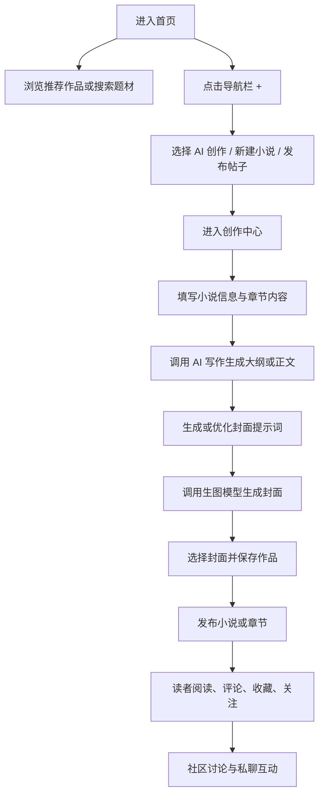

# AI 小说创作网站产品方案与 PRD

## 1. 产品概述

这是一个面向 `创作者 + 读者` 的 AI 小说创作社区网站，核心目标是把 `灵感生成 -> AI 写作成稿 -> 小说发布 -> AI 封面生成 -> 阅读互动 -> 评论聊天` 做成一条完整链路。

- 目标用户：原创小说创作者、轻度写作爱好者、网文读者、同人社区用户
- 核心价值：降低小说创作与发布门槛，同时让阅读、讨论、关注、聊天自然发生
- 公司品牌：`启创联科 ChevoLink`
- 推荐产品中文名：`启创墨域`
- 推荐产品英文辅助名：`ChevoInk`

## 1.1 产品命名与定位

### 命名方案

- 中文主名：`启创墨域`
- 英文辅助名：`ChevoInk`
- 推荐展示方式：
  - 顶部品牌名：`启创墨域`
  - 页面副标题：`AI 小说创作与阅读社区`

### 命名理由

- `启创`：延续公司品牌识别
- `墨`：对应写作、文本、创作
- `域`：比“站”“工具”更像内容世界与社区空间
- `ChevoInk`：简洁、好记，兼顾品牌来源与文字创作语义

## 1.2 第一版产品定位

第一版不做成“全功能网文大站”，而聚焦在一个更容易打透的方向：

> 一个界面顺手、上手极低、以 AI 写作为核心能力，并支持封面生成的原创小说社区网站。

第一版必须做到：

- 能轻松写
- 能正式发
- 能方便读
- 能自然评
- 能快速生成封面
- 能在手机、平板、电脑上分别顺手使用

---

## 2. 核心功能

### 2.1 用户角色

| 角色 | 注册方式 | 核心权限 |
|------|----------|----------|
| 游客 | 免登录浏览 | 浏览首页、搜索作品、阅读公开内容、查看评论 |
| 普通用户 | 手机号/邮箱注册登录 | 阅读、收藏、评论、点赞、关注、发帖、私聊 |
| 创作者 | 注册后开通创作身份 | 新建小说、章节管理、发布作品、上传封面、使用 AI 写作生成大纲与正文 |
| 管理员 | 后台账号 | 审核内容、处理举报、管理话题和用户 |

### 2.2 功能模块

1. **首页发现页**：推荐流、分类、榜单、搜索、热门话题
2. **小说详情页**：简介、标签、目录、评论、相关推荐、作者信息
3. **阅读页**：沉浸阅读、章节切换、字体设置、评论入口、书签记录
4. **创作中心**：新建小说、章节编辑、草稿管理、发布状态、封面管理
5. **AI 写作工作台**：生成大纲、按大纲起草章节、直接续写正文、改写与润色成稿
6. **AI 封面中心**：根据小说主题优化封面提示词，并调用生图模型生成封面
7. **社区广场**：帖子发布、话题流、互动评论、点赞、收藏
8. **聊天中心**：私聊会话列表、消息发送、未读消息提醒
9. **作者主页**：作者简介、作品列表、动态、粉丝数、关注入口
10. **个人中心**：书架、阅读记录、收藏、评论记录、帖子记录、草稿入口

### 2.3 页面明细

| 页面名称 | 模块名称 | 功能说明 |
|-----------|-----------|-----------|
| 首页 | 顶部导航 | Logo、搜索、分类、通知、用户入口 |
| 首页 | 推荐流 | 推荐作品、最新更新、热门作品、编辑精选 |
| 首页 | 快捷创作入口 | 底部/顶部 `+` 入口，进入创作动作面板 |
| 首页 | 热门话题区 | 展示社区热帖、征文活动、创作挑战 |
| 小说详情页 | 作品头图区 | 封面、书名、作者、标签、状态、字数 |
| 小说详情页 | 简介与目录 | 作品简介、角色简介、章节目录、更新状态 |
| 小说详情页 | 评论互动区 | 精选评论、最新评论、发表评论 |
| 阅读页 | 正文区 | 沉浸阅读、章节翻页、段落定位 |
| 阅读页 | 阅读工具栏 | 字号、行高、背景色、目录、书签、评论入口 |
| 创作中心 | 小说工作台 | 小说基本信息、标签、简介、封面、章节列表 |
| 创作中心 | 编辑器 | 富文本/Markdown 风格编辑、自动保存、章节字数统计 |
| 创作中心 | AI 写作侧栏 | 大纲生成、正文起草、直接续写、改写与润色成稿 |
| 创作中心 | AI 封面面板 | 主题提炼、提示词优化、封面生成、封面替换 |
| 社区广场 | 帖子流 | 发帖、话题、热议、图文混排、互动 |
| 聊天中心 | 会话列表 | 最近联系人、系统通知、未读数 |
| 聊天中心 | 消息面板 | 文本消息、作品分享卡片、帖子分享卡片 |
| 作者主页 | 作者信息区 | 简介、粉丝数、关注按钮、社交关系 |
| 作者主页 | 作品列表 | 已发布作品、连载中、完结作品、置顶作品 |
| 个人中心 | 书架与历史 | 收藏作品、阅读进度、最近浏览 |

---

## 3. 主要流程

### 3.1 关键业务流程

用户进入首页后，可以先像普通小说平台一样浏览推荐作品、搜索题材和进入阅读；也可以点击导航中的 `+` 直接开始创作。创作者在创作中心输入主题或大纲后，可以调用 AI 直接生成章节大纲、起草正文、续写后续内容或改写当前章节。小说基础信息完善后，用户可使用 `AI 封面` 能力，将小说主题、世界观、主角信息自动优化成高质量封面提示词，再调用生图模型生成候选封面。创作者确认后即可发布小说或发布新章节。作品发布后，读者进入详情页和阅读页进行评论、收藏、点赞、分享，社区广场和聊天中心则继续放大讨论与互动。

### 3.2 AI 封面核心流程

这是本产品的关键差异化能力，流程必须足够简单：

1. 用户在小说信息中填写主题、题材、主角、世界观或简介
2. 系统自动提炼关键信息
3. AI 将原始主题优化为适合生图模型的封面提示词
4. 用户可微调提示词
5. 发送至生图模型生成 1-4 张候选封面
6. 用户选择一张设为正式封面，或重新生成

---

## 4. 用户界面设计

### 4.1 设计风格

- 总体风格：`极简、克制、内容优先的企业级内容社区`
- 气质关键词：`安静、顺手、专业、可长期停留`
- 主色：石墨黑、暖白、低饱和灰蓝
- 辅助色：克制的青灰/墨蓝，仅用于选中、链接、重点状态
- 强调色：谨慎使用深墨色按钮，不使用高饱和霓虹色
- 按钮风格：大圆角但扁平、无塑料感、低阴影
- 字体策略：中文优先现代无衬线，阅读正文与控制界面做区分
- 布局风格：信息层级清楚，不堆“AI 炫技感”装饰
- 图标规范：统一 SVG 图标，禁止 emoji

### 4.2 页面设计概览

| 页面名称 | 模块名称 | UI 设计说明 |
|-----------|-----------|--------------|
| 首页 | 顶部导航 | 左侧品牌，中间搜索与分类，右侧通知、头像 |
| 首页 | 主内容区 | 推荐流 + 榜单 + 热门话题，保证进入后立即能“读” |
| 首页 | 中间 `+` 入口 | 像 TikTok 一样把创作入口升为一级动作 |
| 小说详情页 | 作品头部信息 | 大封面、书名、标签、作者、简介，首屏决策足够完整 |
| 阅读页 | 正文区域 | 极简正文，弱化外围装饰，工具栏按需呼出 |
| 创作中心 | 工作台布局 | 左侧章节与项目结构，中间编辑器，右侧 AI 写作/封面 |
| 社区广场 | 帖子流 | 类内容社区的信息流布局，强调轻互动 |
| 聊天中心 | 双栏消息 | 左侧会话列表，右侧聊天详情 |

### 4.3 响应式原则

- **手机端**：底部导航固定，中间 `+` 为主创作入口，内容流单列，阅读页全屏优先
- **平板端**：双栏为主，阅读与目录、创作与 AI 面板可以并排
- **电脑端**：支持双栏/三栏工作台，适合长文本编辑和多任务管理
- **禁止**：三端只靠 CSS 缩放；必须根据屏幕尺寸重新分配导航、侧栏和操作路径

### 4.4 核心交互细节

- 导航栏中间 `+` 点击后弹出轻量动作面板：
  - AI 创作
  - 新建小说
  - 发布章节
  - 发布帖子
- 创作中心自动保存草稿，避免丢稿
- AI 写作结果默认作为可直接使用的正文产物，支持追加、替换、另存版本与撤销
- AI 封面提示词默认先自动优化，再允许用户手动编辑
- 作品封面支持：
  - 上传本地封面
  - 使用 AI 生成封面
  - 在已有候选中切换
- 阅读页评论入口不抢正文空间，采用底部抽屉或侧边弹层
- 手机端聊天入口与通知分离，避免误触

---

## 5. 第一版范围

### 5.1 第一版必做

- 用户注册登录
- 首页推荐与分类发现
- 小说详情页
- 阅读页
- 作者主页
- 创作中心
- 小说新建与章节发布
- AI 写作：大纲、起草章节、续写、改写、润色
- AI 封面提示词优化
- 调用生图模型生成封面
- 评论系统
- 发帖系统
- 私聊聊天
- 收藏、点赞、关注
- 手机/平板/电脑三端适配

### 5.2 第一版建议增强

- 草稿箱版本记录
- 评论精选与热评排序
- 话题活动页
- 作品举报与内容审核基础流程
- 阅读书签与最近阅读进度
- 封面多版本管理

### 5.3 第一版不建议做

- 复杂签约系统
- 稿费结算体系
- 多级编辑后台
- 音频书、动态漫、多媒体 IP 体系
- 大型推荐算法平台
- 复杂商业化投放与广告系统

---

## 6. 成功标准

第一版只要达到以下指标，就说明方向正确：

- 新用户在 30 秒内能找到“开始创作”入口
- 创作者在 5 分钟内能完成“新建小说 + 写一章 + 生成封面 + 发布”
- 读者在 10 秒内能进入一部作品的正文阅读
- 评论与帖子互动能形成内容回流，而不是孤立功能
- 手机端阅读和评论体验明显优于桌面压缩版网站
- 平板端创作体验不只是大号手机，而是真正能写
- AI 封面功能能显著减少用户“不会写提示词”的阻力

---

## 7. 页面优先级建议

### P0 页面

- 首页
- 小说详情页
- 阅读页
- 创作中心
- 登录注册

### P1 页面

- 社区广场
- 聊天中心
- 作者主页
- 个人中心

### P2 页面

- 活动页
- 榜单页
- 搜索结果页
- 设置页

---

## 8. 产品结论

`启创墨域` 的核心不在于“让 AI 写完小说”，而在于提供一个比传统小说平台更轻、更顺、更现代的创作和阅读闭环。

它应当同时满足两件事：

- 对创作者来说：像一个顺手的轻工作台
- 对读者来说：像一个愿意长期停留的内容社区

如果第一版能把 `创作 + 封面 + 发布 + 阅读 + 评论 + 社区` 六件事打通，这个项目就已经具备产品级落地价值。
