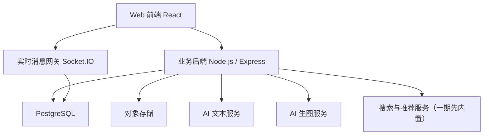
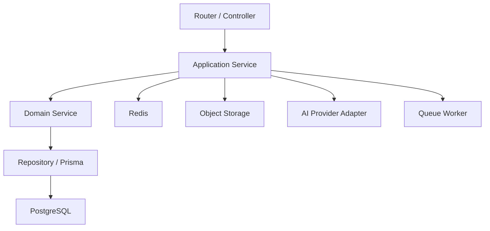
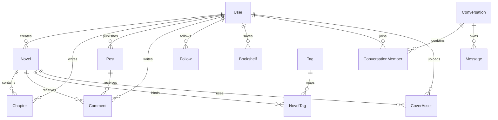

# AI 小说创作网站技术架构方案

## 1. 架构设计

这个项目和本地 AI 工具不一样，它是一个面向多用户的正式内容平台，因此不能采用“纯前端 + 本地缓存”的简化方案，而应采用：

> `Web 前端 + 业务后端 + 实时服务 + 数据库 + 对象存储 + AI 能力服务`

推荐总体架构如下：



### 1.1 为什么采用这套结构

- 需要用户系统、作品数据、评论数据、消息数据
- 需要章节、草稿、封面、帖子等复杂实体
- 需要评论和聊天的实时提醒
- 需要对 AI 文本生成和 AI 生图生成做统一编排
- 需要后续支持审核、推荐、活动、通知等平台能力

---

## 2. 技术栈建议

- 前端：`React 18 + TypeScript + Vite`
- UI：`Tailwind CSS + 自定义组件体系`
- 状态管理：`Zustand`
- 服务端状态请求：`TanStack Query`
- 路由：`React Router`
- 表单：`React Hook Form + Zod`
- 后端：`Node.js + Express + TypeScript`
- ORM：`Prisma`
- 数据库：`PostgreSQL`
- 实时通信：`Socket.IO`
- 缓存与会话：`Redis`
- 文件存储：`S3 兼容对象存储` 或 `MinIO`
- 鉴权：`JWT + Refresh Token + HttpOnly Cookie`
- 富文本/长文编辑：`TipTap` 或 `Lexical`
- 队列：`BullMQ`
- AI 文本服务：统一走服务端编排
- AI 生图服务：通过服务端代理生成小说封面

## 2.1 技术选择原则

- 前端沿用你偏好的 `React + TypeScript + Vite`
- 服务端保留 `Express` 路线，降低工程切换成本
- 尽量少引入过度庞大的外部平台依赖
- 数据、封面、评论、消息等核心资产必须落在可控服务端
- 所有 AI 调用必须在后端统一收口，避免密钥暴露

---

## 3. 路由定义

第一版建议采用单页应用，但不是单页面产品，而是多路由内容社区。

| 路由 | 作用 |
|------|------|
| `/` | 首页推荐流 |
| `/discover` | 分类、榜单、专题发现页 |
| `/novel/:novelId` | 小说详情页 |
| `/novel/:novelId/read/:chapterId` | 阅读页 |
| `/author/:authorId` | 作者主页 |
| `/community` | 社区广场 |
| `/post/:postId` | 帖子详情页 |
| `/messages` | 聊天中心 |
| `/create` | 创作动作中转页或桌面端创作入口 |
| `/studio` | 创作中心首页 |
| `/studio/novel/:novelId` | 小说创作工作台 |
| `/me` | 个人中心 |
| `/settings` | 用户设置页 |
| `/login` | 登录页 |
| `/register` | 注册页 |

### 3.1 三端导航差异

- 手机端：底部导航 + 中间 `+`
- 平板端：顶部导航 + 底部快捷动作
- 电脑端：顶部主导航 + 左侧创作入口 + 右侧消息/通知

---

## 4. API 设计

## 4.1 鉴权与用户

### `POST /api/auth/register`

```ts
type RegisterRequest = {
  email?: string
  phone?: string
  password: string
  nickname: string
}
```

### `POST /api/auth/login`

```ts
type LoginRequest = {
  account: string
  password: string
}
```

### `GET /api/users/me`

返回当前登录用户资料、身份状态、创作者状态、未读消息数。

## 4.2 小说与章节

### `POST /api/novels`

```ts
type CreateNovelRequest = {
  title: string
  displayTitle?: string
  summary: string
  categoryId: string
  tags: string[]
  coverImage?: string
  coverPrompt?: string
  publishStatus: "draft" | "published"
}
```

### `PATCH /api/novels/:novelId`

更新小说元信息、封面、简介、标签、展示状态。

### `POST /api/novels/:novelId/chapters`

```ts
type CreateChapterRequest = {
  title: string
  content: string
  status: "draft" | "published" | "scheduled"
}
```

### `GET /api/novels/:novelId/detail`

返回详情页所需完整信息：

- 作品基础信息
- 目录
- 作者信息
- 评论摘要
- 相关推荐

## 4.3 评论与社区

### `POST /api/comments`

```ts
type CreateCommentRequest = {
  targetType: "novel" | "chapter" | "post"
  targetId: string
  content: string
  parentId?: string
}
```

### `POST /api/posts`

```ts
type CreatePostRequest = {
  content: string
  topicId?: string
  images?: string[]
  relatedNovelId?: string
}
```

## 4.4 AI 写作与封面

### `POST /api/ai/novel-outline`

```ts
type GenerateOutlineRequest = {
  theme: string
  genre: string
  tone?: string
  targetLength?: "short" | "medium" | "long"
}
```

### `POST /api/ai/chapter-assist`

```ts
type ChapterAssistRequest = {
  mode: "continue" | "rewrite" | "polish" | "summarize"
  content: string
  novelContext?: string
}
```

说明：

- 该接口返回的不是“建议提示”，而是当前模式下可直接使用的正文结果
- `continue` 用于直接续写后文
- `rewrite` / `polish` 用于直接生成新版正文
- `summarize` 用于提炼当前章节摘要

### `POST /api/ai/cover-prompt`

```ts
type GenerateCoverPromptRequest = {
  novelTitle: string
  summary: string
  genre: string
  protagonist?: string
  stylePreference?: string
}

type GenerateCoverPromptResponse = {
  prompt: string
  negativePrompt?: string
  visualKeywords: string[]
}
```

### `POST /api/ai/cover-image`

```ts
type GenerateCoverImageRequest = {
  modelConfigId: string
  prompt: string
  size: string
  count: number
}
```

## 4.5 聊天

### `GET /api/conversations`

返回会话列表、未读数、最后一条消息摘要。

### `POST /api/conversations/:conversationId/messages`

```ts
type SendMessageRequest = {
  type: "text" | "novel_card" | "post_card"
  content: string
  relatedId?: string
}
```

---

## 5. 服务端架构



### 5.1 分层建议

- `routes/controllers`：参数解析、鉴权入口、响应格式统一
- `services`：业务编排，例如发布小说、生成封面、发评论
- `repositories`：数据库访问
- `adapters`：AI 文本服务、生图服务、对象存储、消息推送
- `workers`：异步任务处理，如封面生成、通知分发、敏感内容检测

### 5.2 为什么要有队列

以下操作不适合阻塞在同步请求里：

- AI 封面生成
- 批量消息通知
- 热门榜单计算
- 封面审核和压缩
- 搜索索引更新

---

## 6. 数据模型

## 6.1 ER 模型



## 6.2 核心表结构定义

### 用户表 `users`

```sql
CREATE TABLE users (
  id UUID PRIMARY KEY,
  email VARCHAR(255) UNIQUE,
  phone VARCHAR(32) UNIQUE,
  password_hash VARCHAR(255) NOT NULL,
  nickname VARCHAR(64) NOT NULL,
  avatar_url TEXT,
  bio TEXT,
  role VARCHAR(20) NOT NULL DEFAULT 'user',
  is_author BOOLEAN NOT NULL DEFAULT FALSE,
  created_at TIMESTAMP NOT NULL DEFAULT NOW(),
  updated_at TIMESTAMP NOT NULL DEFAULT NOW()
);
```

### 小说表 `novels`

```sql
CREATE TABLE novels (
  id UUID PRIMARY KEY,
  author_id UUID NOT NULL REFERENCES users(id),
  title VARCHAR(128) NOT NULL,
  display_title VARCHAR(128),
  summary TEXT NOT NULL,
  category_id UUID,
  cover_asset_id UUID,
  cover_prompt TEXT,
  status VARCHAR(20) NOT NULL DEFAULT 'draft',
  word_count INT NOT NULL DEFAULT 0,
  comment_count INT NOT NULL DEFAULT 0,
  favorite_count INT NOT NULL DEFAULT 0,
  view_count INT NOT NULL DEFAULT 0,
  published_at TIMESTAMP,
  created_at TIMESTAMP NOT NULL DEFAULT NOW(),
  updated_at TIMESTAMP NOT NULL DEFAULT NOW()
);
```

### 章节表 `chapters`

```sql
CREATE TABLE chapters (
  id UUID PRIMARY KEY,
  novel_id UUID NOT NULL REFERENCES novels(id),
  author_id UUID NOT NULL REFERENCES users(id),
  title VARCHAR(128) NOT NULL,
  content TEXT NOT NULL,
  order_index INT NOT NULL,
  word_count INT NOT NULL DEFAULT 0,
  status VARCHAR(20) NOT NULL DEFAULT 'draft',
  published_at TIMESTAMP,
  created_at TIMESTAMP NOT NULL DEFAULT NOW(),
  updated_at TIMESTAMP NOT NULL DEFAULT NOW()
);
```

### 封面资源表 `cover_assets`

```sql
CREATE TABLE cover_assets (
  id UUID PRIMARY KEY,
  user_id UUID NOT NULL REFERENCES users(id),
  source_type VARCHAR(20) NOT NULL,
  image_url TEXT NOT NULL,
  prompt TEXT,
  model_name VARCHAR(128),
  width INT,
  height INT,
  created_at TIMESTAMP NOT NULL DEFAULT NOW()
);
```

### 评论表 `comments`

```sql
CREATE TABLE comments (
  id UUID PRIMARY KEY,
  user_id UUID NOT NULL REFERENCES users(id),
  target_type VARCHAR(20) NOT NULL,
  target_id UUID NOT NULL,
  parent_id UUID,
  content TEXT NOT NULL,
  like_count INT NOT NULL DEFAULT 0,
  created_at TIMESTAMP NOT NULL DEFAULT NOW()
);
```

### 帖子表 `posts`

```sql
CREATE TABLE posts (
  id UUID PRIMARY KEY,
  user_id UUID NOT NULL REFERENCES users(id),
  topic_id UUID,
  related_novel_id UUID,
  content TEXT NOT NULL,
  image_urls JSONB,
  like_count INT NOT NULL DEFAULT 0,
  comment_count INT NOT NULL DEFAULT 0,
  created_at TIMESTAMP NOT NULL DEFAULT NOW()
);
```

### 消息表 `messages`

```sql
CREATE TABLE messages (
  id UUID PRIMARY KEY,
  conversation_id UUID NOT NULL,
  sender_id UUID NOT NULL REFERENCES users(id),
  message_type VARCHAR(20) NOT NULL DEFAULT 'text',
  content TEXT NOT NULL,
  related_id UUID,
  created_at TIMESTAMP NOT NULL DEFAULT NOW()
);
```

---

## 7. 三端实现策略

### 7.1 手机端

- 采用 `单列内容流 + 固定底部导航`
- 创作中心切换为分步式流程
- 阅读页全屏优先，评论抽屉化

### 7.2 平板端

- 首页双列卡片流
- 阅读页采用 `正文 + 目录/评论` 可切换双栏
- 创作中心为 `编辑器 + AI 写作` 双栏

### 7.3 电脑端

- 首页允许 `推荐流 + 榜单 + 热门话题` 复合布局
- 创作中心采用 `左侧小说结构 + 中间编辑器 + 右侧 AI 写作/封面面板`
- 聊天中心和通知支持常驻侧栏

---

## 8. 关键技术点

### 8.1 AI 封面生成链路

建议链路：

1. 后端提炼小说简介、题材、角色、世界观
2. 调用 AI 文本模型优化成封面提示词
3. 用户可在前端二次编辑提示词
4. 后端调用生图服务生成候选封面
5. 图片上传到对象存储
6. 作品封面引用存储资源，不直接引用第三方临时地址

### 8.2 创作自动保存

章节编辑器建议采用：

- 本地 5-10 秒节流保存
- 手动发布前服务端强制保存一次
- 版本记录至少保留最近若干次草稿快照

### 8.3 聊天与通知

第一版不做复杂即时通讯平台，但至少要支持：

- 私聊文本消息
- 作品卡片分享
- 帖子卡片分享
- 评论被回复、被点赞、收到关注的通知

### 8.4 内容审核

第一版建议至少具备：

- 文本敏感词过滤
- 图片基础审核
- 举报入口
- 管理员下架能力

### 8.5 搜索与推荐

第一版先不引入独立搜索集群，优先使用：

- PostgreSQL 全文检索
- 标签、分类、热度字段排序
- 近 7 日更新与互动分数

---

## 9. 开发阶段建议

### 第一阶段：MVP

- 用户系统
- 首页推荐
- 小说详情页
- 阅读页
- 创作中心
- AI 写作
- AI 封面提示词与生图
- 评论
- 收藏与关注

### 第二阶段：社区增强

- 帖子流
- 私聊
- 通知中心
- 作者主页增强
- 榜单与专题活动

### 第三阶段：平台增强

- 审核后台
- 活动运营工具
- 更复杂推荐策略
- 创作者数据看板
- 多模型路由与封面风格模板

---

## 10. 最终技术结论

如果目标是做一个真正能承载内容、社区和 AI 功能的小说平台，推荐的最稳方案是：

> `React + TypeScript + Vite + Express + PostgreSQL + Prisma + Redis + Socket.IO + 对象存储`

它既符合你现有偏好的技术路线，也足以支持：

- 小说创作
- 正式发布
- 多端阅读
- 评论帖子
- 实时聊天
- AI 封面生成

这套结构不会轻到后期撑不住，也不会一开始就重得失控。
