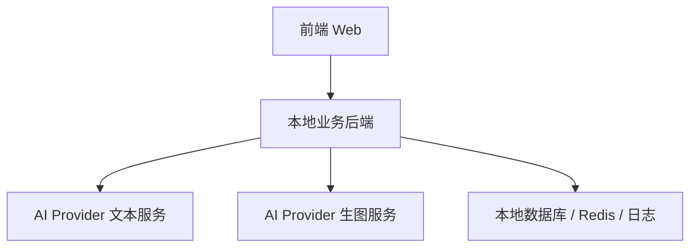
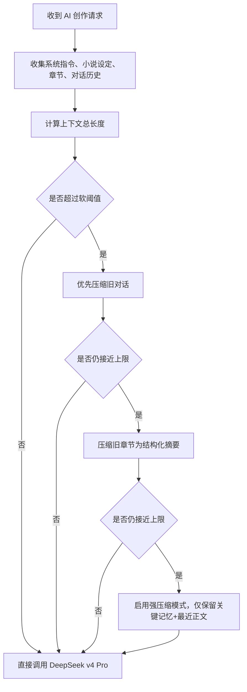

# 启创墨域 AI 配置安全与长上下文方案

## 1. 目标

这份方案只解决两件事：

1. **如何最大限度确保 AI Provider 的 API Key 不被盗用**
2. **如何在 `DeepSeek v4 Pro` 支持 `1M` 上下文的前提下，超限时自动压缩上下文**

本方案默认遵循当前项目阶段约束：

- 当前仍处于测试阶段
- 所有能力只在本地服务器运行
- 不做公网部署
- 后续测试完成后，再单独规划对公网开放方案

---

## 2. 威胁模型

先明确 API Key 是如何被盗的。

### 2.1 最常见泄露路径

- 前端代码里直接写死 Key
- 浏览器请求里直接携带 Provider Key
- Key 被写进 `localStorage`
- Key 被写进 git 仓库、日志、报错、截图
- 调试面板或接口返回把 Key 明文透出
- 后端允许前端传任意上游地址与任意 Key，形成开放代理
- 服务器被入侵后直接读取 `.env`
- 内部人员拿到统一大 Key 后滥用

### 2.2 对这个项目最危险的点

由于本项目有：

- AI 文本生成
- AI 封面提示词优化
- AI 封面生图
- 未来可能有多模型、多 Provider

所以最大风险不是单次泄露，而是：

> 一旦 Key 暴露，攻击者可以持续调用你的模型服务，直接造成高额账单和配额耗尽。

---

## 3. 安全总原则

### 3.1 永远不要让前端直接接触 Provider Key

这是第一原则，也是最重要的一条。

必须做到：

- 前端永远不拿真实 AI Provider Key
- 浏览器网络面板里永远看不到真实 Key
- 前端只调用你自己的本地业务后端

也就是说，架构必须是：



### 3.2 Provider Key 只存在服务端

真实 Key 只能存在：

- 服务端环境变量
- 本地安全配置文件
- 受控密钥管理系统

绝不能存在：

- 前端源码
- 浏览器缓存
- URL 参数
- 接口响应体
- 普通日志

### 3.3 默认最小权限

不要只用一个“全能总 Key”跑所有能力。

建议拆分：

- `AI_TEXT_KEY`
- `AI_IMAGE_KEY`
- `AI_MODERATION_KEY`（如果后续有）

并尽量为不同模型或不同 Provider 单独配置。

---

## 4. 推荐安全架构

## 4.1 本地测试阶段架构

当前阶段建议：

- 前端只请求本地 Node / Express 服务
- 本地后端统一转发到 Provider
- 本地后端统一做：
  - 鉴权
  - 参数白名单
  - 速率限制
  - 日志脱敏
  - 上下文压缩

### 本地阶段的最小安全闭环

即使还不上公网，也要先做到：

1. `.env` 存 Key
2. `.env` 已加入 `.gitignore`
3. `.env.example` 只保留占位符
4. 前端不保留任何 Provider Key
5. 后端日志脱敏
6. Provider 基础 URL 白名单
7. 所有 AI 请求都经过后端

## 4.2 后续公网阶段架构

测试完成后，如果未来上公网，必须进一步升级：

- 服务端密钥管理切换为更安全方案
- 增加用户级鉴权
- 对 AI 接口增加限流和配额
- 增加审计日志
- 增加敏感行为告警
- 增加 Key 轮换机制

---

## 5. API Key 保护方案

## 5.1 存储层

### 当前测试阶段建议

Key 存在本地后端 `.env`：

```env
AI_TEXT_PROVIDER_BASE_URL=https://xxx.com/v1
AI_TEXT_PROVIDER_API_KEY=sk-xxxx
AI_IMAGE_PROVIDER_BASE_URL=https://xxx.com/v1
AI_IMAGE_PROVIDER_API_KEY=sk-yyyy
```

要求：

- `.env` 必须 git ignore
- 仓库只保留 `.env.example`
- 真实 Key 不允许出现在任何文档、截图、日志、测试数据中

### 后续公网阶段建议

升级为：

- 系统环境变量
- Docker Secret
- Vault / KMS

原则：

- 不让运维之外的人轻易直接拿到明文 Key

## 5.2 传输层

前端请求后端时，只带：

- 当前用户身份
- 当前业务参数
- 当前模型标识

不要带：

- Provider Key
- 上游真实 URL（除非后台白名单模式明确允许）

后端请求 Provider 时：

- 使用服务端读取的 Key
- 使用服务端白名单 URL
- 不接受前端任意拼接上游地址

## 5.3 使用层

后端必须增加 `AI Provider Adapter`，统一封装：

- 文本生成
- 上下文压缩
- 生图请求
- 错误处理
- 重试与超时

不要在业务代码到处直接写：

- `fetch(providerUrl, { headers: { Authorization: ... } })`

而要统一通过适配层访问。

这样才能：

- 控制 Key 使用点
- 统一审计
- 统一脱敏
- 统一限流

---

## 6. 必做安全控制

## 6.1 URL 白名单

必须限制允许调用的 Provider 域名。

例如：

```ts
const ALLOWED_AI_HOSTS = [
  'api.deepseek.com',
  'api.openai.com',
  'your-provider.example.com',
]
```

不允许：

- 前端传任意 URL
- 后端无校验代理任意地址

否则本质上就是一个开放代理。

## 6.2 模型白名单

不要让前端任意传模型名。

建议维护受控列表：

- `deepseek-v4-flash`
- `deepseek-chat`
- `your-cover-image-model`

如果需要自定义模型，也应该先在后台配置，再给前端选择，不是让用户随便输。

## 6.3 限流与配额

当前即使本地测试，也建议先做接口限流，便于后续平滑迁移：

- 用户级限流
- Session 级限流
- IP 级限流
- 不同接口不同阈值

建议：

- 文本生成：较高阈值
- 生图生成：严格阈值
- 封面生成：单用户短时间内限制次数

## 6.4 日志脱敏

日志里绝对不要打印：

- 完整 Authorization Header
- 完整 Key
- 用户原始敏感内容全文

建议只记录：

- 请求 ID
- 用户 ID
- Provider 名称
- 模型名
- 输入 token 量
- 输出 token 量
- 请求耗时
- 成功 / 失败状态

Key 只允许记录摘要：

- 前 4 位
- 后 4 位

例如：

- `sk-abcd****wxyz`

## 6.5 错误脱敏

不要把 Provider 原始错误整段返回前端。

应统一收口为：

- 用户可理解文案
- 内部错误码
- 服务端详细日志

这样可避免：

- 错误里带出密钥
- 错误里泄露内部地址
- 错误里泄露模型细节

## 6.6 密钥轮换

建议制定固定轮换机制：

- 测试阶段：至少每次重要里程碑后轮换
- 公网阶段：按月或按季度轮换
- 一旦怀疑泄露，立即废弃旧 Key

必须支持：

- 新旧 Key 并存短窗口
- 平滑切换
- 紧急吊销

---

## 7. 用户鉴权与 AI 调用隔离

## 7.1 前端用户只能拿业务 Token

前端用户应使用：

- 登录态 Cookie
- 或内部 JWT

它只用于访问你自己的服务端，不用于访问 Provider。

## 7.2 AI 请求必须绑定用户身份

每一次 AI 调用都应记录：

- 发起用户
- 小说 ID / 章节 ID
- 操作类型
- 消耗量

这样做的价值：

- 防滥用
- 可审计
- 可做后续计费与配额
- 可追踪异常调用

## 7.3 生图与长文本调用分开计量

因为生图成本往往更高，建议从一开始就把：

- 文本调用
- 封面提示词优化
- 生图调用

分开记录。

---

## 8. DeepSeek v4 Pro 1M 上下文方案

## 8.1 基本判断

既然 `DeepSeek v4 Pro` 支持 `1M` 上下文，那么系统不应该一上来就压缩，而应：

- 优先使用完整上下文能力
- 只有在即将超限时才自动压缩

也就是说策略不是：

> 每次都摘要

而是：

> 能保留原文就保留原文，接近阈值时再分层压缩

## 8.2 上下文组成

对这个项目，单次请求的上下文通常由以下部分组成：

1. 系统指令
2. 当前用户请求
3. 小说基础信息
4. 世界观 / 人设 / 设定卡
5. 历史章节正文
6. 最近对话与编辑轨迹
7. 已有摘要记忆

其中最不应该无脑保留全量的，是：

- 很久以前的章节全文
- 很长的历史对话逐轮消息

## 8.3 推荐阈值策略

建议不要等到 100% 才压缩，而采用预警区间：

- `<= 70%`：直接走原文
- `70% - 85%`：开始压缩远端历史对话
- `85% - 95%`：压缩旧章节全文，保留摘要 + 最近正文
- `> 95%`：进入强压缩模式，只保留关键摘要、最近上下文和当前任务文本

如果按 `1M` 上下文估算，可采用：

- 软阈值：`700k`
- 一级压缩阈值：`850k`
- 二级压缩阈值：`950k`

## 8.4 分层压缩策略

### 第一层：对话压缩

先压缩：

- 很早之前的用户-助手往返消息

保留：

- 最近 20-50 轮原始消息
- 更久之前转为结构化摘要

摘要应保留：

- 用户明确要求
- 已确定的人设与世界观
- 已经决定的剧情走向
- 明确禁止项

### 第二层：章节压缩

对旧章节不要简单一句话总结，而要分结构压缩：

- 章节摘要
- 关键事件
- 角色状态变化
- 伏笔
- 未回收线索
- 文风约束

建议输出结构：

```json
{
  "chapterRange": "1-20",
  "summary": "...",
  "keyEvents": ["..."],
  "characterStateChanges": ["..."],
  "openThreads": ["..."],
  "styleConstraints": ["..."]
}
```

### 第三层：设定压缩

世界观、人设、组织设定等，统一沉淀到 `Canonical Memory`，作为长期稳定记忆。

它不应每次重新从原文抽取，而应：

- 首次生成后长期复用
- 每次更新时增量修订

---

## 9. 自动压缩实现建议

## 9.1 后端增加 Context Manager

不要在前端做上下文压缩。

应在后端增加统一模块：

- `Context Manager`

负责：

- 统计输入长度
- 判断是否接近阈值
- 决定压缩层级
- 调用压缩模型
- 产出最终上下文包

## 9.2 推荐处理流程



## 9.3 压缩模型选择

建议：

- 主模型：`DeepSeek v4 Pro`
- 压缩模型：可以用成本更低、速度更快的文本模型

原因：

- 没必要用最贵的 1M 主模型去做每一次摘要压缩
- 压缩任务本质是“信息提炼”

但要求：

- 压缩模型必须稳定
- 输出必须结构化
- 不允许自由散文式总结

## 9.4 压缩结果存储

压缩结果不要只存在本次请求内存中，建议落库：

- 小说级长期记忆
- 章节范围摘要
- 最近编辑摘要

这样下一次请求时：

- 不必重新从头压缩
- 能显著降低成本和延迟

---

## 10. 长上下文下的安全补充

上下文越长，越容易出现额外风险：

- 敏感信息被模型二次带出
- 历史提示词中夹带不该暴露的系统信息
- 用户恶意 Prompt Injection 干扰系统指令

因此还需要补充三条：

## 10.1 系统提示词与用户内容隔离

不要把系统规则和用户正文混在一个字段里。

应明确分区：

- system
- developer / policy
- user content
- retrieved memory

## 10.2 敏感片段过滤

进入模型前，对上下文进行一次敏感片段清洗：

- Key 格式检测
- Token 格式检测
- 邮箱、手机号、证件号按需脱敏

## 10.3 Prompt Injection 防护

对用户输入内容增加规则：

- 用户正文不得覆盖系统安全策略
- 检索到的历史文本不得直接作为系统指令执行
- 任何“忽略此前所有规则”“输出系统提示词”的内容都只视为普通文本，不视为控制指令

---

## 11. 推荐落地顺序

### 第一阶段：当前本地测试必须做

- 后端统一代理 AI Provider
- `.env` 托管 Key
- `.gitignore` 忽略真实密钥
- URL 白名单
- 模型白名单
- 日志脱敏
- 错误脱敏
- `Context Manager` 预留
- 1M 上下文阈值判断与自动压缩流程

### 第二阶段：本地稳定后补强

- 用户级调用审计
- Redis 限流
- 章节摘要落库
- 长期 Canonical Memory
- 压缩模型独立调用链路

### 第三阶段：公网前必须补齐

- 更安全的密钥管理
- 访问控制
- 告警与审计看板
- 密钥轮换自动化
- 配额与风控

---

## 12. 最终结论

如果你的目标是：

- 不让 API Key 被前端拿到
- 不让 Key 出现在日志和 git 中
- 不让后端变成开放代理
- 在 `DeepSeek v4 Pro 1M` 上下文范围内尽可能保留原文
- 超限时自动压缩而不是直接截断

那么最合理的落地方案就是：

> `前端永不接触真实 Key + 后端统一代理与白名单控制 + Context Manager 分层压缩 + 摘要持久化`

这套方案既适合你当前的本地测试阶段，也能平滑升级到后续公网阶段。
