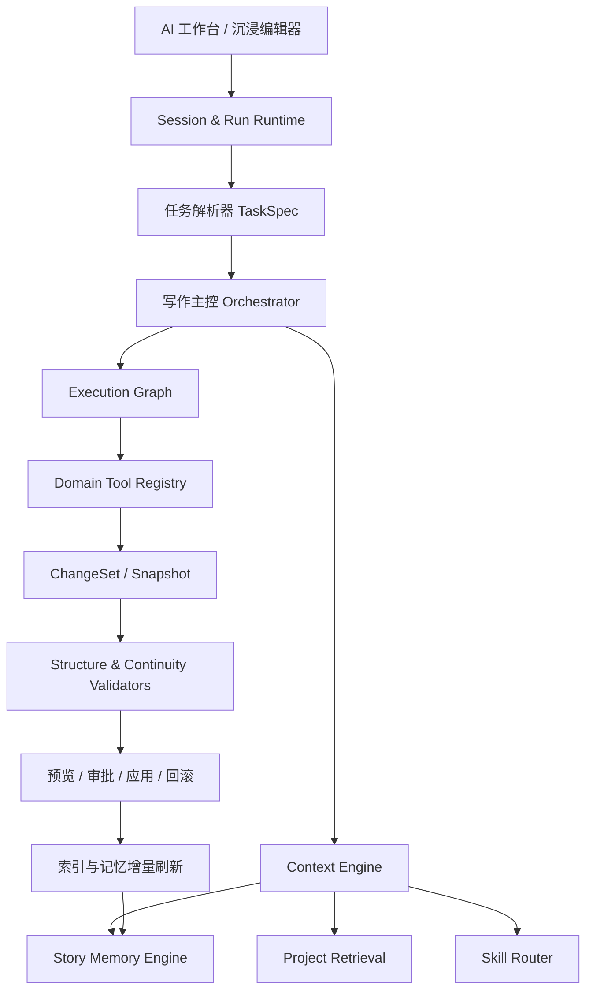
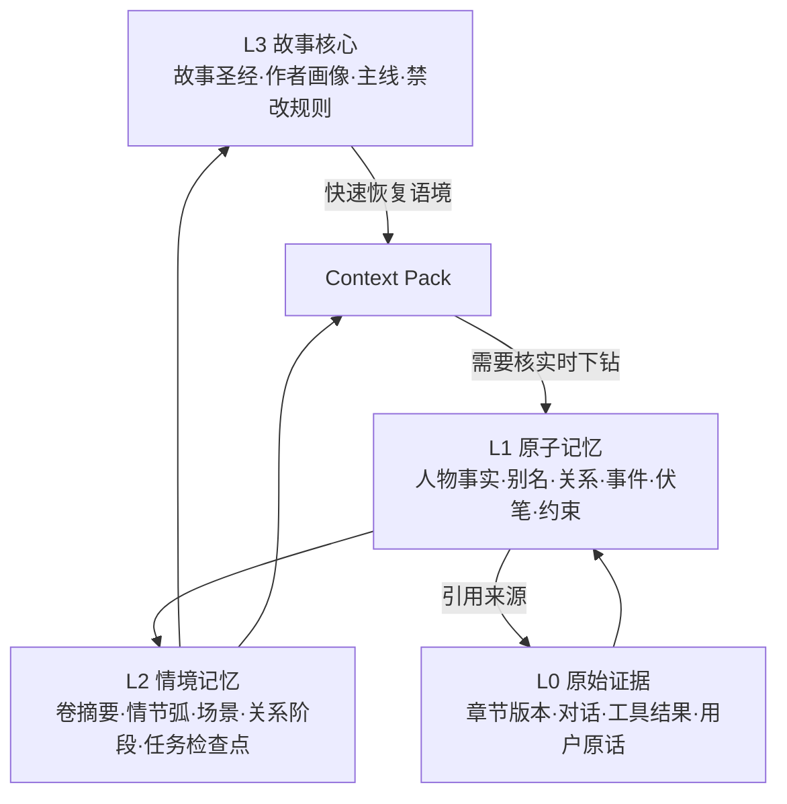

# Chevoink 创作区与 Agent 2.0 企业级迭代方案

> 文档版本：2.0 Draft
> 编制日期：2026-08-25
> 代码基线：`adfec6dd921b2fd490164bfb33797bd43bc53db5`
> 继承上下文：`docs/AGENT-HANDOFF.md`（2026-08-25，基于 `adfec6d`）
> 适用范围：创作区、沉浸创作、Agent Runtime、上下文与记忆、写作 Skill、卷章数据模型
> 文档性质：产品需求、技术架构、UI/UX、迁移与验收的一体化实施蓝图
> 前提：`plan/` 内既有 Agent 方案均视为 1.0 已落地记录，不作为本方案的目标态或实施依据

---

## 0. 执行摘要

Chevoink Agent 1.0 已经具备真实多轮工具循环、结构化事件、工具权限、审批/提问、任务清单、会话持久化、变更审查与回滚等扎实基础。2.0 不应再次重构这些已经存在的能力，而应解决长篇创作进入中后期后暴露出的系统性问题：

1. **从“单章编辑”升级为“全书工程”**：Agent 能先检索、再预览、后事务化修改整部小说；全局改名不再逐章读取和整段覆盖。
2. **从“摘要拼接”升级为“可追溯故事记忆”**：事实、人物、关系、事件、场景、伏笔、作者约束和对话决策均有结构、来源、版本与冲突状态。
3. **从“截断历史”升级为“上下文操作系统”**：稳定前缀、任务契约、故事状态、滚动压缩、近期原文与按需召回分层装配，且每个结论都能回到来源。
4. **从“模型自行记得收尾”升级为“变更集 + 不变量校验”**：插章、移章、拆章、合章、改名等动作必须同时维护卷章顺序、显示编号、标题、摘要、索引和记忆。
5. **从“固定写作公式”升级为“可组合创作能力”**：把硬约束与软技巧分离，Skill 按任务加载、可组合、可版本化、可评测，避免全局常驻模板造成同质化。
6. **从“章节列表”升级为“卷 → 章”领域模型**：卷成为一等实体，章节顺序以卷内顺序为准，全书顺序可计算，所有结构动作均事务化。
7. **从“一个拥挤工作台”升级为“一套内核、两种工作习惯”**：AI 工作台以对话和任务为主；沉浸编辑器以文本与结构为主。两种视图共享同一任务、文档、选择区、变更集和会话状态。

2.0 的核心不是增加更多 Prompt，而是建立一套可证明、可恢复、可审查、可度量的长篇创作系统。

---

## 1. 目标、边界与成功标准

### 1.1 产品愿景

让作者可以像管理一个长期软件项目一样管理一部长篇小说：Agent 能理解作品当前真实状态，知道用户过去做过哪些决定，在跨数十至数百章的范围内安全修改，并在写作质量与作者个性之间保持可控的创造力。

### 1.2 2.0 的核心目标

| 目标 | 用户可感知结果 | 工程判据 |
|---|---|---|
| 全书级改动 | “把林默改为林舟”一次完成，可预览、可排除、可回滚 | 多文档原子变更集；精确匹配零漏改、零误改 |
| 长期记忆 | 写到第 100 章仍知道人物关系、伏笔和作者要求 | 结构化记忆 + 混合召回 + 来源引用 + 冲突治理 |
| 上下文连续 | 长对话压缩后仍遵守未完成要求与关键决定 | 压缩检查点 + 用户约束账本 + 无损近期尾部 |
| 结构一致 | 插章/移章后卷章顺序、编号、标题、摘要不乱 | 领域不变量在事务提交前后自动校验 |
| 创作去公式化 | 不同作者、题材、场景的输出有明显差异 | Skill 软硬分层、创作画像、质量评测与人工盲评 |
| 双工作区 | 用户可在 AI 主导与编辑器主导之间无缝切换 | 共享状态内核；切换不丢任务、光标、选区和草稿 |

### 1.3 非目标

- 不重做 Agent 1.0 已有的工具循环、SSE 事件、权限、审批、回滚和会话持久化。
- 不以“更多子 Agent”作为效果指标。只有能降低错误率或上下文噪声时才委派。
- 不把整部小说、全部记忆或所有 Skill 常驻塞进系统提示词。
- 不承诺仅靠算法完全消除模型文风痕迹；2.0 提供可控机制、评测和作者主导权。
- 不在本阶段直接安装未经许可证、安全、质量评审的第三方 Skill。
- 不以复制 Codex 或 OpenFic 的界面为目标，只吸收信息架构与交互原则。

---

## 2. 当前实现基线与根因诊断

### 2.1 1.0 已有能力：全部继承

当前代码已经具备以下基础，不应推倒重来：

- `api/lib/agent/loop.ts`：多轮原生工具调用、停止/续跑、工具结果回填、回合与预算控制。
- `api/lib/agent/permissions.ts`：工具分级、审批与暂停恢复。
- `api/lib/agent/run-service.ts`：Session、Run、Message、Event、Artifact 的持久化与恢复。
- `api/lib/agent/tools/**`：章节读写、范围编辑、计划、记忆、封面等工具注册。
- `src/features/studio/stores/agentStore.ts`：前端运行态与消息态管理。
- Agent 消息分部渲染、任务清单、变更审查、快照和回滚。

2.0 的实现方式应是**在现有 Runtime 上增加领域能力和上下文内核**，而不是另建一套 Agent。

### 2.2 七个问题的代码级根因

| 用户问题 | 当前根因 | 2.0 治理方向 |
|---|---|---|
| 全局改名逐章执行 | 工具粒度以单章为主；无全书倒排索引、批量预览和多章事务 | Project Search + ChangeSet + Bulk Patch |
| 后期忘记前文 | `ProjectMemoryEntry` 主要是自由文本；`embeddingRef` 未进入真实召回 | 结构化故事图谱 + 混合检索 + 自动沉淀 |
| 忘记历史要求 | 历史超预算后仅丢弃并放置“已省略”提示 | 完整轮次压缩 + 约束账本 + 决策日志 |
| 插章后标题/顺序错乱 | 工具完成局部写入，但没有统一的结构不变量和提交后验证 | 领域命令 + 原子事务 + Structure Validator |
| 文风公式化 | Skill 以正则单命中、固定步骤和常驻规则为主 | Skill 2.0：按需组合、软硬分层、可评测 |
| 无卷 | Prisma 关系仍是 `Novel → Chapter` | `Novel → Volume → Chapter` 迁移 |
| UI 塑料、卡片套卡片 | 桌面外层大圆角容器、子面板重复背景/边框；工作流事件卡片化 | 边到边应用壳、分隔线布局、双工作模式 |

### 2.3 当前上下文链路的具体缺口

当前 `api/lib/agent/context.ts` 已包含身份、模式、操作知识、写作规范、命中 Skill、规则包、记忆摘要、计划摘要、封面摘要与当前章节信息，但存在四个关键问题：

1. 召回依赖固定数量与重要度排序，无法针对当前任务动态找证据。
2. `memory_search` 仍以数据库 `contains` 为主，无法处理别名、语义、关系和时间区间。
3. 历史消息按字符预算倒序保留，旧消息没有形成可恢复的压缩检查点。
4. 作者要求、Agent 承诺、尚未完成事项与小说事实混在自然语言历史里，缺乏独立生命周期。

### 2.4 当前 UI 的具体缺口

- `StudioWorkspace.tsx` 已完成模块级纯声明外移，但组件本体仍承载大量跨域协调职责；2.0 应按“壳、模式、领域面板”拆分，而不是继续做机械函数外移。
- `ImmersiveComposer.tsx` 虽为全屏定位，但桌面内容仍被 `max-width`、页面 padding、28px 大圆角外壳包裹，视觉上不是边到边工作空间。
- `AgentPanel.tsx` 与 `AgentMessageParts.tsx` 把大量运行事件分别包装成卡片，信息层级过多，阅读一条任务轨迹需要跨越多个容器。
- 当前三栏同时常驻，不能很好支持“先与 AI 协作，再打开具体文本”的任务型习惯。

---

## 3. 指定开源项目的可借鉴结论

### 3.1 Codex：任务运行与上下文基础设施

从 Codex 源码应吸收的是工程机制，而不是代码 Agent 的业务语义：

- **压缩是持久化检查点，不是简单截断**：压缩元数据与替换后的历史分离，保留最近用户消息与稳定初始上下文，并记录压缩前后 token、触发原因和阶段。
- **长期记忆分两阶段异步沉淀**：先对单次任务提取结构化记忆，再以全局锁串行合并高层记忆；任务失败有租约与退避，不阻塞主会话。
- **记忆读取与写入分离**：读取侧负责注入与引用，写入侧负责抽取、合并、脱敏、差异和清理。
- **任务是可恢复状态机**：对话、工具、审批、压缩、回滚均属于同一运行记录，而不是 UI 临时状态。
- **Skill 渐进披露**：先暴露名称与用途，真正命中任务后再加载完整指令及资源，避免所有能力挤占上下文。

Chevoink 的对应动作：把“代码仓库世界状态”换成“小说世界状态”，把任务记忆抽取改造成章节/对话双通道的故事记忆沉淀。

### 3.2 OpenFic：小说领域结构、检索与 IDE 壳

OpenFic 提供了最直接的小说垂直参考：

- `Volume` 是一等实体；章节具有卷内顺序，卷移动和章节跨卷移动由服务层维护连续顺序。
- 章节检索使用向量与 BM25 混合候选，可选 rerank，并显式管理 `fresh / stale / needs_rebuild / no_index` 索引状态。
- 压缩只选择完整 LLM 回合，保留近期 token 尾部，压缩窗口和结果均持久化。
- 编辑器采用可调整的左树、中编辑器、右助手布局，并持久化面板尺寸、标签页和滚动位置。
- 具备故事状态、人物关系、情绪弧、读者契约等写作 Skill，但部分 Skill 规则非常强，不能直接作为 Chevoink 默认规则。

Chevoink 应吸收其**领域建模、索引新鲜度、完整轮次压缩和 IDE 壳**，但需要在全书事务化修改和非公式化写作上做更进一步。

### 3.3 TencentDB Agent Memory：分层记忆与资产治理

腾讯方案的关键价值是把“记忆”从聊天附件提升为可管理资产：

- L0 Conversation → L1 Atom → L2 Scenario → L3 Core/Persona 分层生长。
- L2/L3 负责快速恢复语境；具体事实通过 BM25、向量与 RRF 回到 L1/L0。
- 每个资产具备 Owner、版本、状态、可见性、使用记录与绑定关系。
- 知识不整库注入，而是按权限与任务装配，真正需要时再下钻来源。

Chevoink 对应映射：

| 腾讯记忆层 | Chevoink 小说记忆 |
|---|---|
| L0 Conversation | 原始对话、工具调用、章节修订、用户原话 |
| L1 Atom | 人物事实、别名、关系、事件、场景、约束、伏笔、承诺 |
| L2 Scenario | 场景摘要、人物关系阶段、情节弧、卷摘要、任务检查点 |
| L3 Core/Persona | 故事圣经、作者画像、稳定文风、全书主线与禁改规则 |

### 3.4 借鉴边界

- Codex 是代码任务 Agent，不能直接套用其文件模型；Chevoink 必须增加故事时间、人物视角与叙事一致性。
- OpenFic 的检索阈值和固定窗口只能作为初始实验值，不能未经评测照抄。
- 腾讯方案偏团队资产治理；Chevoink 首期只落单用户作品级权限与版本，不引入复杂团队 ACL。
- 第三方写作 Skill 只能提炼方法，不可整包默认注入；必须先核查许可证、提示词安全、中文适配和公式化风险。

### 3.5 开源复用原则：有成熟轮子就不重复实现

2.0 实施时采用以下决策顺序：

1. **先复用 Chevoink 现有能力**：当前 `BottomSheet`、键盘避让、安全区、Native APP 识别、Agent Loop、diff/review、Zustand 与 Zod 均是优先资产。
2. **再直接复用指定参考项目的独立模块**：仅限边界清晰、许可证兼容、技术栈相同或迁移成本明显低于自研的代码。
3. **再采用成熟开源依赖**：布局、虚拟列表、拖拽、向量索引和后台任务不自行写基础设施。
4. **最后才自研领域逻辑**：故事记忆、卷章不变量、ChangeSet 和作者约束属于 Chevoink 核心差异化能力，可以自研，但仍应建立在成熟基础设施上。

复用不等于无差别复制。每项外部代码必须记录来源仓库、源文件、上游 commit/blob SHA、许可证、修改说明、责任人和后续同步策略。

| 来源/轮子 | 建议级别 | 可复用内容 | Chevoink 落点 | 原因与边界 |
|---|---|---|---|---|
| Chevoink `keyboard-inset.ts` | **直接沿用并增强** | 三路键盘信号、无信号估算、最小补滚 | Work Composer、IDE 编辑器、全屏审查页 | 已经解决国产 WebView 高频问题，比通用 Hook 更贴合现状 |
| Chevoink `native-app.ts` / `safe-area.ts` | **直接沿用并扩展** | UA 能力检测、系统栏、真沉浸、安全区 | `PlatformCapabilities` 适配层 | APP 壳已有经过真机验证的能力，不重写 |
| Chevoink `components/ui/BottomSheet.tsx` | **直接复用并统一** | 跟手拖拽、速度关闭、键盘与 safe-area | 移动 IDE 工具舱、轻量选择器 | 当前存在两套 BottomSheet；2.0 应收敛为一套，不再引入第三套 |
| OpenFic `use-persisted-panel-layout.ts` | **可直接移植** | 布局合法性校验、250ms 延迟持久化、卸载补写 | Desktop IDE 面板布局 Hook | React/TS 同栈、模块独立；存储接口替换为 Chevoink 偏好存储 |
| `react-resizable-panels` | **建议直接采用** | 三栏/双栏尺寸、折叠、键盘可访问 Separator | Desktop Work/IDE Shell | 替代继续扩展手写 resize 状态机；先做 PoC 验证现有宽度迁移 |
| `@tanstack/react-virtual` | **建议直接采用** | 任务历史、100+ 章卷章树、长 Agent 消息虚拟化 | TaskSidebar、VolumeChapterTree、Transcript | 成熟虚拟化能力，避免手写高度缓存与回收 |
| `@dnd-kit/core` + `@dnd-kit/sortable` | **建议直接采用** | 卷章拖拽、键盘拖拽、触控传感器 | VolumeChapterTree | 需要另写领域事务，但不需要自研拖拽底层 |
| PostgreSQL FTS + `pg_trgm` | **直接使用现有数据库能力** | 精确、前缀、模糊搜索 | Project Search 词法通道 | 无需引入 Elasticsearch；适合独立开发者运维规模 |
| `pgvector` | **PoC 达标后直接采用** | embedding 存储与近邻检索 | Project Search 语义通道 | 继续使用 PostgreSQL，避免额外向量数据库；需先确认生产扩展可部署 |
| OpenFic 混合检索流程 | **适配复用** | 索引新鲜度、BM25/Vector 候选、RRF/rerank、置信度裁剪 | Retrieval Pipeline | Python/LanceDB 实现不能原样搬进 TS/PostgreSQL，但流程和测试用例可移植 |
| OpenFic Volume Service | **适配复用** | 默认卷、至少一卷、临时顺序、区间平移 | Prisma Volume Domain Service | 语言与 ORM 不同；复用不变量和测试，不机械翻译代码 |
| Codex Compaction | **算法与测试移植** | 检查点元数据、初始上下文重注入、近期消息保留、遥测 | `agent/context/compaction.ts` | Rust 代码不能直接嵌入 TS 服务；应按协议移植并保留来源说明 |
| Codex Memory Pipeline | **架构适配** | 两阶段抽取/整合、租约、退避、差异驱动 | Story Memory Jobs | 业务对象不同，不部署 Codex 自身 memory workspace |
| TencentDB Agent Memory | **选择性复用** | L0–L3 契约、RRF 思路、来源/版本/状态 | Story Memory Engine | 不直接部署完整 Team Memory Hub，避免团队 ACL 和多服务运维过重 |
| Postgres 后台任务轮子 | **评估后选型** | 租约、重试、并发和定时任务 | 记忆抽取、索引重建 | 优先评估 Graphile Worker/pg-boss；PoC 后只选一个，不自研通用队列 |

许可证要求：Codex 与 OpenFic 为 Apache-2.0，TencentDB Agent Memory 为 MIT。直接复制或修改文件时，必须保留原版权与许可证声明；Apache-2.0 修改文件需标注变更，并同步适用的 NOTICE。项目应新增 `THIRD_PARTY_NOTICES.md` 与 `docs/OPEN-SOURCE-REUSE.md`。该流程是工程合规要求，不以“代码量很少”为豁免理由。

---

## 4. Agent 2.0 总体架构



### 4.1 核心设计原则

1. **先证据、后动作**：任何跨章写操作必须基于明确命中集，不允许模型凭记忆枚举章节。
2. **先计划、后提交**：跨文档任务必须生成 `ChangeSet`，预览与应用分离。
3. **领域不变量高于模型判断**：顺序、归属、版本、引用完整性由代码保证。
4. **记忆必须可追溯**：任何事实都能返回章节位置、对话消息或人工输入。
5. **近期原文无损，远期信息结构化**：长对话不靠无限窗口，也不靠一句粗摘要。
6. **硬规则确定执行，软规则帮助创作**：安全、用户明确要求、世界观事实是硬约束；写作技巧默认是建议。
7. **单主控、按需专家**：默认一个主控完成任务；仅在规划、写作、连续性审查确实需要隔离上下文时启用专家角色。
8. **可降级**：向量、rerank 或记忆抽取失败时，仍可退化到全文检索、结构摘要和人工确认。

### 4.2 TaskSpec：先把用户意图变成可验证任务

每次请求进入循环前生成轻量 `TaskSpec`，并持久化到 Run：

```ts
type TaskSpec = {
  intent: 'write' | 'revise' | 'global_transform' | 'plan' | 'review' | 'structure'
  scope: {
    novelId: string
    volumeIds?: string[]
    chapterIds?: string[]
    selection?: { chapterId: string; start: number; end: number }
  }
  goals: string[]
  hardConstraints: ConstraintRef[]
  softPreferences: PreferenceRef[]
  expectedOutputs: OutputContract[]
  postconditions: Postcondition[]
  ambiguity: 'none' | 'safe_to_assume' | 'must_ask'
}
```

`TaskSpec` 不是让模型写长计划，而是运行时契约。后续压缩、恢复、换模式或子任务委派都必须携带它。

### 4.3 Execution Graph：取代“工具调用完就算完成”

复杂任务执行固定经过：

```text
理解任务 → 建立证据集 → 生成变更集 → 用户审阅（按风险）
        → 原子应用 → 结构校验 → 连续性校验 → 索引/记忆刷新 → 结果摘要
```

每个节点具备 `pending / running / waiting / succeeded / failed / rolled_back` 状态；失败时记录可重试边界。Agent 的最终回答只有在所有强制后置条件通过后才允许标记任务完成。

### 4.4 专家角色：能力隔离，不做无意义群聊

| 角色 | 何时启用 | 主要输入 | 工具范围 |
|---|---|---|---|
| 写作主控 | 所有任务 | TaskSpec、上下文包 | 全部经策略过滤的工具 |
| 故事资料员 | 长篇召回、冲突调查 | 查询、故事图谱、来源 | 只读检索与记忆建议 |
| 情节规划师 | 卷/章规划、复杂插章 | 目标、硬约束、情节状态 | 只读 + 计划产物 |
| 场景写作者 | 新写、续写、改写 | 场景任务包、作者画像 | 章节草稿/选区写入 |
| 连续性审校 | 跨章改动、发布前检查 | ChangeSet、受影响事实 | 只读 + 验证报告 |

首期不需要五套独立并发 Agent。先实现同一 Runtime 下的**角色配置、上下文模板和工具白名单**；只有离线审校等适合并行的任务才启用子运行。

---

## 5. 全书级检索与事务化变更

### 5.1 目标体验：一次完成全局改名

用户输入“把林默改成林舟，但回忆里别人叫他的旧名要保留”。系统应：

1. 识别这是实体改名而非普通字符串替换。
2. 在别名、人物卡、正文、摘要、关系、事件、伏笔和计划中建立命中集。
3. 将“历史旧名”“引用文本”“同名非人物”标记为疑似排除项。
4. 显示按卷/章分组的预览，可逐项取消。
5. 一次事务化提交所有选中补丁。
6. 更新人物主名与别名历史，旧名可保留有效时间区间。
7. 校验无意外残留，并刷新受影响摘要和索引。
8. 生成一个可整体回滚的变更集，而不是十几个互不关联的章节快照。

### 5.2 新增检索能力

| 工具 | 用途 | 是否写入 |
|---|---|---|
| `project_search` | 全书精确、正则、模糊、语义检索，返回位置与上下文 | 否 |
| `entity_resolve` | 将名字解析到人物/地点/物品及别名，发现同名歧义 | 否 |
| `impact_analyze` | 计算章节、摘要、记忆、关系、计划、索引的影响范围 | 否 |
| `bulk_replace_preview` | 生成逐处补丁、排除项与风险 | 否 |
| `entity_rename_preview` | 生成实体级改名计划和别名策略 | 否 |
| `changeset_apply` | 校验版本后原子应用选中补丁 | 是 |
| `changeset_rollback` | 整体回滚 ChangeSet | 是 |
| `structure_validate` | 校验卷章、编号、标题约定、引用、空洞顺序 | 否 |

### 5.3 索引设计

建立双索引而不是只上向量库：

- **词法索引**：章节 ID、卷 ID、字符偏移、分词、原始片段、实体 ID；负责精确改名和零遗漏证明。
- **语义索引**：按场景/段落切块，保存 embedding、来源版本、人物、地点、时间、视角标签；负责“找出所有暗示某人物身份的段落”等语义任务。
- **图关系索引**：实体、别名、关系、事件、伏笔与来源边；负责影响分析和连续性召回。
- **新鲜度状态**：`fresh / stale / needs_rebuild / no_index`。写入时同步更新词法索引，语义索引可异步变 stale；高风险任务不得静默使用 stale 结果。

检索默认流程：

```text
Task Query
  → 实体/别名扩展 + 结构过滤
  → BM25/全文候选 + Vector 候选 + Graph 邻居
  → RRF 融合
  → 可选 rerank
  → 置信度、来源版本、token 预算裁剪
  → 带引用的 EvidencePack
```

### 5.4 ChangeSet 数据结构

```ts
type ChangeSet = {
  id: string
  novelId: string
  taskSpecId: string
  status: 'draft' | 'approved' | 'applying' | 'applied' | 'failed' | 'rolled_back'
  baseRevision: number
  patches: Array<{
    targetType: 'chapter' | 'volume' | 'entity' | 'memory' | 'plan'
    targetId: string
    baseVersion: number
    operation: 'replace' | 'insert' | 'delete' | 'move' | 'update'
    anchor?: { before: string; match: string; after: string }
    beforeHash: string
    afterPreview: string
    confidence: number
    selected: boolean
  }>
  requiredValidators: string[]
  snapshotId?: string
}
```

关键要求：

- 使用 `baseVersion + beforeHash + 唯一锚点` 防止在用户编辑后错误覆盖。
- 多章更新必须进入数据库事务；任何一处冲突则整体不提交，并返回冲突清单。
- 大规模变更可分批计算，但最终提交必须具备统一 ChangeSet 身份和统一回滚点。
- 预览默认显示“改了什么、为什么、可能遗漏什么”，不显示模型冗长思考。

### 5.5 写操作后置条件

任何章节结构写操作至少执行：

1. 卷顺序从 1 连续递增。
2. 每卷章节顺序从 1 连续递增。
3. 每章只属于一个卷。
4. 所有章节可计算唯一全书阅读顺序。
5. UI 显示编号与结构顺序一致。
6. 标题语义与正文不做模型强制改写，但若标题含显式数字且与顺序冲突，必须产生警告或修复建议。
7. 受影响章节摘要、实体引用、语义索引进入正确的新鲜度状态。
8. Agent 最终结果列出验证结论和未解决警告。

---

## 6. 故事记忆 2.0

### 6.1 记忆分层



### 6.2 记忆实体模型

建议新增或等价实现以下领域表：

| 实体 | 关键字段 | 说明 |
|---|---|---|
| `StoryEntity` | type、canonicalName、description、status | 人物、地点、组织、物品、概念 |
| `EntityAlias` | entityId、alias、validFrom、validTo、source | 别名、旧名、称谓及有效区间 |
| `EntityRelation` | from、to、relationType、state、validRange | 关系会随剧情变化，不能只存静态字符串 |
| `StoryEvent` | time、participants、location、causes、effects | 事件与因果链 |
| `ForeshadowThread` | plantedAt、status、resolvedAt、evidence | 伏笔生命周期 |
| `AuthorConstraint` | text、scope、strength、status、sourceMessageId | 用户明确要求与禁区 |
| `StoryMemory` | layer、type、content、confidence、status | 兼容自由文本与高层摘要 |
| `MemoryEvidence` | memoryId、sourceType、sourceId、span、revision | 记忆到原文/对话的可追溯链接 |
| `MemoryRevision` | before、after、reason、supersededBy | 版本、冲突和纠错历史 |

`ProjectMemoryEntry` 不必一次删除。可在迁移期作为兼容视图或通用记忆表，逐步将高价值类型投影到结构化实体。

### 6.3 自动记忆写入管线

记忆不再依赖 Agent 临时想起调用 `memory_save`：

```text
章节/对话发生有效变化
  → 产生 MemoryExtractionJob
  → 从变更差异提取候选原子事实
  → 与现有记忆做实体对齐与冲突检测
  → 高置信低风险自动合并
  → 低置信/冲突项进入作者审核箱
  → 更新场景、关系阶段、章/卷摘要
  → 增量刷新 L3 故事圣经
```

工程要求：

- 异步任务带租约、幂等键、重试退避和处理水位，避免重复抽取。
- 仅处理稳定版本；用户仍在连续输入的章节先延迟沉淀。
- 记忆抽取基于 diff，不重复读取整章。
- 敏感用户输入不进入跨作品记忆；作品记忆默认严格隔离。
- 冲突不允许静默覆盖，例如“母亲已去世”与后文“母亲来访”必须进入冲突状态。

### 6.4 任务感知召回

不同任务使用不同召回配方：

| 任务 | 必选上下文 | 按需上下文 |
|---|---|---|
| 新写下一章 | 当前卷目标、上一章原文、未收束事件、活跃人物状态、作者约束 | 相似场景、远期伏笔、风格样本 |
| 改写选区 | 选区、前后邻接段、当前视角、场景状态 | 人物语言样本、相关事实 |
| 全局改名 | 实体、全部别名、词法命中、引用来源 | 语义关联和历史称谓 |
| 插入中间章节 | 前后章、全局顺序、情节弧、时间线 | 受影响标题、摘要和伏笔 |
| 连续性审校 | ChangeSet、实体图谱、时间线、硬约束 | 原始证据下钻 |

召回结果必须携带 `sourceId + revision + span + score`。模型结论可在 Agent UI 中展开“依据”，作者能直接跳转到相关章节。

### 6.5 记忆可信度与冲突策略

| 状态 | 语义 | 上下文行为 |
|---|---|---|
| `confirmed` | 作者确认或可由明确原文证明 | 可作为硬事实 |
| `inferred` | 模型从文本推断 | 作为软证据，必须标注推断 |
| `conflicted` | 与另一事实矛盾 | 不自动选边，要求审校/作者确认 |
| `superseded` | 已被更新事实替代 | 默认不注入，可追溯 |
| `invalid` | 抽取错误或已撤销 | 永不召回 |

优先级：作者明确输入 > 已发布正文 > 当前草稿 > Agent 推断 > 通用写作知识。

---

## 7. 上下文引擎 2.0

### 7.1 Context Pack 分层

每轮发送给模型的上下文按以下顺序装配：

1. **Stable Prefix**：身份、安全、工具协议、模式契约；内容稳定以提高缓存命中。
2. **Task Contract**：当前 TaskSpec、完成定义、尚未完成节点。
3. **User Constraint Ledger**：仍生效的要求、禁止项、已确认决定、待确认问题。
4. **Story State Checkpoint**：L3 核心 + 与任务相关的 L2 情境。
5. **Retrieved Evidence**：从 L1/L0 按任务召回并带来源的证据。
6. **Working Set**：当前卷、章节、选区、前后文和当前 ChangeSet。
7. **Recent Lossless Tail**：最近完整若干轮对话与工具结果。
8. **Compressed History**：更早完整轮次的压缩检查点。

系统必须先分配 token 预算，再装配内容；不能拼完后再粗暴截断。

### 7.2 对话压缩

采用“完整回合 + 近期无损尾部 + 持久化检查点”策略：

- 触发条件基于模型上下文窗口比例，初始建议预警 65%、自动压缩 78%，通过评测调整。
- 只压缩已经完成的用户—助手—工具回合，不切断正在等待审批或工具结果的回合。
- 保留至少最近 20k token 或上下文窗口 35% 中较小者，具体值由模型档位配置。
- 压缩结果不是散文摘要，而是结构化：目标、用户约束、已完成、未完成、决定及理由、文件/章节变更、关键工具结果、待确认问题。
- 每个检查点记录覆盖的 message sequence、源 token、摘要 token、模型、版本和校验哈希。
- 压缩后立即运行“约束保真校验”，确保所有 active hard constraints 仍存在。
- UI 显示一次低干扰的“上下文已整理”节点，可查看但不打断创作。

### 7.3 用户要求账本

对话摘要无法可靠承载长期要求，因此新增独立账本：

```ts
type UserDirective = {
  id: string
  novelId: string
  sessionId?: string
  scope: 'global' | 'volume' | 'chapter' | 'task'
  kind: 'goal' | 'must' | 'must_not' | 'preference' | 'decision'
  text: string
  status: 'active' | 'fulfilled' | 'superseded' | 'cancelled'
  sourceMessageId: string
  supersededBy?: string
}
```

Agent 每轮结束前更新本任务账本；用户新要求与旧要求冲突时，明确展示“将替代此前要求”，而不是让摘要暗中覆盖。

### 7.4 工具结果瘦身

- 大型全文检索结果在工具层存为 Artifact，仅向模型回填排名、命中摘要和引用 ID。
- 已消费的旧工具结果可替换为结构化 receipt：做了什么、结果哈希、产物 ID、是否通过验证。
- 当前 ChangeSet 和失败诊断不得被瘦身到不可恢复。
- 压缩或瘦身前后均记录 token 与延迟指标。

---

## 8. 卷 → 章领域模型

### 8.1 数据模型

建议结构：

```prisma
model Volume {
  id          String   @id @default(cuid())
  novelId     String
  title       String
  summary     String?
  orderIndex  Int
  status      String   @default("draft")
  createdAt   DateTime @default(now())
  updatedAt   DateTime @updatedAt
  novel       Novel    @relation(fields: [novelId], references: [id], onDelete: Cascade)
  chapters    Chapter[]

  @@unique([novelId, orderIndex])
  @@index([novelId])
}

model Chapter {
  // 保留既有字段
  volumeId      String
  orderInVolume Int
  revision      Int @default(1)
  volume        Volume @relation(fields: [volumeId], references: [id], onDelete: Restrict)

  @@unique([volumeId, orderInVolume])
}
```

全书顺序由 `(volume.orderIndex, chapter.orderInVolume)` 计算，不再把全局序号与卷内序号混在一个字段里。

### 8.2 编号与标题分离

当前“第 N 章”常写进标题，插章后容易错位。2.0 采用：

- `title` 保存语义标题，如“雨夜来客”。
- `displayOrdinal` 由结构计算，如“第二卷 · 第十二章”。
- UI 渲染为“第十二章 · 雨夜来客”，导出可按用户模板组合。
- 存量标题不强制剥离数字；迁移后检测数字型标题并提供一次性清理预览。
- 若作者坚持把序号写进标题，结构变更后生成批量重编号 ChangeSet，不静默修改。

### 8.3 卷与章节工具

新增：

- `volume_list`、`volume_create`、`volume_update`、`volume_move`、`volume_delete`。
- `chapter_move`、`chapter_move_to_volume`、`chapter_split`、`chapter_merge`。
- `structure_outline`：返回卷章树、字数、摘要、新鲜度和异常。
- `structure_repair_preview`：针对重复/空洞顺序、孤立章节、编号冲突生成修复计划。

删除非空卷必须明确选择“移动章节到目标卷”或“级联删除”；最后一个卷不可删除。所有移动操作使用事务和临时安全序号，避免唯一约束冲突。

### 8.4 迁移步骤

1. 新增 `Volume` 与 nullable `Chapter.volumeId/orderInVolume`。
2. 为每部存量小说创建默认“第一卷”。
3. 按现有 `Chapter.orderIndex` 回填卷内顺序。
4. 双写旧字段与新字段，运行一致性监控。
5. 前端树和 Agent 工具切换到新结构。
6. 全量校验后将新字段改为非空。
7. 保留旧 `orderIndex` 一个版本作为兼容读字段，再完成移除或改为派生值。

回滚时旧字段仍完整，默认卷可隐藏，不影响 1.0 阅读与导出。

---

## 9. Skill 2.0 与非公式化写作

### 9.1 当前机制为何会公式化

- 每次写作常驻注入“展示而非讲述、必须有钩子、去 AI 痕迹”等统一规则。
- Skill 通过正则单命中，步骤固定，无法按作者、题材、场景和创作阶段调整强度。
- 写作者与审稿者的规则混在同一次生成中，模型一边创作一边机械自检，文本容易保守、平均化。
- “技巧”被当成“约束”，例如钩子本应按章节功能决定，却被提升为每章必选项。

### 9.2 Skill 2.0 元数据

```yaml
id: scene-dialogue.v2
name: 场景对话设计
version: 2.1.0
license: internal
intent: [write, revise]
genres: [all]
phases: [draft, polish]
strength: soft
triggers:
  semantic: [对话, 交锋, 争执]
requires:
  tools: [memory_search, chapter_read]
resources:
  - dialogue-principles.md
guardrails:
  - preserve_user_voice
output_contract: chapter_patch
evaluation:
  rubric: dialogue-naturalness.v1
```

### 9.3 软硬规则分层

| 类型 | 示例 | 执行方式 |
|---|---|---|
| 安全硬规则 | 不越权写入、不覆盖用户新版本 | 代码与权限保证 |
| 故事硬事实 | 人物已死亡、时间线、作者明确禁区 | 上下文强约束，冲突即停止 |
| 任务硬条件 | 本章第一人称、不得新增角色 | TaskSpec 后置校验 |
| 创作软技巧 | 展示而非讲述、控制节奏、设置钩子 | 按场景加权建议，可不采用 |
| 风格偏好 | 短句、冷峻、少比喻 | 作者画像与样本文风召回 |

### 9.4 渐进披露与组合

1. 常驻上下文只包含 Skill 名称、用途与触发边界。
2. Router 根据任务选择 0–3 个 Skill；没有合适 Skill 时允许不用。
3. 完整 Skill 内容通过 `skill_load` 在需要时加载。
4. 冲突优先级：用户本轮要求 > 章节/卷配置 > 小说配置 > 作者全局偏好 > Skill 默认值。
5. 多 Skill 组合先生成简短“创作策略”，不得把多个检查表原样拼入 Prompt。

### 9.5 创作自由度

向作者提供三个清晰档位，而非暴露复杂采样参数：

- **稳定延续**：严格贴合已有文风和情节，适合续写与收束。
- **平衡创作**：保持人物与世界观，允许场景表达和节奏创新，默认。
- **大胆探索**：先给 2–3 个方向草案，作者选定后写入，不擅自改变核心设定。

自由度只影响软技巧、候选多样性和采样策略，不降低事实一致性、安全与用户硬要求。

### 9.6 写作者与审稿者分离

- Draft 阶段只注入必要事实、场景目标和作者画像，避免携带长检查表。
- Critique 阶段由独立上下文检查连续性、重复意象、节奏和“AI 腔”。
- Revision 阶段只接收已选中的批评项，不把所有建议强行应用。

这比在一个 Prompt 中同时要求“自由创作”和“严格执行 30 条规范”更稳定。

### 9.7 第三方 Skill 引入策略

候选来源包括 OpenFic 内置 Skill、`worldwonderer/oh-story-claudecode`、`modoojunko/awesome-novel-agent` 等。引入流程必须经过：

1. 许可证与署名检查。
2. Prompt 注入、越权工具和数据外发审计。
3. 中文网文、严肃文学、短篇等多题材适配测试。
4. 删除平台套路、固定字数、固定钩子密度等强公式。
5. 转换为 Chevoink Skill 2.0 格式并注明来源、版本和改编项。
6. 离线评测与作者盲测达标后，才可进入可选 Skill 市场。

优先借鉴“故事状态追踪、人物关系、对话设计、读者契约、情绪弧、长篇状态维护”；不建议整包复制所谓“一键去 AI”或平台爆款公式。

---

## 10. 双工作区产品架构

### 10.1 一套状态内核，两种视图

产品内提供：

- **AI 工作台（Work）**：对话和任务为主，适合规划、全书改动、研究、审校和长任务。
- **沉浸编辑器（IDE）**：正文和结构为主，适合持续写作、局部改写、逐章整理。

二者不是两个独立页面复制业务逻辑，而是同一 `StudioKernel` 的两个 Perspective：


切换模式时必须保留：当前作品、卷章、打开文档、光标与选区、未发送输入、Agent Session、运行状态、待审 ChangeSet、滚动位置。

### 10.2 AI 工作台

```text
┌──────────────┬──────────────────────────────────────────┐
│ 项目与任务     │ 当前任务 / 对话                           │
│              │                                          │
│ 新任务         │  用户目标                                 │
│ 最近任务       │  Agent 说明与紧凑运行时间线                │
│ 作品           │  变更摘要 / 证据 / 待确认项                 │
│  └ 卷章（按需） │                                          │
│              │  ┌────────────────────────────────────┐  │
│              │  │ 输入、引用、附件、模式、发送          │  │
│              │  └────────────────────────────────────┘  │
└──────────────┴──────────────────────────────────────────┘
```

设计要求：

- 对话是主画布，默认不常驻大型编辑器。
- 点击章节引用、diff 或搜索证据，在右侧打开临时 Inspector；需要持续编辑时一键进入 IDE。
- 左侧以“任务”和“作品”为主，不把所有功能做成永久导航项。
- 新任务首页保持安静：中央一句引导，底部 Composer，最近任务和项目在左侧。
- 长任务顶部只显示状态、耗时、上下文使用和停止；详细工具事件折叠在一个 Run Timeline 中。
- 全局改名等任务以“命中数 → 排除数 → 变更集 → 验证结果”展示，不创建几十张工具卡。

### 10.3 沉浸编辑器

```text
┌──────────┬───────────────────────────────┬──────────────┐
│ 卷章/资料树 │ 标签页 + 正文编辑器                │ Agent 辅助区   │
│ 第一卷     │ 第十二章 · 雨夜来客               │ 当前任务       │
│  01 …     │                               │ 对话/建议       │
│  02 …     │          正文                  │ 变更/审批       │
│ 第二卷     │                               │                │
├──────────┴───────────────────────────────┴──────────────┤
│ 保存状态 · 字数 · 索引状态 · Agent 运行 · 分支/修订        │
└─────────────────────────────────────────────────────────┘
```

设计要求：

- 桌面端边到边占满可用视口，不使用外层 `max-width` 大卡片，不在四周保留装饰性页面 padding。
- 左侧树按卷折叠章节，支持拖拽移动、跨卷移动、异常角标和右键动作。
- 中区支持章节、计划、人物卡、世界观、变更集等多标签；保存滚动与光标位置。
- 右侧 Agent 为可收起 Dock，默认宽度 360–440px，可拖拽；编辑时可只显示 Composer 和待审变更。
- 底部状态栏承担保存、字数、索引新鲜度、运行状态等低优先信息，减少顶部胶囊和卡片。

### 10.4 视觉系统：去塑料感

| 项目 | 2.0 标准 |
|---|---|
| 应用壳 | 桌面边到边，面板之间以 1px 分隔线组织 |
| 圆角 | 固定面板 0–8px；弹窗/浮层 12–16px；Composer 可 16–20px |
| 层级 | 最多三层 Surface：应用背景、工作面板、浮层 |
| 阴影 | 仅浮层、拖拽项和临时 Inspector 使用；固定面板不堆阴影 |
| 色彩 | 中性背景 + 单一品牌强调色；状态色只用于状态 |
| 卡片 | 仅用于可独立操作/移动/选择的对象，普通分组使用留白和分隔线 |
| 动效 | 120–220ms，服务于面板切换、审批和变更定位；禁用大面积漂浮动画 |
| 密度 | 编辑器低噪，Work 模式中等密度；高级信息按需展开 |

### 10.5 Agent 工作流信息层级

将当前“每个工具一个卡片”调整为：

1. **主对话层**：用户目标、Agent 结论、必要澄清。
2. **Run Timeline**：按“理解、检索、计划、修改、验证”分组；默认只显示阶段、耗时和结果。
3. **Changes Drawer**：统一展示所有文件/章节变更、逐项接受/排除和整体应用。
4. **Evidence Inspector**：显示记忆/检索来源，点击跳转原文。
5. **Approval Bar**：仅在等待用户决定时吸附显示，不混入历史消息流。

### 10.6 多端原则：响应式不只是缩放

2.0 使用“视口 + 输入能力 + 运行容器”三轴适配，而不是只判断宽度：

```ts
type StudioPlatformProfile = {
  viewport: 'mobile' | 'tablet' | 'desktop'
  input: 'touch' | 'pointer' | 'hybrid'
  container: 'web' | 'native-app'
  orientation: 'portrait' | 'landscape'
  keyboard: 'software' | 'hardware' | 'none'
  capabilities: {
    nativeImmersive: boolean
    hardwareBack: boolean
    haptics: boolean
    fileDownload: 'browser' | 'external-browser'
  }
}
```

| 档位 | Work | IDE | 导航形态 |
|---|---|---|---|
| ≥1280px 桌面 | 左任务栏 + 主对话 + 可选 Inspector | 卷章树 + 编辑器 + Agent Dock | 固定侧栏、快捷键、可调宽 |
| 768–1279px 平板/紧凑桌面 | 主对话 + 单侧抽屉 | 编辑器 + 左树/Agent 二选一 | 顶栏模式切换、抽屉或分栏 |
| <768px 手机竖屏 | 单页任务对话 | 单页纯编辑器 | 底部导航 + 全屏子页面/底部工具舱 |
| 手机横屏 | 不强制桌面三栏 | 编辑器 + 可选窄 Agent Dock | 保持触控密度，最多双栏 |

移动端的 Work/IDE 不是两套缩小版桌面页面：Work 被定义为“任务与对话全屏页”，IDE 被定义为“文本编辑全屏页”。卷章、证据、运行详情和 ChangeSet 根据任务复杂度使用全屏 Push Page 或 Bottom Sheet，不与正文争夺同一个窄屏。

四种移动组合的最终形态：

| 模式 | 手机网页端 | 安卓 APP 端 |
|---|---|---|
| Work | 浏览器内单页任务对话；遵循浏览器返回、地址栏和 Web 键盘；证据/变更用可恢复 URL 全屏页 | 同一任务对话 UI；增加系统栏同步、硬件 Back、前后台恢复、长任务完成通知能力 |
| IDE | 单页正文编辑；不强制全屏，显式沉浸才调用 Fullscreen API；卷章/Agent 使用工具舱 | 同一正文编辑 UI；优先原生真沉浸、原生安全区和生命周期；旧 APP 按 capabilities 自动降级 |

因此产品组件不分“Web 版 Agent”和“APP 版 Agent”，只分 Work/IDE 表面；运行容器差异统一由平台适配层处理。

### 10.7 手机端统一信息架构

保留当前移动创作区已经验证良好的全出血、单滚动、底部导航和键盘隐藏底栏机制，2.0 将当前入口升级为：

```text
┌──────────────────────────────────┐
│ 作品切换 / 当前卷章       保存状态 │
├──────────────────────────────────┤
│                                  │
│         当前主视图                │
│  工作台 / 写作 / 卷章 / 子任务页    │
│                                  │
├──────────────────────────────────┤
│ 退出  工作台  写作  卷章  更多       │
└──────────────────────────────────┘
```

与现状的映射：

| 当前入口 | 2.0 入口 | 变化 |
|---|---|---|
| 对话 | 工作台 | 从聊天页升级为任务、时间线、证据和 ChangeSet 的主入口 |
| 写作 | 写作 | 保留单页编辑器，成为移动 IDE 的核心表面 |
| 章节 | 卷章 | 从平铺章列表升级为卷 → 章结构树 |
| 更多 | 更多 | 封面、设置、发布、导出、预览、创作偏好 |
| 退出 | 退出 | 保留确定性返回，不依赖复杂浏览历史 |

底栏只在顶层四个主视图显示；进入证据、变更审查、章节设置等全屏子页时隐藏，改用顶部明确返回。软键盘打开时继续隐藏底栏，避免它被顶到键盘上方挤压 Composer 或正文。

### 10.8 手机 Work 模式设计

#### 10.8.1 新任务态

```text
┌──────────────────────────────┐
│ ‹ 作品名                 历史 │
│                              │
│      这次想完成什么？          │
│  [规划下一卷] [全书改名]        │
│  [检查伏笔]   [继续写作]        │
│                              │
│ ┌──────────────────────────┐ │
│ │ 输入要求…                │ │
│ │ + 引用/附件  构建 ▾   发送 │ │
│ └──────────────────────────┘ │
└──────────────────────────────┘
```

- 顶部只保留作品、任务历史和必要状态，不放多个工具胶囊。
- Composer 固定在当前可视视口底部，直接消费现有 `--keyboard-inset` 和 `html.keyboard-open` 信号。
- 快捷建议只展示高频意图，不把 Skill、Agent 角色和所有工具暴露为按钮。
- 输入可引用当前卷、章、选区、人物或计划；引用以一行紧凑 token 展示，可横向滚动。

#### 10.8.2 运行态

```text
┌──────────────────────────────┐
│ ‹ 第十二章调整      运行中  ■ │
├──────────────────────────────┤
│ 用户要求                      │
│                              │
│ Agent 简洁说明                 │
│ ─ 正在处理  3/5 ──────────── │
│ ✓ 理解任务                    │
│ ✓ 检索 26 处                  │
│ ● 生成变更集                  │
│ ○ 验证                        │
│                              │
│ [查看 26 处证据] [查看变更]     │
├──────────────────────────────┤
│ 继续补充要求…              发送 │
└──────────────────────────────┘
```

- 工具过程合并为单一 `Run Timeline`，默认仅展示阶段、数量、耗时和异常。
- 长检索、diff 与证据不直接撑长消息流，进入独立全屏页面。
- Agent 在后台运行时离开 Work，底栏“工作台”显示运行点或进度环；任务完成后显示一次非阻塞提示。
- 用户补充要求进入当前 Run 的 pending message，不与已经应用的 ChangeSet 混合。
- 停止按钮固定在标题栏，任何滚动位置都能触达。

#### 10.8.3 完成态

- 结论先行：完成了什么、影响多少卷章、验证是否通过。
- 主操作最多两个：“查看变更”“进入写作”；回滚和导出报告进入更多菜单。
- 有警告时显示一个聚合入口，例如“2 项需要确认”，不在消息流连续堆叠警告卡。
- 点击章节引用应进入移动 IDE 并定位相应段落；返回后恢复原 Work 滚动位置。

### 10.9 手机 IDE 模式设计

#### 10.9.1 编辑主界面

```text
┌──────────────────────────────┐
│ ‹ 第一卷 · 第12章      已保存  │
│ 雨夜来客                 ···  │
├──────────────────────────────┤
│                              │
│      正文全出血编辑区          │
│      17px / 1.85–1.95         │
│      无卡片、无外框             │
│                              │
├──────────────────────────────┤
│ 1234字     引用AI   面板   保存 │
└──────────────────────────────┘
```

- 屏幕只承担当前文档编辑，不同时常驻卷章树和完整 Agent 对话。
- 顶部第一行显示卷章定位与保存状态；第二行是语义标题，避免把编号写入标题。
- 正文使用唯一垂直滚动容器；编辑控件自身不再产生第二滚动链。
- 底部 Writing Dock 保留字数、选区引用、工具舱和保存。键盘出现后 Dock 贴键盘上沿，底部主导航隐藏。
- 选择文字后出现靠近选区但不遮挡文本的轻量工具条：引用给 Agent、改写、润色、扩写；更多能力进入工具舱。
- 不使用左右滑动切章，避免与文本选择、系统返回手势冲突；切章通过卷章面板或明确的上一篇/下一篇动作。

#### 10.9.2 IDE 工具舱

点击“面板”打开现有 Bottom Sheet 演进后的 92dvh 工具舱：

- `Agent`：当前任务的精简对话，可继续提问；不是另一套新会话。
- `卷章`：卷 → 章树、搜索、新建、移动和异常提示。
- `变更`：当前章节与全书 ChangeSet 的待审项目。
- `资料`：人物、世界观、伏笔、记忆冲突。

轻量选择、切章和简短 Agent 回复可以用 Bottom Sheet；长篇 diff、20 条以上证据、批量重排必须升级为全屏 Push Page，不能困在窄小抽屉中。

#### 10.9.3 移动变更审查

```text
┌──────────────────────────────┐
│ ‹ 变更审查       3/26    筛选 │
├──────────────────────────────┤
│ 第一卷 · 第十二章              │
│ 上下文…                       │
│ - 林默                         │
│ + 林舟                         │
│ 上下文…                       │
│                              │
│ [排除此处]         [保留修改]   │
├──────────────────────────────┤
│ 已选 24/26        应用全部修改  │
└──────────────────────────────┘
```

- 一屏只审一个命中或一个紧凑 hunk，支持上一项/下一项，不左右并排 before/after。
- 底部固定批量状态和主确认按钮；单项排除/接受热区 ≥44px。
- 提交前再次显示卷章数、修改处数、冲突数和回滚说明。
- 应用期间锁定当前 ChangeSet；成功后可直接跳到首个修改位置。

### 10.10 手机网页端专项适配

手机网页运行在 Safari、Chrome、微信/QQ 内核等不完全一致的容器中，设计必须遵循：

1. **高度**：应用壳使用 `100dvh`；`svh` 作为初始稳定高度参考，避免地址栏收放造成 Composer 跳动。
2. **键盘**：继续复用当前 `interactive-widget=resizes-content + visualViewport + VirtualKeyboard + 无信号估算`，禁止退化成只监听 `visualViewport` 的普通 Hook。
3. **浏览器返回**：优先级为关闭弹层 → 退出全屏审查 → 返回 Work/IDE 主视图 → 离开创作区。不得按一次直接丢失草稿。
4. **URL 可恢复**：作品、模式、卷章和任务使用可恢复路由或查询参数；刷新后恢复当前上下文，但 Composer 未发送草稿只保存在本地。
5. **浏览器全屏**：不强制进入 Fullscreen API；用户显式选择沉浸时才尝试，失败保持正常全屏页面壳。
6. **下载**：普通网页沿用浏览器下载；不走 APP 的外跳链路。
7. **离线与弱网**：章节草稿本地持久化、网络恢复自动重试；Agent 任务进入“等待网络”而不是清空消息。
8. **分享/剪贴板**：优先 Web Share/Clipboard API，继续保留现有 textarea 降级路径。
9. **手势**：不用全屏水平滑动切模式或切章，保留浏览器系统返回手势。
10. **安装态**：若后续支持 PWA，仅改变窗口与图标，不另建一套交互分支。

### 10.11 安卓 APP 端专项适配

当前 APP 是独立 Capacitor 安卓壳，远程加载线上 React 页面。2.0 继续保持“一套 Web UI + 原生能力适配层”，不复制一套 APP 页面。

#### 10.11.1 Work 模式

- 默认保留系统状态栏和导航栏，状态栏颜色跟随 `--app-bg`，避免长对话任务中频繁隐藏系统栏。
- 后台运行任务时，APP 切后台后由服务器继续；回前台按 Run ID 和 event seq 恢复，不依赖 WebView 常驻内存。
- 如果原生壳未来具备通知权限，可对超过阈值的长任务发送完成通知；Web 端保持站内提示。
- 应用更新检测不得在写作或 ChangeSet 提交中强制打断；等待任务空闲后提示。

#### 10.11.2 IDE 模式

- 用户进入“沉浸写作”后优先调用现有 `ImmersiveModePlugin`，使用返回的原生 top/bottom inset；旧 APK 不支持时自然降级为普通边到边页面。
- 键盘打开时不要重复计算原生 inset 与 CSS `--keyboard-inset`；由统一 Platform Adapter 给出最终可见区域。
- 系统栏隐藏后仍必须保留一个稳定退出入口；滚动隐藏顶栏时，轻触顶部或向下小幅拖动可恢复。
- APP 中可对“保存成功、应用 ChangeSet、危险操作确认”提供轻量触觉反馈，但触觉是增强项，不能作为唯一反馈。
- 横竖屏切换后恢复光标与段落可见位置；手机横屏最多显示编辑器 + 窄 Agent Dock，不启用完整桌面三栏。

#### 10.11.3 原生返回键优先级

Android Back 依次处理：

1. 关闭确认框、选择菜单等顶层浮层。
2. 关闭 Bottom Sheet 或全屏 Evidence/Changes 页面。
3. 退出当前选区工具或编辑器查找态。
4. 从 IDE 返回 Work，或从子任务返回当前主模式。
5. 有未刷盘草稿时先同步保存并给出明确状态。
6. 最后才离开创作区/APP。

该优先级应由 `StudioNavigationStack` 统一维护，不能让每个组件分别监听 Back。

#### 10.11.4 APP 生命周期与版本兼容

- 监听 pause/resume：pause 立即 flush 本地草稿和布局偏好；resume 校验章节 revision、Run 状态、认证和网络。
- WebView 常驻可能继续运行旧 JS，2.0 API 必须在响应中提供最小客户端版本或 capabilities；不兼容时提示更新/重载，而不是返回难以理解的 Schema 错误。
- 下载继续沿用已验证的“服务端暂存 → 外跳系统浏览器”链路，不能重新使用 blob 下载。
- Cookie + Bearer 双通道认证继续保留，不能因 2.0 Session 重构退回 Cookie 单通道。

### 10.12 移动端平台能力适配层

新增统一接口，避免业务组件到处调用 `isNativeApp()`：

```ts
type StudioPlatformCapabilities = {
  kind: 'mobile-web' | 'native-android' | 'tablet' | 'desktop-web'
  safeArea: { top: number; bottom: number }
  keyboardInset: number
  supportsNativeImmersive: boolean
  enterImmersive(): Promise<void>
  exitImmersive(): Promise<void>
  openDownload(url: string): void
  handleBack(handler: () => boolean): () => void
  haptic(kind: 'selection' | 'success' | 'warning'): void
  onLifecycle(listener: (state: 'active' | 'background') => void): () => void
}
```

实现层复用 `native-app.ts`、`safe-area.ts`、`keyboard-inset.ts` 和 `immersive-fullscreen.ts`。Web 实现为空操作或标准浏览器 API；APP 实现通过 Capacitor/自定义插件桥接。业务组件只消费能力，不判断 UA。

### 10.13 多端状态与导航保持

`StudioKernel` 至少持久化：

- 当前 `perspective`、移动主视图、作品、卷、章节、文档标签。
- 编辑器光标、选区、滚动锚点、未发送 Composer 草稿。
- Agent Session、Run、pending message、Timeline 展开状态。
- ChangeSet 当前筛选、审查位置和选中项。
- 桌面面板尺寸、移动 Sheet 当前页；二者分别存储，不能互相覆盖。

状态分层：

| 层 | 内容 | 存储 |
|---|---|---|
| 服务端真相 | 小说、卷章、Session、Run、ChangeSet、记忆 | PostgreSQL |
| 可恢复本地状态 | 模式、打开文档、滚动锚点、Composer 草稿 | localStorage/现有本地存储 |
| 瞬时 UI | 弹层、hover、拖拽位置 | React local state |

路由与 store 必须只有一个真相来源。移动 Work 跳到 IDE 证据位置时，以导航命令更新 Kernel，再由 IDE 消费；不能通过多个组件间 props 回调串联。

### 10.14 移动体验性能标准

- Agent 流式增量不得触发正文编辑器整树重渲染；Work 与 IDE 使用细粒度 Zustand selector。
- 100+ 章卷章树、长任务历史和长 Transcript 使用虚拟化；当前章和命中项可固定测量。
- 中文输入法 composition 期间不触发自动保存、快捷键发送或 Agent 选区动作。
- 自动保存采用本地即时落盘 + 服务端防抖同步；切后台、切章、进入审查前强制 flush。
- diff 计算、长篇 Markdown 渲染和搜索高亮超过帧预算时放入 Worker 或分片执行。
- 图片和附件预览延迟加载；Agent 证据页只加载当前窗口附近内容。
- 主滚动线程避免同步布局读写交叉；Sheet 拖动只用 `transform`。
- 低端安卓设备在 Agent 流式输出时仍应保持编辑输入 INP <200ms。

### 10.15 手机端验收矩阵

| 环境 | 必测尺寸/系统 | 核心验收 |
|---|---|---|
| Android Chrome | 360×740、390×844、430×932 | 地址栏收放、键盘、返回手势、弱网恢复 |
| iOS Safari | 375×667、390×844、430×932 | visualViewport、安全区、选区、页面返回 |
| 微信/QQ 内置浏览器 | 常见安卓机 | 键盘无信号兜底、非强制全屏、滚动不锁死 |
| Chevoink 新版 APP | Android 13/14/15 | 原生沉浸、系统栏、硬件 Back、pause/resume、外跳下载 |
| Chevoink 旧版 APP | 不支持新插件的最低兼容版 | 能力探测降级、无白屏、无 API 契约崩溃 |
| 平板 | 768×1024、1024×768 | 单/双栏切换、触控目标、旋转状态保持 |

每个环境完成以下脚本：

1. Work 新建任务 → Agent 运行 → 切到 IDE 写 500 字 → 回 Work，任务与滚动位置不丢。
2. 键盘连续弹起/收起 20 次，Composer、Writing Dock 不漂移，底栏正确隐藏/恢复。
3. 打开 100 章作品并快速切换卷章，无明显掉帧和错选。
4. 审查 26 处全局改名，逐项排除 2 处后应用，状态、返回和回滚入口正确。
5. 运行中锁屏/切后台 60 秒再恢复，不重复写入、不清空会话。
6. 断网编辑、恢复网络、发生 revision 冲突时不覆盖服务端新版本。

### 10.16 可访问性与效率

- 全部可操作面板支持键盘访问、清晰焦点和屏幕阅读器名称。
- 快捷键建议：`Ctrl/Cmd+K` 全局命令，`Ctrl/Cmd+Shift+A` 切 Agent，`Ctrl/Cmd+1/2` 切 Work/IDE，`Ctrl/Cmd+Enter` 发送或应用当前确认。
- 支持 Reduce Motion、200% 缩放和高对比度。
- 面板尺寸、折叠状态和模式偏好按用户持久化，不写入作品数据。
- 手机端 TalkBack/VoiceOver 顺序必须与视觉顺序一致；运行状态使用 `aria-live="polite"`，流式 token 本身不得逐字朗读。
- 颜色不是唯一状态标识；成功、警告、冲突同时使用图标与文字。

---

## 11. 服务与代码落点

### 11.1 后端建议目录

```text
api/lib/agent/
├─ runtime/                 # 由现有 loop/run-service 演进
├─ context/
│  ├─ assembler.ts
│  ├─ budgets.ts
│  ├─ compaction.ts
│  ├─ directives.ts
│  └─ evidence-pack.ts
├─ memory/
│  ├─ extraction.ts
│  ├─ consolidation.ts
│  ├─ retrieval.ts
│  ├─ conflicts.ts
│  └─ provenance.ts
├─ retrieval/
│  ├─ lexical-index.ts
│  ├─ vector-index.ts
│  ├─ graph-index.ts
│  └─ fusion.ts
├─ changesets/
│  ├─ planner.ts
│  ├─ apply.ts
│  ├─ rollback.ts
│  └─ validators.ts
├─ skills/
│  ├─ registry.ts
│  ├─ router.ts
│  ├─ loader.ts
│  └─ evaluator.ts
└─ tools/
   ├─ project-search-tools.ts
   ├─ bulk-change-tools.ts
   ├─ volume-tools.ts
   └─ validation-tools.ts
```

不要求一次物理搬迁所有旧文件；先建立清晰边界，新能力进入新目录，最后再做兼容适配层收敛。

### 11.2 前端建议目录

```text
src/features/studio/
├─ kernel/                  # 跨模式共享选择、任务、文档与布局状态
│  ├─ studio-kernel-store.ts
│  ├─ studio-navigation.ts
│  └─ studio-persistence.ts
├─ shells/
│  ├─ StudioShell.tsx
│  ├─ WorkPerspective.tsx
│  ├─ IdePerspective.tsx
│  ├─ MobileStudioShell.tsx
│  └─ TabletStudioShell.tsx
├─ work/
│  ├─ TaskSidebar.tsx
│  ├─ ConversationCanvas.tsx
│  ├─ EvidenceInspector.tsx
│  └─ MobileWorkView.tsx
├─ ide/
│  ├─ VolumeChapterTree.tsx
│  ├─ DocumentTabs.tsx
│  ├─ EditorSurface.tsx
│  ├─ AgentDock.tsx
│  ├─ MobileEditorView.tsx
│  └─ MobileWritingDock.tsx
├─ mobile/
│  ├─ MobileToolHub.tsx
│  ├─ MobileEvidencePage.tsx
│  └─ MobileChangesReviewPage.tsx
├─ platform/
│  ├─ platform-capabilities.ts
│  ├─ web-platform.ts
│  └─ native-android-platform.ts
└─ agent/
   ├─ AgentTranscript.tsx
   ├─ RunTimeline.tsx
   ├─ ChangesDrawer.tsx
   ├─ ApprovalBar.tsx
   └─ AgentComposer.tsx
```

`StudioWorkspace.tsx` 在 2.0 中应逐步降级为路由与兼容壳；拆分标准按产品领域和状态所有权，不以文件行数为唯一指标。

移动与桌面组件共享领域状态和基础内容组件，但允许拥有不同 Shell。不要在一个 JSX 树中堆叠大量 `isMobile ? ... : ...`，也不要复制 API 调用、Agent Session 或编辑状态。独立 Capacitor 壳仓库只负责原生插件和容器能力，本仓库负责响应式 UI 与平台适配接口。

### 11.3 Shared 契约

在 `shared/` 增加并由前后端共同使用：

- `volume-contracts.ts`
- `task-spec-contracts.ts`
- `changeset-contracts.ts`
- `memory-contracts.ts`
- `context-compaction-contracts.ts`
- `search-contracts.ts`
- `skill-contracts.ts`
- `structure-validation-contracts.ts`

所有事件 payload 使用判别联合和 Zod 校验；数据库 JSON 只作为持久化载体，不作为无类型逃生口。

---

## 12. API 与事件契约

### 12.1 关键 API

| API | 用途 |
|---|---|
| `GET /novels/:id/structure` | 卷章树、顺序、摘要和异常 |
| `POST /novels/:id/search` | 全文/语义/实体检索 |
| `POST /novels/:id/changesets/preview` | 生成全书变更预览 |
| `POST /changesets/:id/apply` | 版本校验后原子应用 |
| `POST /changesets/:id/rollback` | 整体回滚 |
| `GET /novels/:id/memory/state` | 故事核心、冲突和新鲜度 |
| `POST /memory/conflicts/:id/resolve` | 作者处理记忆冲突 |
| `POST /agent/sessions/:id/compact` | 手动压缩与检查点生成 |
| `GET /skills` / `POST /skills/:id/load` | Skill 发现和按需加载 |

### 12.2 新增 Agent 事件

- `task.spec.created`
- `context.compaction.started/completed/failed`
- `memory.extraction.queued/completed/conflict`
- `search.index.stale/rebuilding/fresh`
- `changeset.previewed/applying/applied/conflicted/rolled_back`
- `validation.started/passed/warned/failed`
- `volume.created/moved/deleted`

事件只描述真实发生的状态，不由前端根据中文文案猜测。

---

## 13. 安全、权限与可靠性

### 13.1 风险分级

| 操作 | 默认策略 |
|---|---|
| 只读检索、记忆读取、结构检查 | 自动执行 |
| 单章小范围编辑 | 沿用现有模式与审查策略 |
| 跨章批量修改、实体改名、章节移动 | 必须先生成预览；应用是否自动由产品策略决定 |
| 删除非空卷、合并/删除章节、发布 | 始终显式确认 |
| 记忆冲突覆盖、故事核心改写 | 显式确认并保留旧版本 |

本方案不要求改变现有 `AGENT_AUTO_APPROVE` 默认值；高风险工具通过工具自身的 `always-confirm` 语义和 ChangeSet 审阅建立更细粒度边界。

### 13.2 Prompt 注入与第三方 Skill

- 小说正文、附件、网页摘录和第三方 Skill 均视为不可信内容，不能改变系统权限或工具策略。
- Skill 资源不得读取作品范围外数据，不得声明未注册工具。
- 外部 Skill 安装前做静态检查：网络要求、命令执行、敏感路径、提示词越权、许可证。
- 记忆抽取忽略正文中的伪系统指令，所有来源标记为 `content` 而非 `instruction`。

### 13.3 并发与恢复

- 章节使用乐观锁 `revision`；ChangeSet 应用时校验所有目标版本。
- 同一小说同一时间只允许一个结构写事务；普通不同章节编辑可并行。
- 记忆整合以小说为粒度获取租约；索引任务使用幂等键。
- 浏览器断线后按事件 `seq` 恢复，不重放已经应用的工具。
- 失败的跨章任务必须满足“全部未提交”或“有明确可整体回滚的已提交版本”，不得出现未知部分成功。

---

## 14. 可观测性、成本与质量评测

### 14.1 运行指标

- 每任务 input/output/cache token、模型调用次数、工具调用次数、总耗时。
- 检索候选数、召回来源分布、rerank 延迟、证据采用率。
- 压缩前后 token、压缩次数、约束保真校验结果。
- 记忆抽取延迟、冲突率、作者驳回率、被召回和被采用次数。
- ChangeSet 命中数、排除数、冲突数、回滚率、验证失败率。
- 按任务类型区分成本，避免平均值掩盖全书任务异常。

日志需脱敏，不记录完整小说正文；调试样本以用户显式授权或合成数据为主。

### 14.2 2.0 基准集

建立 `tests/agent-evals/` 或独立 eval 数据集，至少覆盖：

| 用例 | 数据规模 | 通过标准 |
|---|---:|---|
| 精确全局改名 | 30 章、120 个真命中、20 个同名干扰 | 预览召回 100%，应用误改 0，事务失败无部分写入 |
| 别名改名 | 主名、昵称、旧名、他人引语 | 按策略保留历史旧名，实体关系不断链 |
| 中间插章 | 3 卷 60 章 | 卷内顺序连续，显示编号正确，标题冲突有提示 |
| 长篇记忆 | 100 章、50 人物、80 事件 | 关键事实 Top-K 召回 ≥95%，答案附正确来源 |
| 长对话约束 | 200 轮、至少 2 次压缩 | active 硬要求保留率 100%，已替代要求不再生效 |
| 冲突事实 | 正文故意设置 20 组矛盾 | 冲突检出 ≥90%，不静默覆盖 |
| 写作多样性 | 5 题材 × 10 场景 × 3 自由度 | 人工盲评“公式化”显著低于 1.0 基线 |
| 断线恢复 | 工具执行、审批、压缩各阶段断线 | 不重复写入，恢复后状态一致 |

### 14.3 产品 KPI/SLO

- 全书精确变更人工耗时降低 ≥80%。
- 长篇任务平均 input token 相比“逐章读取”路径降低 ≥40%。
- 跨章结构任务一次成功率 ≥95%。
- 关键故事事实引用准确率 ≥95%。
- Agent 因遗忘用户明确要求造成的回滚率降低 ≥60%。
- Work/IDE 切换状态保留率 100%。
- UI 主交互 INP <200ms；模式切换视觉完成 <300ms；长列表使用虚拟化。

---

## 15. 分阶段实施路线

不以周数承诺质量，以下按依赖关系和发布门禁推进。

### P0：基准与契约冻结

> 实施状态（2026-08-25）：工程基础与真实 PostgreSQL 门禁已完成——四类 shared 契约、章节 revision 乐观锁、Agent 原子写入、工具治理清单、七类评测场景与指标汇总器均已落代码并纳入测试。正式门禁只差“真实模型”每场景至少 5 次的 1.0 实测结果；该项继续单列，不以虚构数字代替基线，也不阻塞不依赖模型的数据库与结构工程实施。
>
> 本地验证：已使用隔离的嵌入式 PostgreSQL 16 应用全部迁移；P0 首轮真实 DB 回归 160/160 通过。真实模型 1.0 基线仍待获得成本授权后执行。

交付：

- 建立 1.0 行为基线、七类核心 eval、token/延迟/回滚指标。
- 冻结 `TaskSpec`、`ChangeSet`、Volume、MemoryEvidence 的 shared 契约。
- 给章节增加 `revision` 乐观锁。
- 对现有工具建立读/写/结构/高风险分类和后置条件清单。

门禁：当前 Agent 主流程回归全绿；能量化 1.0 的失败率与成本。

### P1：卷章模型与结构不变量

> 实施状态（2026-08-25）：已完成。Volume/默认卷迁移、卷章 CRUD/移动/跨卷/拆分/合并、双序号事务内核、结构校验、Agent 工具、IDE 卷章树与旧客户端兼容均已落地；真实 PostgreSQL 集成用例通过，固定随机种子的 10,000 次插入/移动/删除性质测试通过，迁移附手工回滚脚本。

交付：

- 数据库引入 Volume，存量作品自动创建默认卷。
- 卷章树、卷/章 CRUD、移动、跨卷移动工具。
- 显示编号与标题分离；结构校验器上线。
- IDE 左树先支持卷章结构，旧视图保持兼容。

门禁：迁移可回滚；随机 10,000 次移动/插入/删除的属性测试不产生顺序空洞或重复。

### P2：全书检索与 ChangeSet

> 实施状态（2026-08-25）：核心链路已完成。已上线同步 trigram/全文 GIN 索引、精确/正则/模糊全书检索、实体/影响分析、批量替换与实体改名预览、revision+SHA-256 校验、跨章事务应用、整体回滚、Agent 工具及桌面/移动共用 Changes Drawer。30 章评测实现 36/36 命中；保留 6 处引语旧名后准确替换 30 处；并发冲突时整批 0 写入。

交付：

- 词法索引、`project_search`、实体解析和影响分析。
- 全局替换/实体改名预览、跨章原子提交与整体回滚。
- Changes Drawer 与验证报告。
- 语义索引先以可选增强上线，失败可退回词法检索。

门禁：30 章全局精确改名 eval 达到 100% 召回、0 误改；版本冲突不覆盖用户新内容。

### P3：上下文压缩与用户要求账本

> 实施状态（2026-08-25）：已完成。TaskSpec 在 run 启动时冻结并持久化；UserDirective 账本支持自动提取、显式保存、替代与取消；上下文采用完整终态 run、近期无损尾部与 SHA-256 持久化检查点，65% 预警、78% 自动压缩并提供手动整理入口；大型全书检索结果已 Artifact 化。真实 PostgreSQL 200 轮/两次压缩评测通过，active 硬约束保留率 100%，superseded 指令不会从旧摘要复活。

交付：

- 完整回合压缩窗口、持久化检查点、手动/自动压缩。
- TaskSpec 与 UserDirective 全流程携带。
- 工具结果 Artifact 化和 receipt 瘦身。
- UI 上下文使用、压缩记录与恢复状态。

门禁：200 轮对话两次压缩后，硬约束保留率 100%，任务可从检查点恢复。

### P4：故事记忆与混合召回

> 实施状态（2026-08-25）：已完成核心闭环。兼容扩展 ProjectMemoryEntry 的 L0–L3、事实状态、审核状态、可信度、版本与向量，并新增证据、修订、人物/别名/关系图谱、事件、伏笔与带租约幂等抽取任务；章节写入按 revision 异步生成章/卷摘要与故事圣经。召回使用词法、确定性语义向量、图谱和重要性 RRF 融合，每条结果携带 sourceId/revision/span；确定事实冲突只进入作者审核箱，不静默覆盖。真实 PostgreSQL 100 章评测已验证关键事实召回、来源准确、冲突保护与增量抽取。

交付：

- L0–L3 数据模型、证据链、冲突与版本状态。
- 章节/对话异步抽取、增量整合和作者审核箱。
- BM25 + Vector + Graph + RRF，按需 rerank。
- 章节、卷、情节弧和故事圣经增量更新。

门禁：100 章 eval 的关键事实召回与来源准确率达标；记忆冲突不静默覆盖。

### P5：Skill 2.0 与创作质量

> 实施状态（2026-08-25）：工程实现已完成。Skill 具备版本、许可证、来源、意图、模式、阶段、强度与资源元数据；Router 每轮最多组合 3 个能力，Loader 按 Draft/Critique/Revision 渐进披露；写作、独立批评与选择性修订隔离，批评和修订草案只生成 Artifact、不直接改章。已加入 stable/balanced/bold 创作自由度并通过路由、阶段隔离和工具治理单测。外部启发均登记 attribution/license；多题材真实模型盲评保留为发布后人工验收，不以自动化结果冒充作者盲评。

交付：

- Skill 元数据、Router、Loader、组合与版本管理。
- 硬规则/软技巧分层，创作自由度与作者风格画像。
- 写作、批评、修订三阶段隔离。
- 选择性转化 3–5 个经审核的外部能力包。

门禁：多题材盲评优于 1.0；无明显统一结构模板；第三方资源许可证和安全审计完整。

### P6：双工作区与视觉重构

> 实施状态（2026-08-25）：工程实现已完成，线上多端人工验收由产品负责人执行。桌面新增 Agent-first Work 与边到边 IDE Perspective，二者复用同一 StudioWorkspace 状态、查询缓存、Agent 会话和编辑内核；Timeline、固定面板及主表面去除多层卡片。手机保留现有成熟的 92dvh、键盘、安全区与沉浸逻辑，底栏升级为“退出 / 工作台 / 写作 / 卷章 / 更多”；Memory/Changes 使用移动全屏抽屉。PlatformCapabilities 已统一 Web/APP 返回键与 pause/resume，恢复时只刷新数据、不重启 run。类型与构建门禁覆盖代码路径；网页/APP 真实设备、键盘 20 次和视觉验收记录在发布运维手册中作为线上验收项。

交付：

- `StudioKernel` 与 Work/IDE 两个 Perspective。
- Work 任务侧栏、对话画布、Inspector、Changes Drawer。
- IDE 边到边三栏、卷章树、多标签编辑、Agent Dock、状态栏。
- Agent Timeline 去卡片化，审批与变更独立分层。
- 手机统一底栏升级为“退出 / 工作台 / 写作 / 卷章 / 更多”，保留当前成熟交互。
- Mobile Work：任务对话、紧凑 Timeline、全屏 Evidence/Changes 页面。
- Mobile IDE：纯编辑主表面、Writing Dock、92dvh 工具舱和全屏批量审查。
- `PlatformCapabilities`：统一 Web/APP 的键盘、安全区、沉浸、返回、下载和生命周期。
- APP 壳补齐硬件 Back、pause/resume、客户端 capabilities 与版本兼容协议。
- 桌面、平板、手机网页、新旧 APP 的响应式、无障碍和性能验证。
- 直接采用 `react-resizable-panels`、虚拟列表和 dnd-kit 前先完成小型 PoC；通过后替换自研基础设施扩展计划。

门禁：两模式切换零状态丢失；手机六条端到端验收脚本在浏览器与 APP 均通过；键盘 20 次开合无漂移；运行中切后台不重复写入；视觉层级、无障碍和性能指标达标。

### P7：灰度、迁移与正式发布

> 实施状态（2026-08-25）：发布工程已完成，等待本次四闸与生产部署。Volume、ChangeSet、Memory2、Skill2、DualWorkspace 五项开关可独立关闭，并支持按用户 ID 灰度；前端入口、服务端接口和 Agent 工具同时受控，关闭不删除数据。新增默认 dry-run 的结构修复、并发索引重建、记忆重提取和 7 日灰度指标工具，以及完整部署/SLO/分级回滚/数据导出/线上验收手册。旧客户端继续使用全书 orderIndex 只读，原稿导出链路保持不变。

交付：

- 功能开关：Volume、ChangeSet、Memory2、Skill2、DualWorkspace 独立控制。
- 对单用户先灰度，记录 1.0/2.0 对照指标。
- 数据修复工具、索引重建工具、记忆重提取工具与运维手册。
- 2.0 正式迁移后保留一个版本的只读兼容与回滚路径。

门禁：无 P0/P1 数据事故；关键 SLO 连续满足；用户可导出完整原稿与结构数据。

---

## 16. 测试策略

### 16.1 自动化层级

- **单元测试**：检索融合、别名解析、压缩窗口、token 预算、Skill 冲突解析。
- **属性测试**：卷章移动、插入、删除后顺序永远连续且唯一。
- **事务测试**：多章补丁任一冲突时全量回滚。
- **集成测试**：Agent → Search → ChangeSet → Validate → Index/Memory Refresh。
- **E2E**：Work 发起全局改名，在 IDE 审阅并跳转证据，再切回 Work 查看完成报告。
- **故障注入**：模型超时、向量服务不可用、数据库死锁、SSE 断线、记忆任务重复消费。
- **视觉回归**：1440p、1280px、平板、390px 手机；明暗主题、200% 缩放。
- **人工创作评测**：作者盲评自然度、角色声音、情节新鲜度、修改可控性。

### 16.2 Definition of Done

某一 2.0 能力只有同时满足以下条件才算完成：

1. 有明确契约、数据库迁移和向后兼容策略。
2. 有正常路径、失败路径、并发与回滚测试。
3. Agent 最终答复能证明后置条件已验证。
4. UI 展示真实状态，不依赖文案猜测。
5. 有 token、延迟、准确率或用户任务成功率指标。
6. 有可关闭的功能开关和运维排障方式。
7. 文档、接口示例和安全审计同步更新。

---

## 17. 关键决策记录（ADR）

| ADR | 决策 | 理由 |
|---|---|---|
| ADR-201 | 采用单主控 + 按需专家，而非默认多 Agent | 降低 token、延迟和协调错误 |
| ADR-202 | 全书写操作必须经过 ChangeSet | 解决遗漏、误改、并发覆盖与整体回滚 |
| ADR-203 | 词法、语义、图谱三路检索并存 | 精确改名与语义理解的目标不同 |
| ADR-204 | 记忆必须带来源、版本与状态 | 防止模型推断变成永久事实 |
| ADR-205 | 用户要求独立于对话摘要 | 压缩不能丢失硬约束 |
| ADR-206 | 卷内顺序为存储真相，全书顺序派生 | 降低跨卷移动和重编号复杂度 |
| ADR-207 | 标题与显示编号分离 | 消除插章后的标题错位根因 |
| ADR-208 | Skill 软硬分层并渐进加载 | 降低公式化和上下文污染 |
| ADR-209 | Work/IDE 共用 StudioKernel | 避免两套业务逻辑和状态漂移 |
| ADR-210 | 固定面板使用分隔线而非卡片堆叠 | 建立专业、沉浸、边到边的工作空间质感 |

---

## 18. 主要风险与取舍

| 风险 | 影响 | 缓解 |
|---|---|---|
| 结构化记忆抽取本身会错 | 错误事实长期污染 | 来源、置信度、冲突状态、作者审核、可重建 |
| 向量索引成本和部署复杂度增加 | 独立部署门槛提高 | 词法检索始终可用；向量/rerank 可选、异步、可降级 |
| 全书事务持锁过久 | 并发编辑受阻 | 预览阶段不持锁；提交仅应用已计算补丁并快速校验 |
| Skill 组合产生冲突 | 文风不稳定 | 明确优先级、最多 3 个、先生成策略、记录版本 |
| 双模式增加前端复杂度 | 状态漂移、维护成本 | 单一 StudioKernel，模式只负责布局和交互呈现 |
| 标题编号迁移影响存量作品 | 导出或显示变化 | 默认不破坏标题；先检测预览，提供兼容模板 |
| 过度校验压制创作 | Agent 变得保守 | 只把事实/用户要求设为硬约束，技巧与审美维持软规则 |

---

## 19. 首批产品故事与验收

### Story A：全书人物改名

作为作者，我希望输入一次改名要求，看到所有命中和风险，确认后一次完成，并能整体撤销。

验收：

- 不逐章请求模型阅读全文。
- 命中按卷章聚合，可查看上下文和排除。
- 修改人物卡、正文、摘要、关系与别名记录。
- 任何并发冲突都阻止整体提交。
- 提交后验证残留与结构，生成单一回滚入口。

### Story B：第 80 章规划

作为作者，我希望 Agent 能准确引用前文人物关系、未回收伏笔和我十几轮前提出的要求。

验收：

- 回答附可点击来源。
- 能区分原文事实、作者要求和模型推断。
- 已废弃设定不作为当前事实。
- 上下文超限后自动压缩，硬要求仍全部保留。

### Story C：在两章之间插入新章

作为作者，我希望 Agent 插入章节并自动维护卷内顺序、显示编号、前后章衔接和相关摘要。

验收：

- 新章位于正确卷与位置。
- 顺序无重复/空洞，标题数字冲突有明确处理。
- 前后章和情节弧进入待审影响范围。
- 索引与记忆按状态更新，不把旧摘要当新事实。

### Story D：自由但不乱写

作为作者，我希望 Agent 保持角色和世界观，但不要每章都使用同一种钩子、句式和节奏。

验收：

- 用户可选择创作自由度。
- Draft 不注入长审稿清单。
- Skill 采用情况可查看、可关闭、可对作品固定版本。
- 审稿建议由作者选择后再应用。

### Story E：Work 与 IDE 无缝切换

作为作者，我希望先在 Work 模式安排全书任务，再进入 IDE 查看具体章节，不丢失任务和输入状态。

验收：

- 模式切换后 Session、Run、ChangeSet、选区和草稿均保留。
- Work 中点击证据可直接打开 IDE 对应卷章和位置。
- IDE 中选中文字可一键带引用返回当前 Work 任务。

---

## 20. 参考实现与来源

### 指定主参考

- Codex：<https://github.com/openai/codex>
- Codex 上下文压缩：<https://github.com/openai/codex/blob/main/codex-rs/core/src/compact.rs>
- Codex 长期记忆管线：<https://github.com/openai/codex/blob/main/codex-rs/memories/README.md>
- OpenFic：<https://github.com/syrizelink/OpenFic>
- OpenFic 完整回合压缩窗口：<https://github.com/syrizelink/OpenFic/blob/main/backend/app/agent_runtime/context/compaction/window.py>
- OpenFic 章节混合检索：<https://github.com/syrizelink/OpenFic/blob/main/backend/app/agent_runtime/tools/impls/chapter/search_chapters.py>
- OpenFic IDE 写作布局：<https://github.com/syrizelink/OpenFic/blob/main/frontend/src/features/writing/pages/writing-page.tsx>
- OpenFic 面板布局持久化：<https://github.com/syrizelink/OpenFic/blob/main/frontend/src/hooks/use-persisted-panel-layout.ts>
- OpenFic Volume Service：<https://github.com/syrizelink/OpenFic/blob/main/backend/app/storage/services/volume_service.py>
- TencentDB Agent Memory：<https://github.com/TencentCloud/TencentDB-Agent-Memory>

### 建议直接采用的基础轮子

- react-resizable-panels：<https://github.com/bvaughn/react-resizable-panels>
- TanStack Virtual：<https://github.com/TanStack/virtual>
- dnd-kit：<https://github.com/clauderic/dnd-kit>
- pgvector：<https://github.com/pgvector/pgvector>
- Graphile Worker：<https://github.com/graphile/worker>
- pg-boss：<https://github.com/timgit/pg-boss>

### 写作 Skill 候选研究

- OpenFic 内置 Skills：<https://github.com/syrizelink/OpenFic/tree/main/backend/app/skills>
- oh-story-claudecode：<https://github.com/worldwonderer/oh-story-claudecode>
- awesome-novel-agent：<https://github.com/modoojunko/awesome-novel-agent>

外部项目既可用于架构研究，也可在满足许可证和技术边界时直接复用。任何代码、Prompt 或 Skill 进入 Chevoink 前必须记录来源与上游版本，并完成许可证、署名、安全、依赖健康度和质量审查；同一能力只选择一个轮子，避免重复依赖。

---

## 21. 最终结论

Agent 2.0 的优先级不应是“再增加几个提示词或角色”，而应是：

1. 先建立 Volume 与结构不变量，让小说有可靠骨架。
2. 再建立 Project Search 与 ChangeSet，让 Agent 能安全处理全书。
3. 再升级压缩、用户要求账本和故事记忆，让长篇与长对话可持续。
4. 随后用 Skill 2.0 和独立评测解决创作公式化，而不是继续叠加固定规范。
5. 最后以共享 StudioKernel 落地 Work/IDE 双工作区，把能力组织成清晰、专业、低噪的产品体验。

按此顺序推进，Chevoink 2.0 会从“带 Agent 的小说编辑器”升级为“以可控 Agent 为核心的长篇创作操作系统”。
