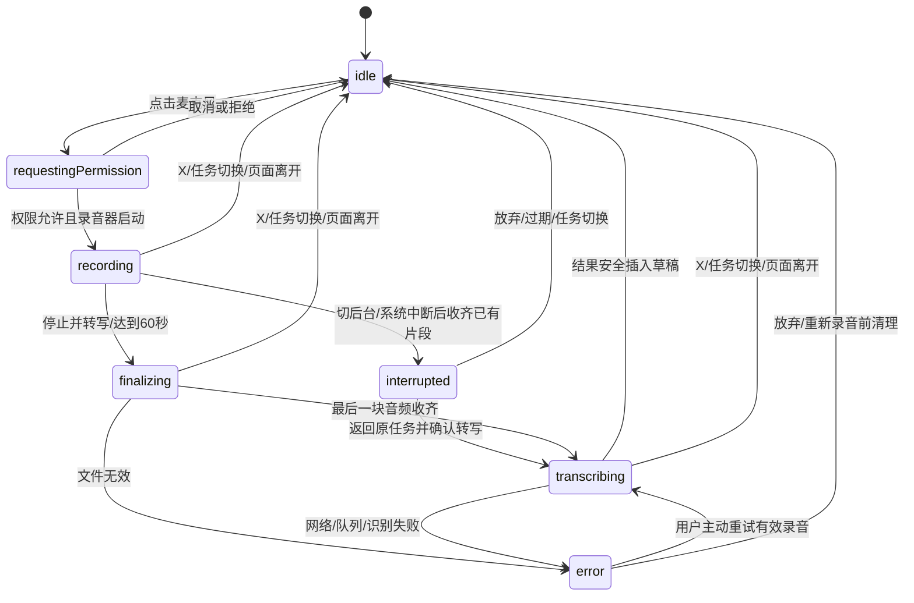
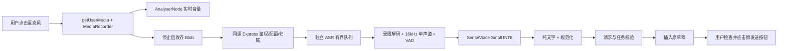

# 创作区语音输入与中英双语转写：产品级实施方案

> **2026-09-05 决策变更：用户确认改为设备端优先并要求实施。实际实现、安装和验收以 [设备端语音工程说明](../docs/VOICE_INPUT.md) 为准。下文原始服务器方案保留作为调研快照，其中服务器 ASR、上传 API、语音用量表及服务器并发配额不属于本次实施；不提供隐式在线回退。**

> 日期：2026-09-05。基线：`d88cdac`。状态：调研与待实施方案，不代表功能已上线或模型已通过本项目实测。
> 范围：创作区 Agent 输入框。目标是「说话 → 转成可编辑草稿」，不是语音通话、声音克隆、听书或自动执行语音命令。

## 1. 决策摘要

**首选：浏览器录音 + 自托管 SenseVoice Small INT8 / sherpa-onnx 独立识别服务。** 中文优先，保留英文及中英混说；停止录音后一次转写，结果插入原输入框，由用户校对后自行发送。

- 需要语音识别模型（ASR），不需要再调用写作大语言模型润色。现有「极速、标准、性能」等模型选择不影响转写，不向 DeepSeek/GLM 的文本接口发送录音。
- 模型在运营方机器上离线推理，没有按次 ASR API 费用；用户仍须联网把录音传至本站。这不等于「录音不离开用户设备」，也不等于服务器、电费、带宽和维护免费。
- 个人电脑可以运行同一套识别服务；正式公测不能依赖开发者 Windows 电脑开机或把个人电脑暴露到公网。
- 当前生产机器适合做**限流小灰度验证**，不能未经压测就全量部署重型模型。许可证、中文/英文质量、资源占用任一不达标，保持功能关闭，先升级独立 ASR 节点或复测替代模型。
- 第一版不做实时逐字字幕、长时间听写、跨设备录音同步、自动翻译、自动发送、语音指令执行、付费云端自动兜底。

### 1.1 真实环境核查

2026-09-05 对生产部署目标进行了只读资源检查，没有安装模型或修改服务：

| 项目 | 已核查事实 | 对方案的约束 |
| --- | --- | --- |
| 生产架构 | x86_64，2 个逻辑 CPU，约 3.64GiB 物理内存；当时 available 约 2.64GiB | 内存瞬时空闲不代表并发余量，不能挤占写作 Agent/数据库 |
| GPU、音频工具 | PATH 中未找到 `nvidia-smi`、`ffmpeg` | 不能假设有可用 GPU；实施时补齐受控音频解码依赖 |
| Web | React 18 / Vite / TypeScript / Zustand | 复用既有输入框、主题、状态管理，不引入整套聊天 UI |
| API | Express / Prisma；PM2 部署；Node 绑定回环地址 | ASR 与 Node 主进程隔离，API 只做鉴权与调度 |
| Android | 相邻 `chevoink-android` 是远程 WebView 壳；应用 Manifest 目前仅声明 INTERNET | 不能把网页录音通过当作 APK 已支持麦克风 |

没有在生产机做推理/负载实验；本文延迟、准确率和资源额度均是**待验证准入线或配置初值**，不是已测结果。

## 2. 开源选型与依据

GitHub Stars 为 2026-09-05 通过 GitHub API 读取的快照。热度仅辅助判断社区规模，不代表精度或安全认证。以下结论是针对本项目的工程取舍。

| 方案 | Stars 快照 | 作用与适用性 | 本期决策 |
| --- | ---: | --- | --- |
| [sherpa-onnx](https://github.com/k2-fsa/sherpa-onnx) | 14,608 | 支持 CPU、ONNX、离线 ASR/VAD，也有移动端及 WASM 路线；代码 Apache-2.0 | 首选运行时，独立服务使用 Python 绑定，不在 Express 里同步推理 |
| [SenseVoice](https://github.com/QwenAudio/SenseVoice) | 9,236 | 支持普通话、英文等语言；存在成熟 INT8 导出路线 | 首选模型，精度及许可证按下文验收 |
| [whisper.cpp](https://github.com/ggml-org/whisper.cpp) | 53,441 | C/C++ 本地推理、CPU 及量化部署路线；代码 MIT | 本地通用备用；只测多语言模型，不选 `.en` 英文专用权重 |
| [faster-whisper](https://github.com/SYSTRAN/faster-whisper) | 25,236 | CTranslate2 推理，可用于独立 Python 服务；代码 MIT | 作为 Whisper 对照基线，不在 2 核主站同时常驻多个模型 |
| [FunASR](https://github.com/modelscope/FunASR) | 20,172 | ASR、VAD、标点等完整工具链；代码 MIT，模型许可另查 | 原始模型/导出及质量对照，首期不引入完整训练环境 |
| [Qwen3-ASR](https://github.com/QwenLM/Qwen3-ASR) | 3,473 | 新一代多语种 ASR，含 0.6B/1.7B；[0.6B 模型卡](https://huggingface.co/Qwen/Qwen3-ASR-0.6B)标注 Apache-2.0 | 独立算力节点上的质量升级候选；不能把 0.6B 当成当前主机上已验证的低内存方案 |

### 2.1 为什么首选 SenseVoice Small INT8

[sherpa 官方预训练文档](https://k2-fsa.github.io/sherpa/onnx/sense-voice/pretrained.html)提供中英等语言的 INT8 模型与 CPU 示例，列出的 `model.int8.onnx` 文件约 228M。**这是模型文件大小，不是运行内存。** 使用 `language=auto`、`use_itn=1` 作为标点/数字规范化的初始配置；中文人物名、数字和混说仍需本项目语料验收。

它适合先测试本项目「中文短指令 + 少量英文 + CPU + 录完转写」的组合，并不意味着英语精度一定胜过 Whisper/Qwen。评测必须分别公布中文、英文、混说结果，不能只看中文平均分。

### 2.2 许可证必须独立验收

- sherpa 的代码许可不覆盖它加载的所有模型；SenseVoice 的代码 MIT 也不等于权重 MIT。[官方模型卡](https://huggingface.co/FunAudioLLM/SenseVoiceSmall)标注独立模型许可。
- 以下载时的权重许可证、转换产物许可证及[官方商用说明](https://github.com/QwenAudio/SenseVoice/issues/334)逐项核对。[FunASR Model License v1.1](https://github.com/modelscope/FunASR/blob/58830eca4012644aac0c3218c3ccc7d98f003fda/MODEL_LICENSE)有来源署名与模型名称保留要求，不能去掉。
- 上线前保存模型 revision、SHA256、来源、许可证原文、依赖清单。ONNX 转换不改变原始权重的许可义务；如预转换包的来源或许可不清楚，使用已核验权重自行导出，不直接上线未知包。
- 主项目继续遵守现有 `LICENSE`（AGPL-3.0）；新增组件的声明进入第三方许可清单。运营方审核具体义务；未完成许可核验不得标为商业发布可用。
- 普通输入框只显示「语音输入」，不显示内部路由/model ID；必要的开源署名保留在许可说明，不能因 UI 隐藏模型标识而删掉署名。

### 2.3 为什么不直接用浏览器“免费识别”或全部端侧

[Web Speech API 的 SpeechRecognition](https://developer.mozilla.org/en-US/docs/Web/API/SpeechRecognition)仍有兼容限制，部分实现依赖远端识别；新出现的设备内识别能力也要检查浏览器及语言包。不能假设中国网络、Safari、Android WebView 都稳定可用。本期不把它作为默认或隐式兜底。

浏览器 WASM/WebGPU 真本地识别可列第二期隐私增强项，但首次模型下载、缓存回收、内存、发热、移动端中断和 CSP/WASM 兼容都需要独立验收。首期不让所有用户为一个麦克风按钮下载数百 MB，不因设备支持 WebGPU 就自动下载模型。

若用户未来主动选择设备内识别：必须明确展示下载大小、删除模型入口和不上传音频说明；失败后不能偷偷切到服务端。原生 Android 离线包则涉及另一仓库和 APK 体积，不混入本期网页交付。

## 3. 与当前代码的准确对接

| 当前文件 | 已确认实现 | 计划改动 |
| --- | --- | --- |
| `src/features/studio/agent/components/AgentComposer.tsx` | `contentEditable`，引用芯片，`insertPlainText` / `syncComposerFromDom` / `setComposerContent`，模型菜单和发送/停止按钮 | 模型选择右侧新增麦克风，底部工具条录音态切换；用现有文本与引用逻辑插入，不替换成 textarea |
| `src/features/studio/agent/agentStore.ts` | 草稿、引用、附件、技能选择提升至 store | 仅必要的草稿 revision/安全插入动作；不持久化 MediaStream、Blob、音量数组 |
| `src/features/studio/agent/components/AgentPanel.tsx` | 传入会话、运行状态及 `conversationLoading`；新任务懒创建 session | 透传稳定任务标识与录音禁用状态；转写不能触发 `ensureSession()` 或启动 run |
| `src/features/studio/StudioWorkspace.tsx` | 管理 `activeAgentTaskWindowId`；同作品可有多个无 session 的窗口 | 把真实任务窗口标识向下传递，解决同作品空任务间回写串台；不要使用 `emptyStateSeed` 代替任务 ID |
| `src/features/studio/agent/agentApi.ts` | 请求默认 JSON Content-Type，携带 cookie 和 auth header | 新建独立 `speechApi.ts`，复用认证约定；原始二进制上传不能被默认 JSON 包装 |
| `api/app.ts` / `api/lib/auth-session.ts` | 全局 JSON/urlencoded 40MB、统一 session 闸口、`requireSessionUserId` | 新增 speech router，经身份检查后才读取限定音频；不放大现有全局 body limit |
| `api/lib/tts-service.ts` / `shared/contracts/tts.ts` | 听书/合成语音链路 | 不复用 TTS 为 ASR，不改动听书能力 |
| `deploy/nginx.chevoink.conf` | `/api` 反代、公开 uploads 路径、强制 CSP | 增加精确的语音接口体积/超时限制；音频不得进入公开 uploads |
| `scripts/deploy-production.ps1` / `deploy/deploy-production.sh` | 既有应用发布链路 | 独立 provision ASR 运行环境；网页发布不得每次下载模型或重启推理进程 |

建议新增：

- `shared/contracts/speech.ts`：能力、成功结果、错误码契约，导出至 `shared/contracts/index.ts`。
- `src/features/studio/agent/hooks/useVoiceInput.ts`：录音有限状态机、取消和资源释放。
- `src/features/studio/agent/components/AgentVoiceInputBar.tsx`：小型工具条视图；不再套一层大卡片。
- `src/features/studio/agent/speechApi.ts`：音频传输与取消，不耦合聊天 SSE。
- `api/routes/speech.ts`、`api/lib/speech-service.ts`：身份/归属/限额/内部代理。
- `services/asr/`：独立、锁定依赖的 Python HTTP 服务、sherpa 绑定、工作进程和测试；不得导入 Node 运行时。
- `deploy/chevoink-asr.service`、资源配置及独立安装说明；新增脱敏 ASR 指标表迁移，详见第 7 节。

一个与本功能相关的现存缺口：`AgentPanel` 的 `onSend` 包装使用 `void handleSend(...)`，而 `AgentComposer` 依赖返回 Promise 来判断发送成功。实施时必须改为返回该 Promise，并补发送失败保留草稿/引用/附件的回归；否则语音草稿也可能在启动失败时丢失。除此之外不顺手重构 Agent loop。

## 4. 交互规格

### 4.1 视觉与入口

- 常态顺序：模型选择 → 麦克风 → 原发送按钮。使用现有 lucide `Mic` / `X` / `Square` / `LoaderCircle`，统一中性前景色、低饱和圆形 hover 背景；无星星、彩色渐变或发光塑料效果。
- 浅色保持创作区当前表面色，深色使用主题变量，不能硬编码整条黑底；麦克风图标约 18px，手机点击热区至少 44×44px。
- 录音只替换输入框**底部工具行**，上方原草稿/附件仍可见，输入框高度和消息滚动位置不突然变化。录音/转写期间暂时锁定本输入框的文本、引用和附件编辑；退出后立即恢复。
- 录音行：左 X，中部随真实音量起伏的波形和计时，右方块「停止并转写」，最右发送箭头保留但禁用。用户所说“暂停”在第一版定义为**停止并转写**，不调用 `pause()` 后继续等录音。
- 转写行：左 X，中间「正在转写…」，右加载图标；发送仍禁用。错误用工具行附近一条简短文字和「重试 / 重新录音」，不用阻塞弹窗。
- 波形仅是实时振幅显示，不做声纹识别、情绪识别或身份建档；安静时低平点线，不生成虚假的随机波形。
- 360px 聊天栏、320px 手机视口均不能水平溢出；必要时缩短模型显示，不能挤掉取消/停止热区，也不改动现有 Work 面板最小宽度。

### 4.2 明确状态机

- 首次权限前给一句就地说明：「录音将发送至本站进行转写，不用于训练，完成后删除。请勿录入敏感信息。」不出现与实现不符的“全程本机”。后续点击直接请求/使用系统权限。
- 默认每段最多 60 秒，到上限停止并转写，提示「已达到单段时长上限」；不自动另开新段，不因短暂停顿提前截断。
- X / Esc 取消当前语音操作，保留原草稿，绝不调用原 `onStop` 误停写作 Agent。
- Agent 正在运行、正在启动、历史正在恢复、附件正在上传或语音操作进行中时，禁止再次开始录音；原运行停止按钮仍按既有语义可用。其他任务正在运行不应被语音取消影响。
- 转写完成只填草稿，绝不自动发送，也不执行录音里的“发送、删除本章、停止”等口令。
- 成功后焦点回到插入文本后；提供可撤销的本次插入（保持引用），不能整份草稿无条件回滚。键盘 Undo 的浏览器行为必须实测，必要时提供同一条轻提示「撤销本次插入」。
- 拒绝权限、无麦克风、设备占用、网络断开、不支持录音各给可操作提示，不反复弹权限请求。未响应系统权限弹框时仍能取消；迟到的授权流必须立即 stop，不允许后台补录。

### 4.3 草稿和任务隔离：P0

开始时捕获 `{userId, novelId, taskWindowId, requestId, draftRevision, selectionBookmark}`。`taskWindowId` 来自宿主；不能只检查 `novelId` 或可为 null 的 `sessionId`。无服务端会话的新任务使用宿主生成并保持稳定的临时窗口 ID，不在每次 render 新建 UUID；窗口尚未确定时禁止录音。

1. 点击麦克风的 pointerdown 阶段保存编辑器选区，不让按钮夺焦点后丢位置。引用芯片视为不可分割对象，书签应包含文本偏移与相邻引用标识，不保留可能失效的 DOM Range 作为唯一依据。
2. 普通非折叠选区不自动删掉被选中的文字：收拢到选区末尾插入；没有有效书签则追加到草稿末尾，必要时加一个换行，不覆盖原文。
3. 权限等待、录音、转写各异步边界都检查 operation generation；切换任务、同作品新任务、退出账户、卸载或隐藏工作区时同步使旧 generation 失效并清理。
4. 回写前再次校验 owner、任务标识及 draft revision；若有其他程序修改草稿，禁止按旧快照覆盖，在**原任务仍在前台时**提供「插入到末尾」的显式操作；切走直接丢弃，不能写到新任务。
5. 回写走纯文本节点和现有 `syncComposerFromDom()`，不使用 `innerHTML`。移动引用的 offset，保持附件、技能、创作自由度不变。
6. 稳定布局不依赖给整个 AgentPanel 加随机 key；不能为录音功能再次引入会话欢迎页闪现或丢失 SSE 连接。

## 5. 录音与识别链路

### 5.1 浏览器录音

- HTTPS/localhost、安全上下文及用户授权是前提；不假设浏览器 `Permissions.query` 对 microphone 全支持。参见 [getUserMedia](https://developer.mozilla.org/en-US/docs/Web/API/MediaDevices/getUserMedia)。
- 请求 `audio`、不请求 `video`；降噪/回声消除用 ideal 或可降级约束。`sampleRate:16000` 不是实际采样率保证，后端负责真正重采样。
- 用 [MediaRecorder.isTypeSupported](https://developer.mozilla.org/en-US/docs/Web/API/MediaRecorder/isTypeSupported_static)协商 WebM/Opus、MP4/AAC、Ogg/Opus，记录实际 `recorder.mimeType`；构造/启动失败仍须处理。不要把 Safari 的 mp4 Blob 改个 webm 后缀。
- 以约 250–1000ms timeslice 收集 chunk，按真实字节与单调时钟计时；不能用 chunk 数量当时长。停录遵循 [stop 事件规则](https://developer.mozilla.org/en-US/docs/Web/API/MediaRecorder/stop_event)：最终 `dataavailable` 收齐后再拼 Blob，不能丢最后一句。
- 音量用 Web Audio AnalyserNode，requestAnimationFrame 驱动画布、约 30fps 上限，不以 React 每帧 setState 重绘整段聊天。节点不接扬声器避免回授；`prefers-reduced-motion` 下改为简单音量指示。
- 每段前端累计上限 8MiB，超限停止并提示重新短录，不上传一个无声截断的文件；单段上限仍按 60 秒优先限制。
- 成功、失败、取消、超时均关闭 tracks、AudioContext、动画和监听器，释放 Blob/ObjectURL。失败允许原任务内保留 Blob 最多 2 分钟供手动重试；到期删除并提示重录；不进 localStorage/IndexedDB。
- 页面切后台、锁屏或系统中断时结束采集，已收齐片段仅内存保留供回前台确认转写，不暗中继续录制/上传；路由离开或切任务则取消并删除。移动系统直接杀页时不能保证恢复录音，需要明确提示此限制。

### 5.2 最小但可靠的 API

首期采用「单次上传、同步等待结果」，不增加聊天 SSE 类型，也不需要 WebSocket 实时传音。

| 接口（计划新增） | 请求与用途 |
| --- | --- |
| `GET /api/speech/capabilities` | 已登录用户的开关、可用性、最大秒数/字节、语言提示及限额；不暴露 provider、权重 ID、内网地址 |
| `POST /api/speech/transcriptions` | 原始 Blob；真实 audio Content-Type，`X-Transcription-ID` UUID、`X-Novel-ID`，可选 `X-Agent-Session-ID`；不需要已有 session |
| `DELETE /api/speech/transcriptions/:requestId` | 当前用户取消；幂等，不能取消其他用户的任务 |

成功包沿用 `ApiResponse`：`{ success:true, data:{ requestId, text, audioDurationMs, language:null或短代码, noSpeech:boolean } }`。状态无法可靠识别时 `language:null`，不编造置信度。内部队列耗时等只记指标，不输出音频 URL。

错误统一：401 未登录；403 禁用/无归属权限；409 requestId 与音频冲突；413 太大；415 不支持的格式；422 无效/过长音频；429 用户限额/队列已满并附 `Retry-After`；503 未就绪；504 超时。没有语音返回成功空文本及 `noSpeech:true`，不当作系统故障，不插入说明文字。

- Express 路由在统一 session 闸口之后挂载；先 `requireSessionUserId`、归属、Origin/请求来源、Content-Type 和额度检查，再进入 route-local 限 8MiB 的原始流读取。不能只靠 CORS 或浏览器按钮鉴权。
- Cookie 请求检查可信同源 Origin/Fetch Metadata；兼容现有合法 Bearer 客户端，不把原始音频端点变成跨站消耗资源入口。拒绝任意音频 URL，避免 SSRF。
- 有效新作品可不带 session；带 session 时必须同时属于当前用户和作品。客户端 taskWindowId 只用于前端隔离，不能充当服务端授权凭据。
- 读取音频前还需申请有界上传槽位，初值全局 3 个、每用户 1 个，并叠加短时 IP 防滥用限制；身份由 Node 从登录态注入内部请求，不能信任前端传来的 userId。超限直接拒绝读取，避免很多 8MiB 请求同时占满内存。
- 原始上传不用 base64/dataURL，不进入现有 Agent attachments 契约，也不发给 Agent loop。明确拒绝 speech POST 的 JSON/urlencoded 格式；在全局大 JSON parser 之前为该路径做轻量格式拒绝，避免恶意请求走 40MB 解码。
- Nginx 语音 location 配置 8m 请求体及有限上传超时，禁用该路由的请求磁盘缓冲（`proxy_request_buffering off`）并实测；不得因此影响 Agent SSE。错误保持前端可理解，即使 Nginx 返回 HTML 413 也正确映射。

### 5.3 独立服务与取消

- 单独常驻 Python 控制进程 + 1 个模型工作进程，HTTP 控制层不被推理阻塞；模型只加载一次。不每条录音重新启动 CLI，不在 Node/React 主线程推理。
- 控制层独立于 PM2 应用 worker：全局队列、用户并发与去重在同一 ASR 控制层协调，不能 PM2 每个进程各放一份限流计数。
- 按 `{userId, requestId}` 去重，校验音频 hash；相同请求挂接同一工作，不重复计算。已完成结果最多内存保存 2 分钟供重试，控制总数量/大小；不同内容复用 ID 返回 409。
- X 同时 abort 上传并发取消请求。取消先于上传到达时记录短时取消 tombstone；取消后晚到的请求不能重新开始。网络断开后端检测 response 未完成的断连，不把普通 `req.close` 当成必然取消。
- 排队任务立即移除；正在推理的 native 调用不一定可中断。立即禁止结果交付、停止后续分段，当前调用受总超时约束；到硬超时终止并重建**该模型工作进程**，不杀共享 Node。不能宣传“点 X 就瞬间释放全部 CPU”。
- FFmpeg 使用参数数组、无 shell、无网络、低权限；限定输入容器/协议、解码时间、声道、输出字节数、时长，拒绝播放列表/嵌套资源和伪造 MIME。最多解码到 60 秒 + 检测余量，超限明确拒绝，不能静默截断。
- 解码为 16kHz 单声道 PCM；VAD 过滤无语音，长语音按停顿切段并带边界保护；超长单句有确定切片上限与时间定位去重，不能按文字“重复”删掉作者真实的重复句。
- 保留英文，不自动翻译；只做识别标签清理、空白和模型可支持的标点/ITN。默认不读整本小说做“纠错”，不凭词典强行改专有名词。热词能力必须实测该具体 backend 支持后另立增强项。

## 6. 性能、额度和部署边界

### 6.1 初始限制（灰度前必须校准）

| 参数 | 初值 | 说明 |
| --- | --- | --- |
| 单次录音 | 60 秒、8MiB | 按后端实际解码结果再验，不能信任客户端 duration |
| 用户并发 | 1 个上传/排队/推理任务 | 额度预占具有到期回收；用用户身份而非仅 IP |
| 全局容量 | 1 个推理 + 最多 2 个等待 | 适用于当前 2 核试点，满则快速 429 |
| 用户频率/日额度 | 5 次/分钟、20 分钟/日 | 可配置公平使用额度；网络重试同 ID 不重复计时，失败回退预占，滥用失败仍受频率限制 |
| 等待/识别预算 | 排队最多 5 秒，单次解码+推理最多 45 秒 | 不合格则报错/扩容，不无限挂起；按真实音频长度观察分档延迟 |
| 外层超时 | 上传体读取最多 20 秒，应用总预算 75 秒，Nginx 等待 90 秒，前端 95 秒 | 从客户端及服务端各自起点说明，上传/推理各阶段独立计时；宽松硬上限不是体验目标 |
| CPU/内存 | 1 推理线程；ASR cgroup 最多约 1 核 / 1.25GiB | 包含解码器/子进程；OOM 验收、工作进程重建、队列失败恢复必须通过 |

20 分钟是个人限额，不是承诺所有注册用户同时获得满额吞吐。近 200 位公测用户不等于 200 并发；按真实峰值录音到达率规划容量。

估算：日音频分钟 `D` × 实测 RTF = 推理占用分钟；峰值到达率 × 平均服务秒数应低于 worker 数量，并保留峰值余量。例如 RTF=0.2 仅是算例，不是现网数据；200 人每天各 5 分钟即 1000 音频分钟，对应约 200 分钟推理占用，峰值扎堆仍会排队。

### 6.2 部署方式

1. 在开发/隔离测试机下载固定版本权重并核验，不把大模型提交 Git、不在客户点击时拉模型、不在生产安装 `@latest` 或 `trust_remote_code` 未审核代码。
2. 使用锁定版本的 sherpa-onnx/Python/HTTP 服务依赖，FFmpeg 选择经过检查的发行包；运行时只允许读固定模型目录。
3. 独立 systemd 服务、非 root、仅回环监听；Node→ASR 使用服务凭证，凭证仅服务端持有。跨机器时必须私网加密通道/认证，不开放匿名公网推理端口。
4. `FEATURE_SPEECH_INPUT_ENABLED=false` 默认关闭，独立用户灰度名单；不要沿用现有 Agent2「名单为空=全量」的语义直接开放。capabilities 由服务端判断可用及授权。
5. 增加 `/readyz`（模型已加载并通过自检）与 `/healthz`；Node 短时缓存健康结果，失败熔断，仅语音入口降级，打字和 Agent 不受牵连。
6. 安装脚本与应用发布脚本分离，首次 provisioning 需核实资源；若主站压测退化则必须移至独立 ASR 节点，不能为了“免费”放松主站体验验收。
7. 发布顺序：数据库增量字段/指标表 → ASR 服务且开关关闭 → API → 前端 → 内部用户 → 小灰度 → 实测达标再扩大。ASR 模型不随每次网页部署重启。
8. 回滚先关闭服务端语音开关，取消队列；旧前端也必须处理禁用响应。模型保留上个已验证 revision；数据库只做向后兼容的增量，不用删表回滚。

## 7. 隐私、用量与成本

- 音频仅浏览器内存及后端受限临时空间；不进入公开 `/api/uploads`、日志、对象存储或训练/技法库。开发环境也不得默认开启录音请求体日志。
- 取消成功后同时删除当前请求的结果缓存，只保留无正文的短时取消标记；不把“断开 HTTP”当作音频和缓存已经清除的证据。
- 后端优先管道/tmpfs，临时数据设容量上限；完成/取消/超时立即释放，异常遗留清扫上限 5 分钟。检查 Nginx 缓冲、APM 抓包、core dump、swap 等潜在落盘点，不以“代码没 writeFile”就承诺绝对不落盘。
- 录音不进备份；结果短时缓存不超过 2 分钟，仅本人可复用。未发送草稿沿用既有草稿存储行为，不能声称所有转写文字都不留存；用户发送后文字会进入正常对话历史。
- 新增最小 `SpeechUsageLog`（独立于 `AiUsageLog`）：userId、requestId、status/errorCode、audioDurationMs、queueMs、inferenceMs、totalMs、audioBytes、backendRevision、createdAt；不含音频、转写文字或小说正文。唯一键 userId+requestId，索引 userId+createdAt；按期清理，默认保留 30 天。
- 每日额度使用原子预占/结算及崩溃到期释放；即使服务重启也不能重置当日额度。可在独立 usage 表记录 reservation/expiry 字段；不要把当前短时结果缓存当账本。
- 首期作为公平使用范围内免费的输入辅助，不扣现有 Credits，不冒充输入 token、缓存命中或写作模型调用数；用户点击发送后仍按原 Agent 计费。未来要收费须单独定义规则与用户告知，不在本期暗加扣费。
- 监控：识别秒数、失败/取消率、P50/P95延迟、RTF、队列拒绝、内存峰值、CPU、主站 Agent 首 token 延迟。只展示运营必要的聚合指标，不为语音新造一套复杂管理后台。

## 8. 三端适配与可访问性

- 桌面：Chrome/Edge/Firefox/Safari 支持范围按实际录音格式测试；首次拒绝、忽略权限、设备热拔插必须覆盖。
- 手机浏览器：iOS Safari 和 Android Chrome 实机验证 MP4/Opus、切后台、锁屏、来电、中断、蓝牙麦克风与键盘；不以桌面设备模拟替代录音验收。
- Android 壳：单独修改 `chevoink-android/android/app/src/main/AndroidManifest.xml` 的 `RECORD_AUDIO` 及按已安装 Capacitor 版本验证运行时授权/可信 WebView origin 权限桥。**不得直接对所有 onPermissionRequest 无条件 grant。** 若需要自定义插件，仅授权本站音频采集，不请求摄像头；先验证默认桥，避免重复权限弹窗。
- 网页功能部署不能替代 APK 更新。新 APK 真机通过后再对其开放；旧 APK 显示更新指引或保持文字输入。UA 版本只用于体验提示，不能作为权限保证。
- 开始、取消、停止有清晰 aria-label；状态用 polite live region，不能每帧/每秒轰炸读屏。按钮有可见焦点、Tab 可达，Esc 只处理当前语音层，不误关闭工作区。
- 语音模块动态按需加载，主聊天首屏不下载模型/录音大库。不修改全站 CSP 为 unsafe-eval 或开放任意连接；若添加 Permissions-Policy，仅允许本站 microphone，并注意 Nginx add_header 继承规则。

## 9. 产品级验收门槛

### 9.1 准确率与容量：先实验，后承诺

建立至少 300 条经授权录音的冻结测试集，按说话人拆分调参集与最终验收集，至少 20 位说话人：100 条普通话写作指令、60 条中英混说、60 条纯英文、40 条噪音/口音、40 条静音/非语音/中断。覆盖 3/15/30/60 秒、章节编号、数值、否定词、角色名、生僻姓氏及英文专名。

用统一文本规范化脚本公布中文 CER、英文 WER、混说 MER（中文按字、英文按词）、关键实体正确率；同时保留数字/否定词的原始评估，不能通过抹掉差异“提高精度”。录音不使用未授权用户生产数据。

建议初始准入线（正式冻结前可根据试验一次性调整并记录原因，之后不能为过关临时放宽）：

- 安静普通话 CER ≤8%；纯英文 WER ≤15%；混说 MER ≤15%；章节编号/数字/否定词关键实体正确率 ≥95%。小说罕见人物名单列结果，不承诺全部准确。
- 静音/非语音测试不能生成可执行虚构指令，noSpeech 判断达到人工标注要求；不允许为避幻觉删除真实轻声语音。
- 在目标配置、预热且无排队时：15 秒录音停止至结果 P95 ≤5 秒；60 秒录音 P95 ≤15 秒。网络条件单列：上行≥5Mbps、RTT≤100ms；慢网单独统计上传耗时。
- 压测并行真实 Agent 任务：主站 P95 API 及首 token 延迟相对基线退化不超过 10%，没有 OOM/意外重启；连续 1 小时稳态负载及突发 10 用户请求下限流可预测、无无限队列。
- 不达标时先按瓶颈调整 ASR 独立节点/模型，不扩散到 Agent 提示词和工具链。英文或混说未达标，就不能以“中文已经很好”判定完成。

### 9.2 自动化测试

- hook 单测：权限拒绝/迟到/不响应、重复点击、停止收齐最后 chunk、空 Blob、字节/时长上限、取消及卸载释放、后台中断、过期重试。
- Composer 组件测试：有原文/引用/附件/技能时插入、选区不删文、引用 offset、撤销、失败保留、IME Enter、录音中禁止发送、录音停止不调用 Agent 停止。
- 并发竞态：A→B→A，两个无 session 的同作品窗口，新任务懒创建、账户切换、DOM 重建、迟到结果、取消先于上传到达，不能串台或重复插入。
- API 集成：未登录/封禁/跨用户/跨作品/伪造 MIME/超限/CSRF/音频 URL拒绝、配额原子性、重试去重、PM2 多入口共享上限、断连及超时、ASR crash/OOM恢复。
- 识别 worker：真实许可测试音频覆盖三种容器，解码限额，VAD 边界不丢词，ITN/标签清理不乱改，结果缓存 TTL 与临时数据清扫。mock 不能代替这组集成测试。
- E2E：使用测试麦克风音轨覆盖 Chrome/Firefox；Safari/iOS/Android 实机补人工签收。浅/深色、320/360/768/1440px、键盘/读屏/减弱动效全部验收。
- 不做付费云 API CI 测试，不在 CI 下载未经 pin 的权重；模型集成测试使用受控预装 runner/工件，报告不能把 skip 算通过。

### 9.3 发布四闸与完成定义

实施时依次通过 `npx tsc --noEmit` → `npm test` → `npm run build` → `npm run lint`，另跑新增 Python/ASR 集成测试、模型与依赖许可/安全检查。四闸仅覆盖 Web/Node，不能代替声音质量和真机验收。

通过后提交并推送本次相关变更 → 等待对应 commit 的 CI 成功 → 依前述顺序部署 → 验证 ASR readiness、脱敏合成音频转写、网页主链路健康 → 小灰度观察。报告必须区分“代码完成 / CI通过 / Web已部署 / APK已更新 / 灰度中 / 全量开放”。不能推送就声称已部署，或部署按钮就声称识别达到产品级。

## 10. 分阶段执行清单

- [ ] P0 选型试验：许可锁定、300 条语料及说话人划分、INT8 对照、英文/混说质量、当前同规格主机资源和 Agent 并行基线。产出可复现评测报告。
- [ ] P1 前端：独立状态机、录音工具条、安全草稿插入/撤销、权限提示、任务隔离及发送 Promise 回归；先接受控 mock，不对公测开放。
- [ ] P2 服务：原始音频 API、鉴权归属、配额预占、独立 worker、VAD/解码限制、取消、脱敏指标、readiness/熔断。
- [ ] P3 端到端：绑定真实 ASR，三端验证、性能压测、隐私清扫、四闸及服务专项测试，形成上线记录。
- [ ] P4 发布：推送、等 CI、先关闭开关部署、小灰度验证；Android 单独构建/发布。扩容或质量不足时不全量。
- [ ] P5 可选增强：经实测有效的作品人名提示、设备内离线推理、独立更强模型节点。实时字幕与长时听写另立项，不加入本期关键路径。

**本方案的完成边界：本次只提交可执行规划；没有安装模型、开麦克风、增加收费、修改生产设置或实现语音功能。实施完成后仍须以实测报告决定能否对全部用户开放。**
